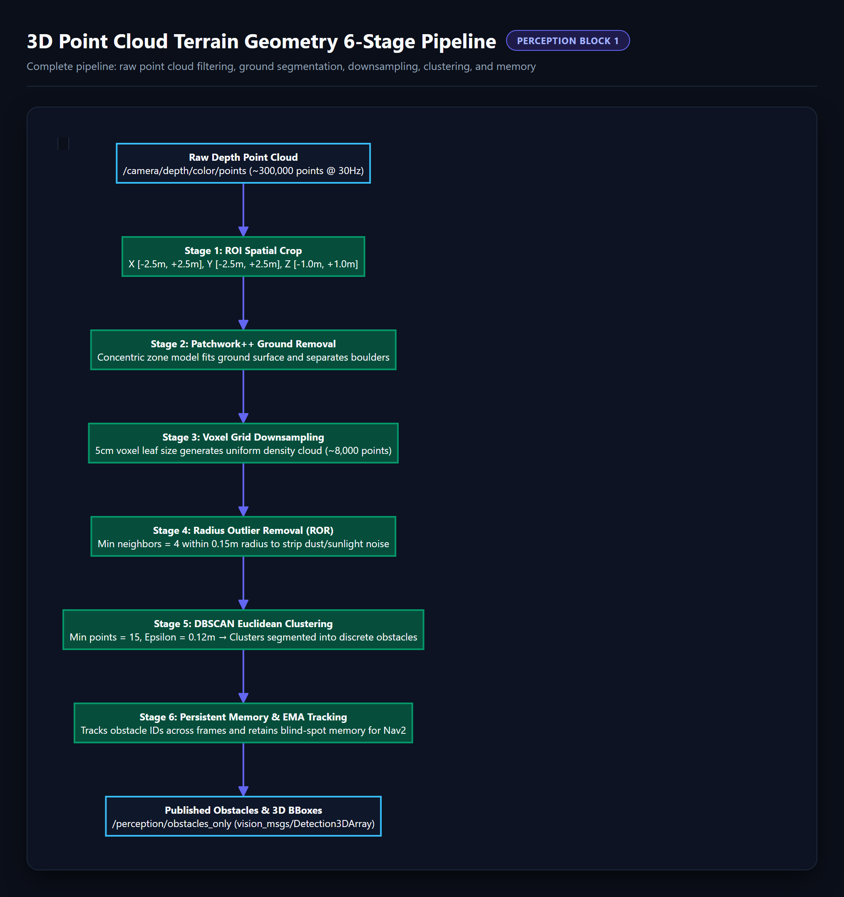
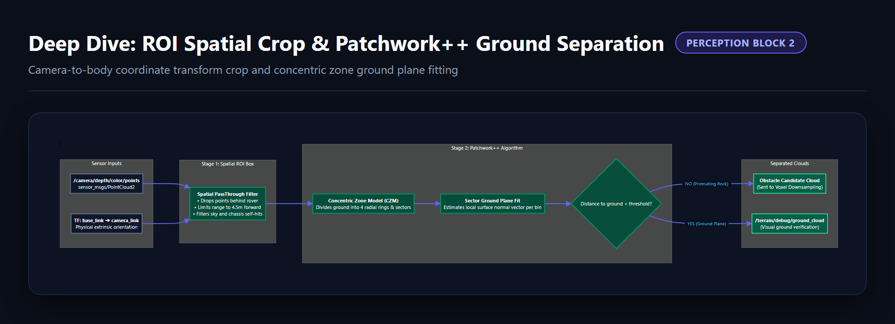
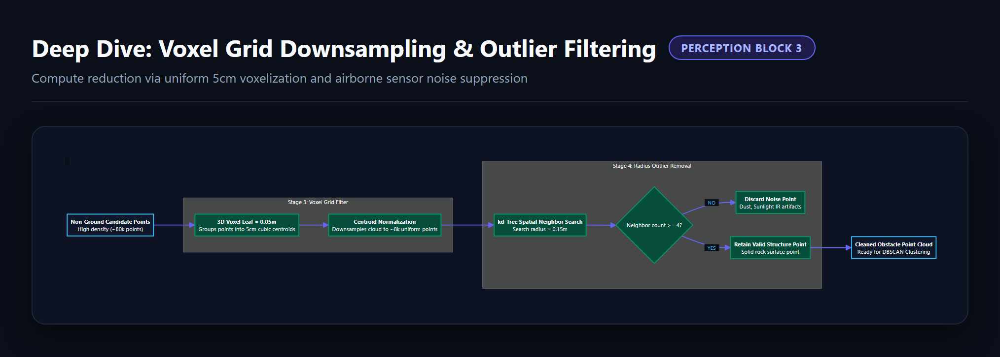
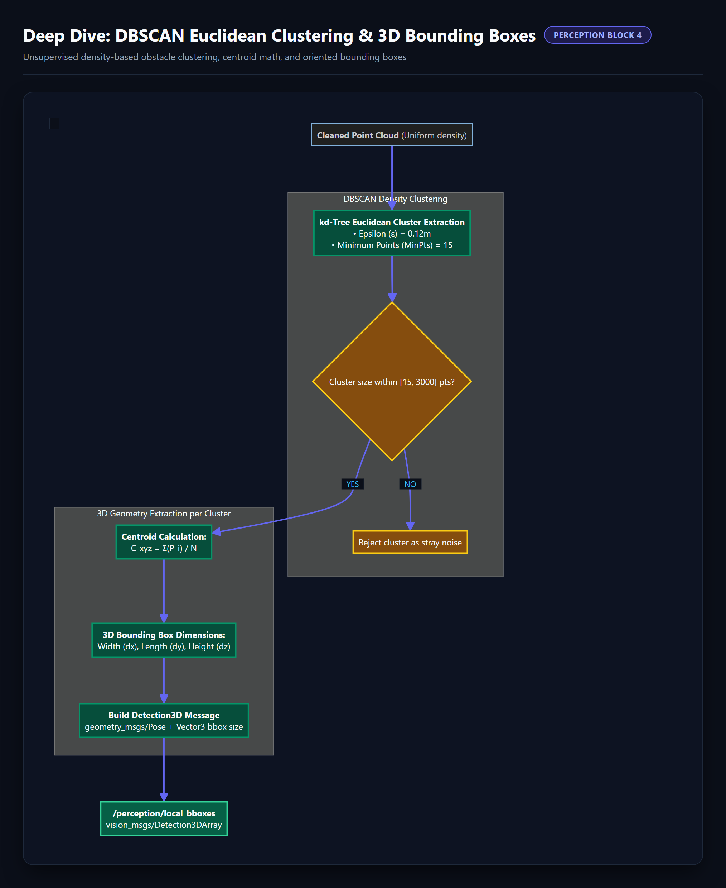
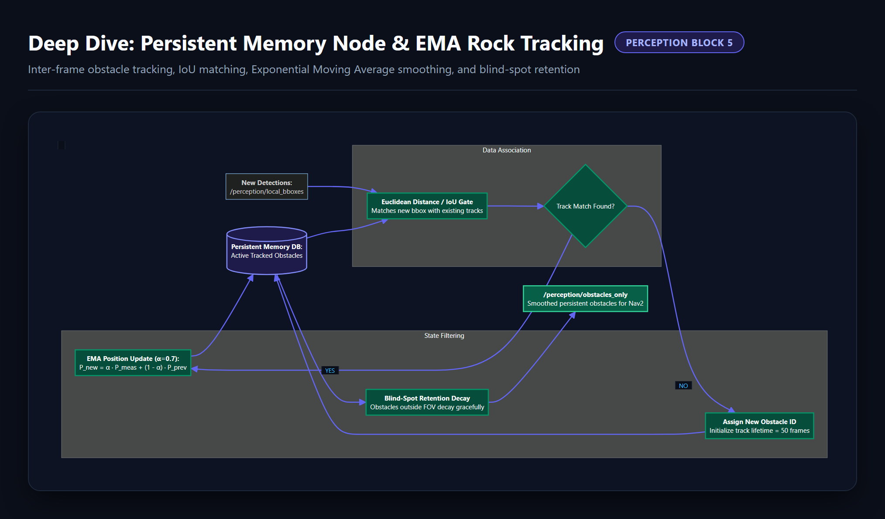
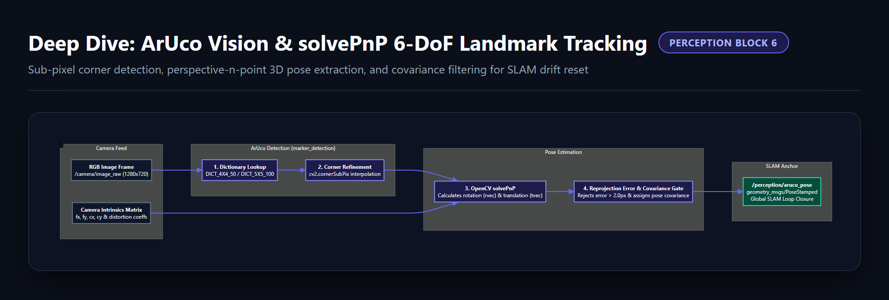
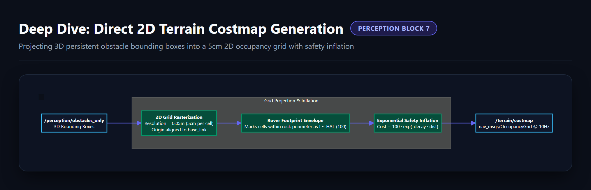

# 👁️ Perception Subsystem Diagrams (`General_Docs/1-Perception/`)

This directory contains the visual pipeline graphs and granular block deep-dive diagrams for the **Perception Subsystem** (3D terrain point cloud geometry and ArUco marker vision).

---

## 📸 Diagram Gallery

### 1. Master Pipeline

---

### 2. 3D Terrain Geometry 6-Stage Pipeline

---

### 3. Spatial ROI Crop & Patchwork++ Ground Separation

---

### 4. Voxel Grid Downsampling & Radius Outlier Removal

---

### 5. DBSCAN Euclidean Clustering & 3D Bounding Boxes

---

### 6. Persistent Memory Node & EMA Rock Tracking

---

### 7. ArUco Corner Extraction & solvePnP 6-DoF Landmark Estimation

---

### 8. Direct 2D Terrain Costmap Generation

