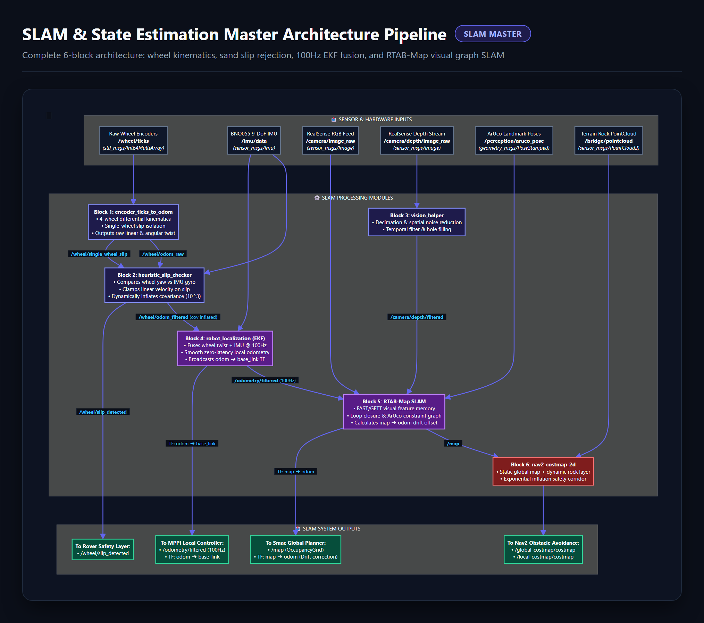
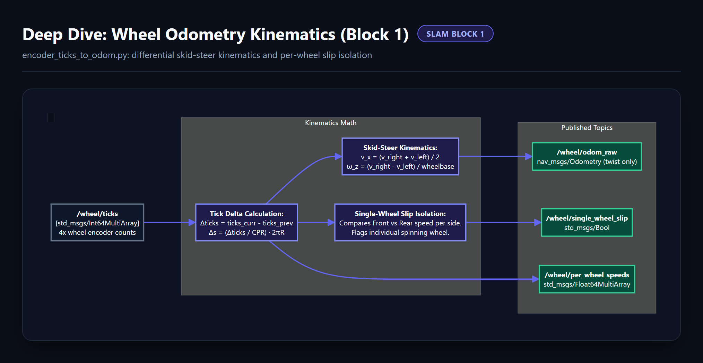
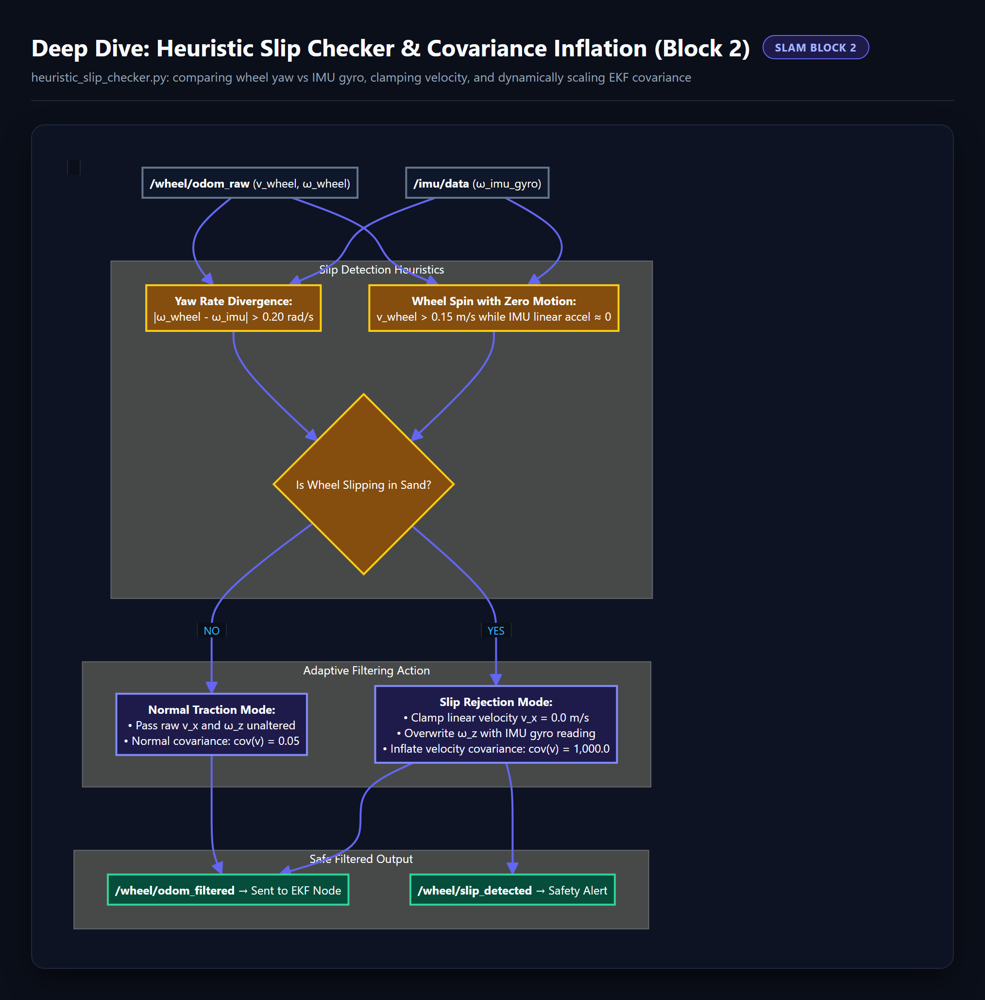
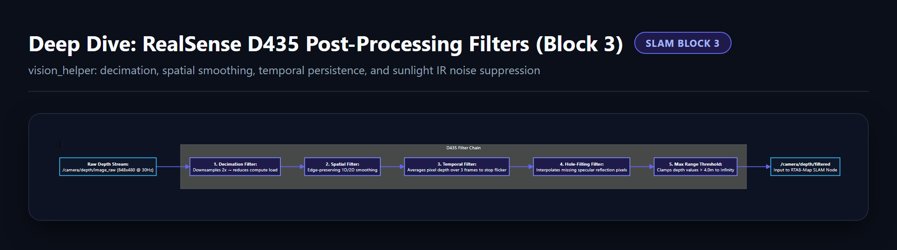
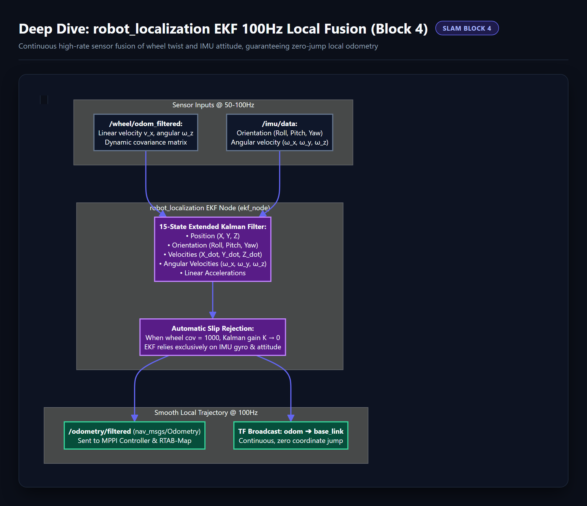
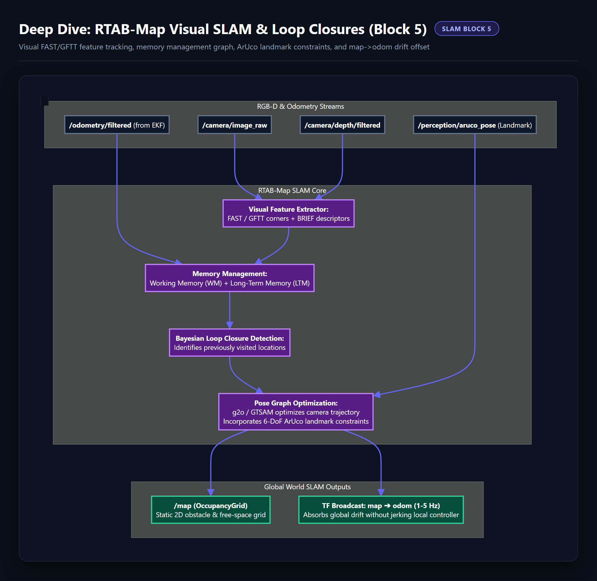
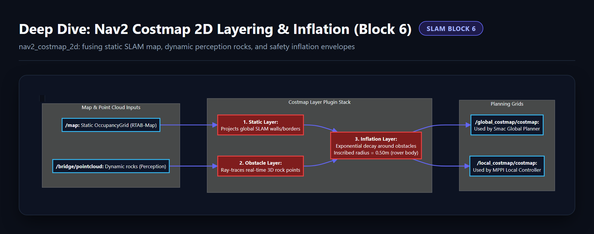

# 🧭 SLAM & State Estimation Subsystem Diagrams (`General_Docs/2-SLAM/`)

This directory contains the visual pipeline graphs and granular block deep-dive diagrams for the **SLAM Subsystem** (multi-sensor state estimation, wheel slip rejection, 100Hz EKF fusion, and RTAB-Map SLAM).

---

## 📸 Diagram Gallery

### 1. Master Pipeline

---

### 2. Wheel Odometry Kinematics & Single-Wheel Slip Isolation

---

### 3. Heuristic Slip Checker & Dynamic Covariance Inflation

---

### 4. RealSense D435 Post-Processing Depth Filters

---

### 5. robot_localization EKF 100Hz Local Sensor Fusion

---

### 6. RTAB-Map Visual SLAM, Memory Graph & Loop Closures

---

### 7. Nav2 Costmap 2D Layering & Inflation Safety Corridor

