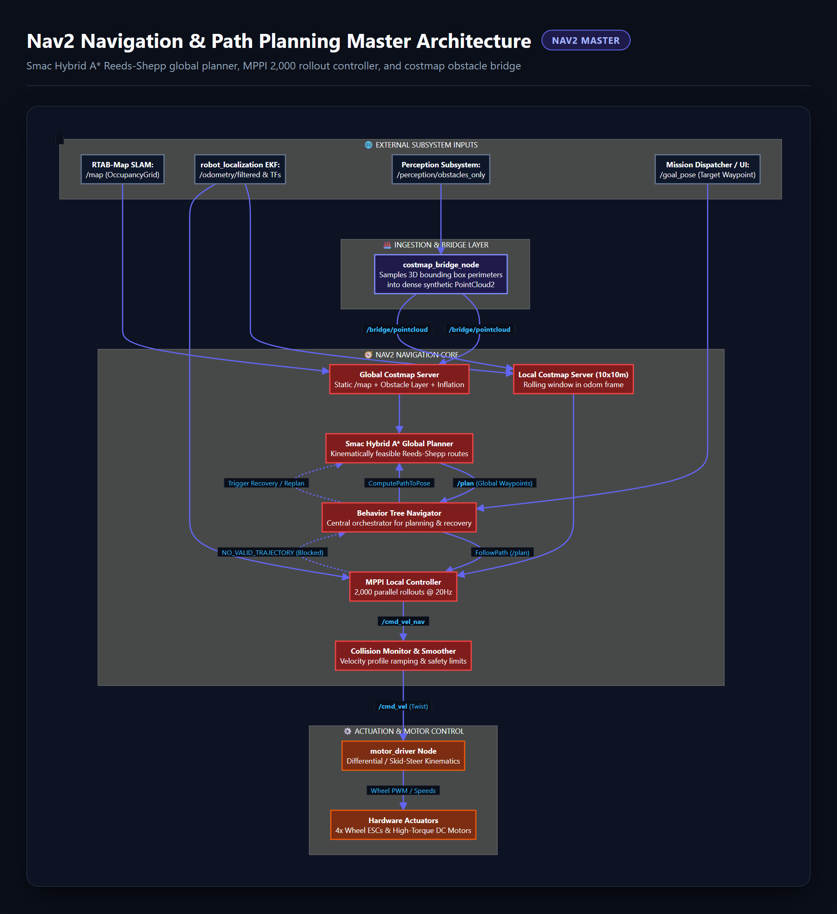
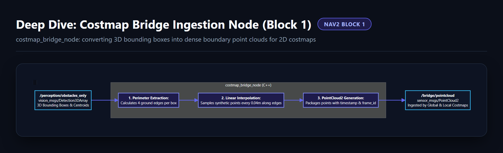
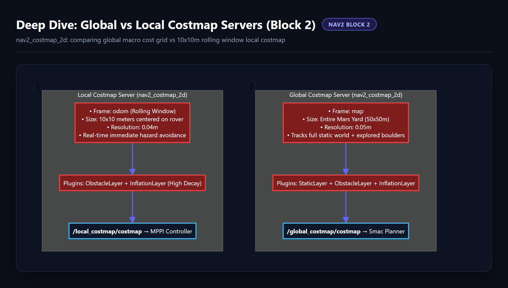
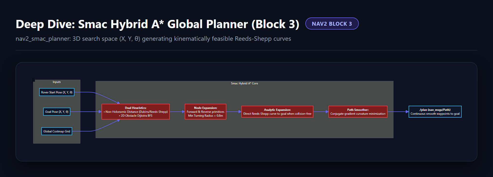
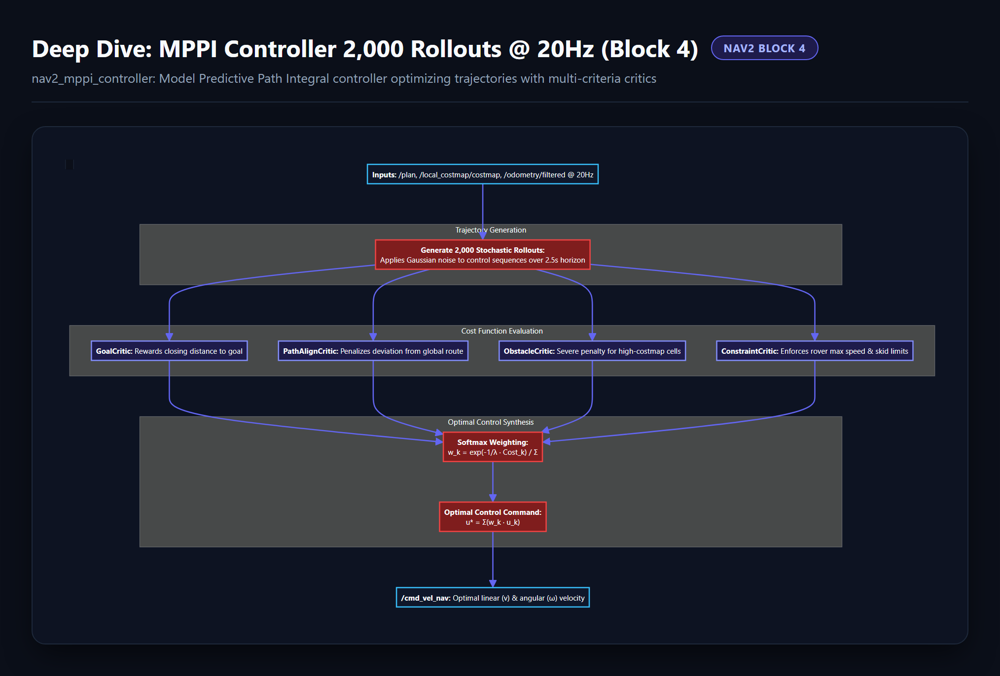
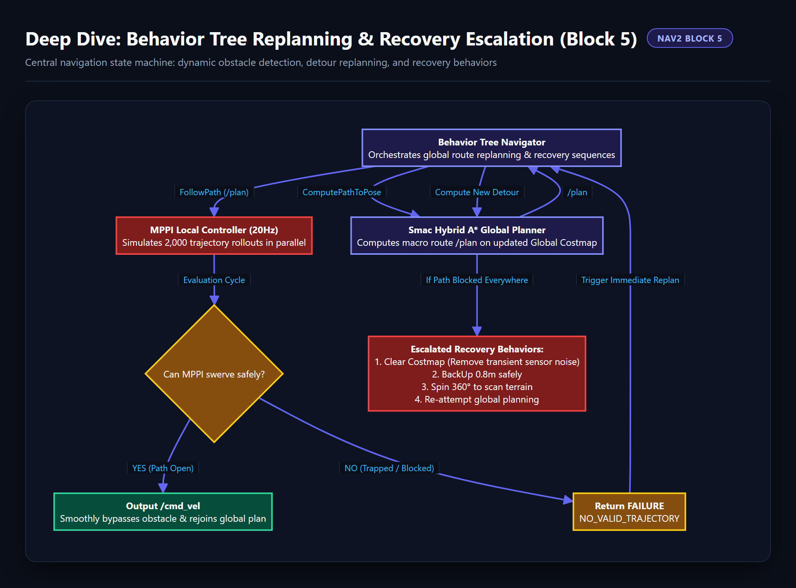
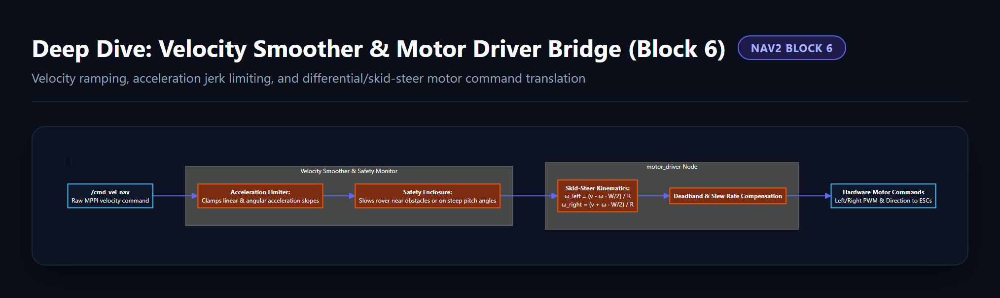

# 🗺️ Nav2 Navigation & Path Planning Diagrams (`General_Docs/3-Nav2/`)

This directory contains the visual pipeline graphs and granular block deep-dive diagrams for the **Nav2 Navigation & Path Planning Subsystem** (Smac Hybrid A* planner, MPPI controller, costmap bridges, and Behavior Trees).

---

## 📸 Diagram Gallery

### 1. Master Pipeline

---

### 2. Costmap Bridge Ingestion Node (3D BBox to PointCloud2)

---

### 3. Global vs Local Rolling Window Costmap Servers

---

### 4. Smac Hybrid A* Global Planner (Reeds-Shepp Search)

---

### 5. MPPI Controller (2,000 Rollouts @ 20Hz & Critics)

---

### 6. Behavior Tree Replanning & Recovery Escalation

---

### 7. Velocity Smoother & Skid-Steer Motor Driver Bridge

