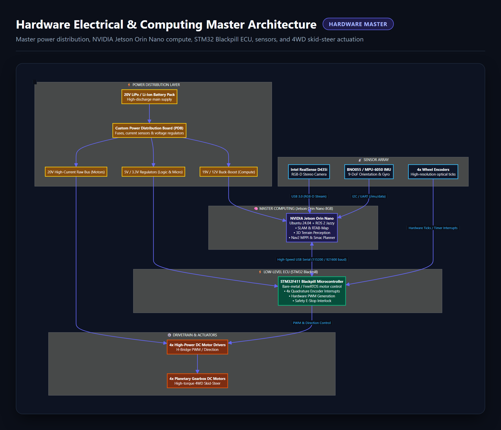
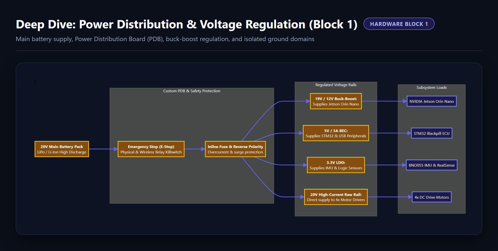
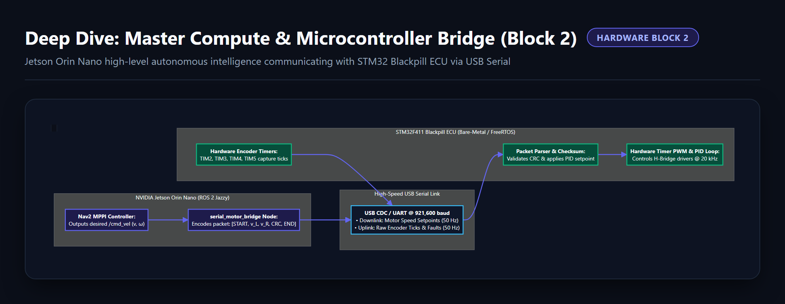
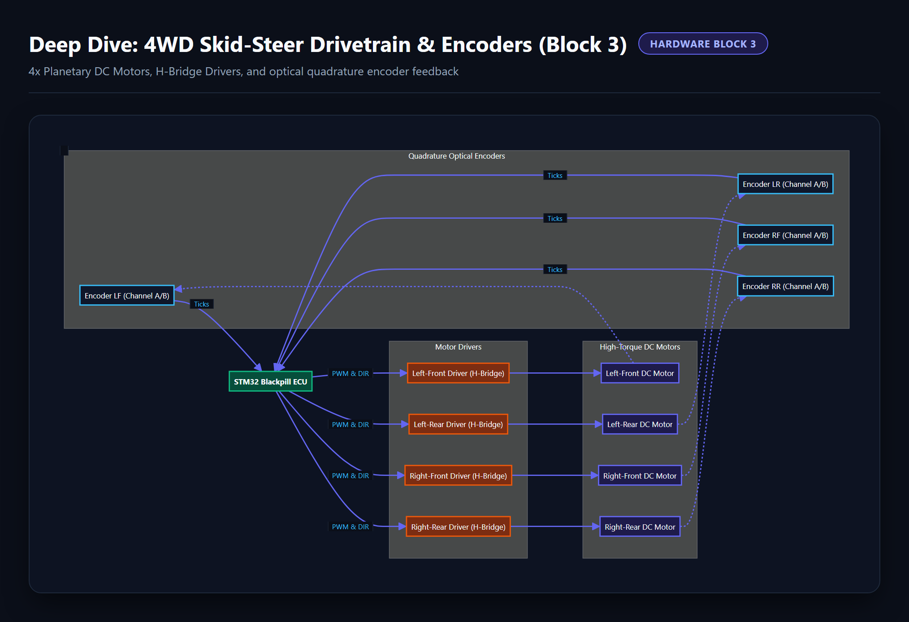
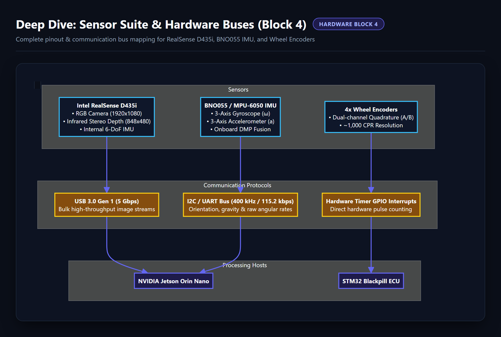
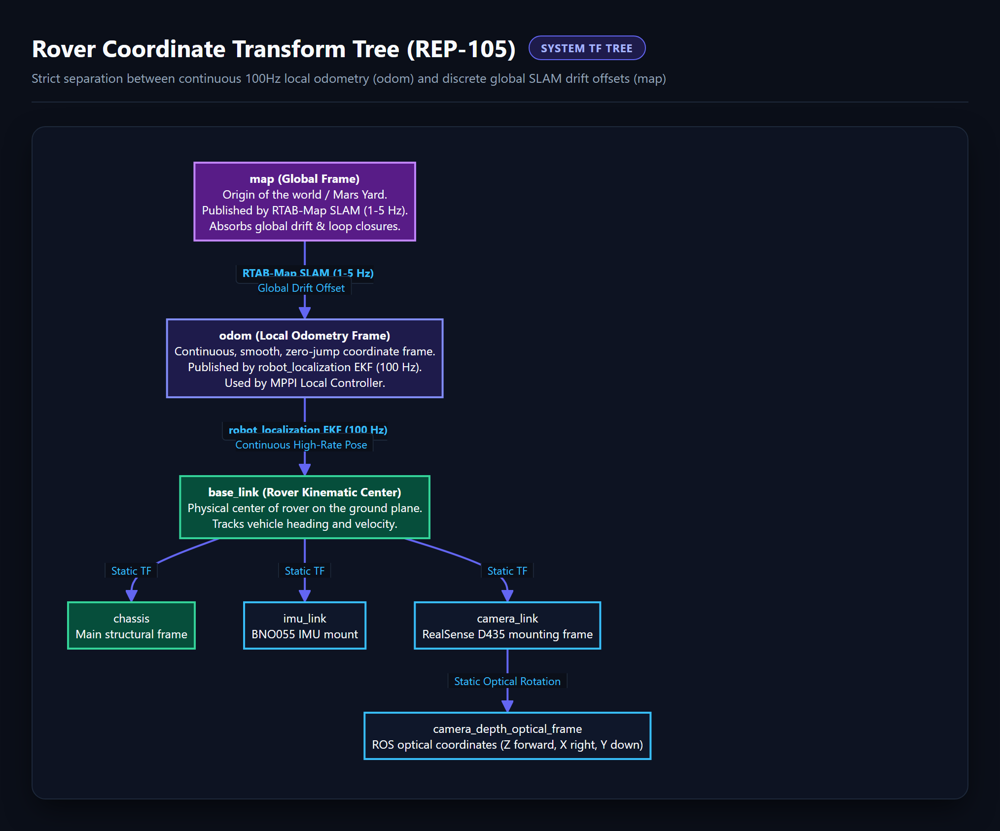

# ⚙️ Hardware, Electrical & Actuation Architecture (`General_Docs/4-Hardware/`)

This directory contains the electrical schematics, power distribution diagrams, computing architecture graphs, and hardware component specifications for the Autonomous-27 rover.

---

## 📸 Diagram Gallery

### 1. Master Hardware Architecture

---

### 2. Power Distribution Board (PDB) & Voltage Regulators

---

### 3. Master Compute (Jetson Orin Nano) & ECU (STM32 Blackpill) Bridge

---

### 4. 4WD Skid-Steer Drivetrain, Drivers & Quadrature Encoders

---

### 5. Sensor Suite & Communication Hardware Buses

---

### 6. REP-105 Rover Coordinate Transform Tree (TF Hierarchy)

---

## 📄 Engineering Documentation
* [`hardware_specs.md`](hardware_specs.md): Electrical schematics, motor specifications, battery sizing, and mechanical limits.
* [`index.html`](index.html): Interactive Hardware Dashboard & Component Visualizer.
