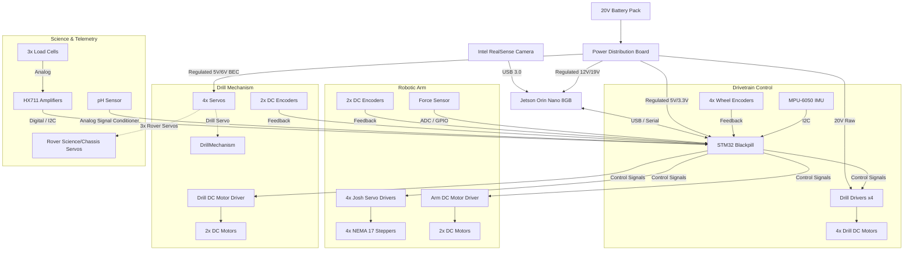

# RoverTech Hardware Specifications

This document outlines the hardware components, specifications, and architecture of the Rover project.

---

## 1. Drivetrain & Mobile Base
*   **Motors**: 4× DC motors salvaged from drills
    *   *Voltage*: 20V
    *   *Torque*: 50 Nm each
    *   *Drivers*: Internal drivers from the drills are reused to drive the motors.
*   **Power System**: 20V battery packs (shipped with the drills).
    *   *Quantity*: TBD (still figuring out how many battery packs will be used in parallel/series).
*   **Sensors**:
    *   *IMU*: MPU-6050 (6-axis Inertial Measurement Unit)
    *   *Wheel Encoders*: 4× encoders (one per wheel, exact model TBD)
    *   *Depth Camera*: Intel RealSense Depth Camera (for visual processing, mapping, and obstacle avoidance)
    *   *Load Cells*: 3× load cells (typically for science payload weighing, suspension telemetry, or soil collection analysis)
    *   *pH Sensor*: 1× pH sensor (for soil chemical composition analysis)
*   **Actuators**:
    *   3× small servo motors (typically for science payload mechanisms, camera gimbals, or soil cover mechanisms)
*   **Controllers & Compute**:
    *   *Main Compute*: Jetson Orin Nano (8GB RAM)
    *   *Motor Control MCU*: STM32 Blackpill (STM32F411 or STM32F401 based board)

---

## 2. Robotic Arm
*   **Joint Motors**:
    *   4× NEMA 17 stepper motors.
    *   2× DC motors + encoders (exact specs TBD).
*   **Actuator Drivers**:
    *   4× Servo Drivers from "Things by Josh" (Joshua Vasquez / custom closed-loop servo controller boards).
*   **Sensors**:
    *   1× Force sensor (typically an FSR or micro load cell placed on the end effector/gripper to measure grip force).

---

## 3. Drill Mechanism
*   **Motors**: 2× DC motors + encoders (exact specs TBD).
*   **Actuators**:
    *   1× small servo motor (typically for drill deployment, angle adjustment, or shutter/gate control).

---

## 4. Suggested & Missing Components (For Review)
Based on the current list of components, the following critical hardware elements are missing to make the rover operational:

### A. Power Distribution & Regulation
*   **Power Distribution Board (PDB)**: A central board to clean up wiring and distribute power.
*   **Buck Converters / Voltage Regulators**:
    *   *Jetson Orin Nano Power*: Needs a stabilized supply (accepts 9V–20V, but a regulated 12V or 19V supply is recommended).
    *   *STM32, IMU, and Logic Power*: Regulated 5V and 3.3V.
    *   *Servos Power*: Regulated 5V or 6V high-current BEC (Battery Eliminator Circuit). Small servos can draw up to 1-2A each under stall.
    *   *Josh's Servo Drivers*: Need to verify their voltage rating to ensure they can run directly off the 20V battery packs.

### B. Motor Drivers (Missing for Arm & Drill)
*   **Arm DC Motors**: You have 2× DC motors on the arm, but only 4× "Things by Josh" drivers (which likely run the 4× NEMA 17 steppers). You need a dual DC motor driver (e.g., L298N, TB6612FNG, or Cytron MD10C / MDD10A) for the arm's DC motors.
*   **Drill DC Motors**: You have 2× DC motors in the drill. You need a dual DC motor driver (e.g., Cytron MDD10A or similar high-current driver depending on the drill motor specs) to control these from the STM32.

### C. Sensor Interfaces & Signal Conditioning
*   **Load Cell Amplifier**: Load cells output tiny analog voltages (millivolts). You will need **HX711** amplifier modules (usually 1 per load cell, or a multi-channel ADC) to interface them with the STM32.
*   **pH Sensor Signal Conditioner**: If using an analog pH probe, you need a signal conditioning board (like the DFRobot Gravity pH meter board) to convert the high impedance probe signal to a 0-3V analog voltage readable by the STM32 ADC.
*   **Force Sensor Interface**: If using a Force Sensitive Resistor (FSR), you will need a simple voltage divider circuit (resistors) to read it via the STM32 ADC.

### D. Wireless Communications
*   **Transceivers / Bridges**: A reliable long-range radio link to control the rover from the Ground Control Station (GCS). Common choices:
    *   *Wi-Fi Bridge*: Ubiquiti Bullet or Rocket (5 GHz) with omnidirectional antennas.
    *   *RC Link (Manual backup)*: ELRS (ExpressLRS) or FrSky receiver for manual override.

### E. Safety & Controls
*   **Emergency Stop (E-Stop)**: Physical latching button on the chassis to immediately cut motor power, plus a wireless relay receiver for remote E-stop functionality (required for safety and most competitions).

---

## 5. System Architecture Diagram

