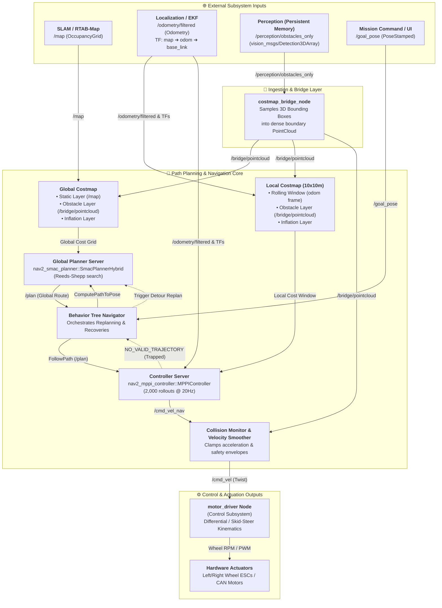

# ERC 2026 Path Planning & Control Architecture

This package provides the complete autonomous navigation, obstacle avoidance, and motion control stack for the **ERC 2026 Rover**, integrating **ROS 2 Nav2**, the **Smac Hybrid A\* Global Planner**, the **MPPI Unified Local Planner & Controller**, and downstream **Motor Control Hardware Interfaces**.

---

## 🧭 1. System Overview: Perception, SLAM, Path Planning & Control

The rover's autonomous pipeline strictly separates **Visual SLAM & State Estimation**, **3D Obstacle Perception**, **Macro & Micro Path Planning**, and **Motor Actuation**:

```
                      [ RealSense D435 Hardware / Simulation ]
                                   │               │
     /camera/depth/color/points    │               │ /camera/color/image_raw + CameraInfo
     (3D Point Cloud)              │               │ /camera/depth/image_rect_raw (Depth Image)
                                   ▼               ▼
                 +─────────────────────+       +──────────────────────+
                 │  PERCEPTION MODULE  │       │   VISUAL SLAM MODULE │
                 │ (Rocks & Costmaps)  │       │      (RTAB-Map)      │
                 +──────────┬──────────+       +───────────▲──────────+
                            │                              │
                            ├────► /perception/aruco_pose ─┘
                            │      (Landmark Loop-Closure Reset)
                            ▼
           /perception/obstacles_only (vision_msgs/Detection3DArray)
                            │
                            ▼
                 +─────────────────────+
                 │ COSTMAP BRIDGE NODE │
                 │ (3D BBox -> Points) │
                 +──────────┬──────────+
                            │ /bridge/pointcloud (sensor_msgs/PointCloud2)
                            ▼
        ┌─────────────────────────────────────────────────────────────┐
        │                 NAV2 PATH PLANNING STACK                    │
        │                                                             │
        │  [ Global Costmap ] ──► [ Smac Hybrid A* Global Planner ]   │
        │                                  │ /plan                    │
        │                                  ▼                          │
        │  [ Local Costmap  ] ──► [ MPPI Local Planner & Controller ] │
        └──────────────────────────────┬──────────────────────────────┘
                                       │ /cmd_vel (geometry_msgs/Twist)
                                       ▼
        ┌─────────────────────────────────────────────────────────────┐
        │             MOTOR DRIVER (CONTROL SUBSYSTEM)                │
        │  • Skid-Steer / Differential Drive Kinematic Decomposition │
        │  • Output: Left & Right Wheel RPM / CAN Bus Motor Commands │
        └──────────────────────────────┬──────────────────────────────┘
                                       ▼
                             [ Physical Motors ]
```

---

## 🏛️ 2. Detailed Path Planning + Control Architecture

In modern autonomous robotics, rather than using separate, decoupled modules for local planning and control, our architecture unifies **Local Path Adjustment (Real-time Swerving)** and **Kinematic Control** directly inside the **MPPI Controller** running at **20 Hz**.

```
┌─────────────────────────────────────────────────────────────────────────────────────────────┐
│ 1. GLOBAL PLANNER (Smac Hybrid A*)                                                          │
│ • Computes the initial macro-highway from Start to Goal (across 50+ meters).                │
│ • Uses Reeds-Shepp vehicle kinematics (respects 0.8m minimum turning radius).               │
│ • Outputs: /plan (nav_msgs/Path)                                                            │
└──────────────────────────────────────────────┬──────────────────────────────────────────────┘
                                               │
                                               ▼
┌─────────────────────────────────────────────────────────────────────────────────────────────┐
│ 2 & 3. UNIFIED LOCAL PLANNER + CONTROLLER (MPPI Controller)                                 │
│                                                                                             │
│ [ Local Planning Function ]                                                                 │
│ • Scans immediate obstacles in a 10m x 10m rolling window from /local_costmap/costmap.      │
│ • Samples 2,000 candidate trajectory rollouts every 50ms (20 Hz).                           │
│ • Dynamically adjusts the path to swerve smoothly around newly appeared obstacles.         │
│                                                                                             │
│ [ Control Function ]                                                                        │
│ • Evaluates vehicle velocity and acceleration limits.                                       │
│ • Optimizes cost critics (ConstraintCritic, PathAlignCritic, GoalCritic, CostCritic).       │
│ • Outputs: /cmd_vel_nav (linear velocity vx, angular velocity wz)                          │
└──────────────────────────────────────────────┬──────────────────────────────────────────────┘
                                               │
                                               ▼
┌─────────────────────────────────────────────────────────────────────────────────────────────┐
│ 4. SAFETY & SMOOTHING LAYER (Collision Monitor & Velocity Smoother)                         │
│ • Validates robot footprint safety zones and limits jerk.                                   │
│ • Outputs: /cmd_vel (geometry_msgs/Twist)                                                   │
└──────────────────────────────────────────────┬──────────────────────────────────────────────┘
                                               │
                                               ▼
┌─────────────────────────────────────────────────────────────────────────────────────────────┐
│ 5. MOTOR HARDWARE DRIVER (Control Subsystem)                                                │
│ • Converts /cmd_vel (m/s and rad/s) into left/right wheel RPMs or PWM for motor ESCs.       │
│ • Differential / Skid-steer kinematics: v_left = vx - (wz * L / 2), v_right = vx + (wz*L/2)│
└──────────────────────────────────────────────┬──────────────────────────────────────────────┘
                                               ▼
                                  [ Hardware Actuators / ESCs ]
```

---

## 🔄 3. End-to-End Pipeline & Data Flowchart



---

## 📊 4. Summary of Block Interfaces & Topics

| Subsystem / Block | Role | Inputs Consumed | Outputs Produced | Message Type |
| :--- | :--- | :--- | :--- | :--- |
| **`costmap_bridge_node`** | Translates persistent 3D obstacles into dense point clouds | `/perception/obstacles_only` | `/bridge/pointcloud` | `vision_msgs/Detection3DArray` ➔ `sensor_msgs/PointCloud2` |
| **`global_costmap`** | Global obstacle map across the full terrain | `/map`, `/bridge/pointcloud`, TF | `/global_costmap/costmap` | `nav_msgs/OccupancyGrid` |
| **`local_costmap`** | High-frequency rolling window (10x10m) centered on rover | `/bridge/pointcloud`, `/odometry/filtered`, TF | `/local_costmap/costmap` | `nav_msgs/OccupancyGrid` |
| **`planner_server` (Smac)** | Calculates kinematically feasible global macro path | `/goal_pose`, `/global_costmap/costmap` | `/plan` | `nav_msgs/Path` |
| **`controller_server` (MPPI)** | Real-time obstacle avoidance + velocity control | `/plan`, `/local_costmap/costmap`, `/odometry/filtered` | `/cmd_vel_nav`, `/local_plan` | `geometry_msgs/Twist`, `nav_msgs/Path` |
| **`collision_monitor`** | Emergency safety envelope & velocity clamping | `/cmd_vel_nav`, `/bridge/pointcloud` | `/cmd_vel` | `geometry_msgs/Twist` |
| **`bt_navigator`** | Master state machine (Replanning & Recovery) | Feedback from Planner & Controller | Lifecycle & recovery triggers | Behavior Tree Action XML |
| **`motor_driver` (Control)** | Actuation interface to physical wheels | `/cmd_vel` | Left & Right wheel RPM / CAN packets | Custom Motor / CAN Frames |

---

## 🛠️ 5. System Prerequisites & Dependencies

Before building this module, install ROS 2 Navigation2 and its bringup packages:

```bash
sudo apt update
sudo apt install ros-humble-navigation2 ros-humble-nav2-bringup ros-humble-vision-msgs -y
```

### ROS 2 Package Dependencies
- `rclcpp`
- `sensor_msgs`
- `vision_msgs` (Standard ROS 2 Vision Messages)
- `geometry_msgs`
- `nav_msgs`
- `nav2_bringup`
- `nav2_smac_planner`
- `nav2_mppi_controller`
- `nav2_costmap_2d`
- `nav2_bt_navigator`

---

## 🏗️ 6. Building the Package

```bash
# 1. Navigate to workspace root
cd /path/to/your/cloned/repository

# 2. Build the path planner package
colcon build --packages-select erc_path_planner
source install/setup.bash
```

---

## 🚀 7. Execution & Quickstart

```bash
# Terminal 1: Launch Nav2 Path Planning Stack
ros2 launch erc_path_planner path_planning.launch.py

# Terminal 2: Launch RViz Visualization Dashboard
ros2 launch erc_path_planner rviz.launch.py

# Terminal 3: Run Costmap Perception Bridge (if testing standalone)
ros2 run erc_path_planner costmap_bridge_node
```

---

## 🧪 8. Standalone Testing & Benchmarking Suite

For standalone closed-loop testing, mock simulation, and automated multi-scenario benchmark evaluation without Gazebo or hardware:
* See the testing package at [`testing/PathPlanner/`](file:///e:/meseket/Autonmous-27/testing/PathPlanner/README.md).
* See the detailed integration and GitHub tasks document at [`PathPlanner_doc.md`](file:///e:/meseket/Autonmous-27/PathPlanning/PathPlanner_doc.md).

