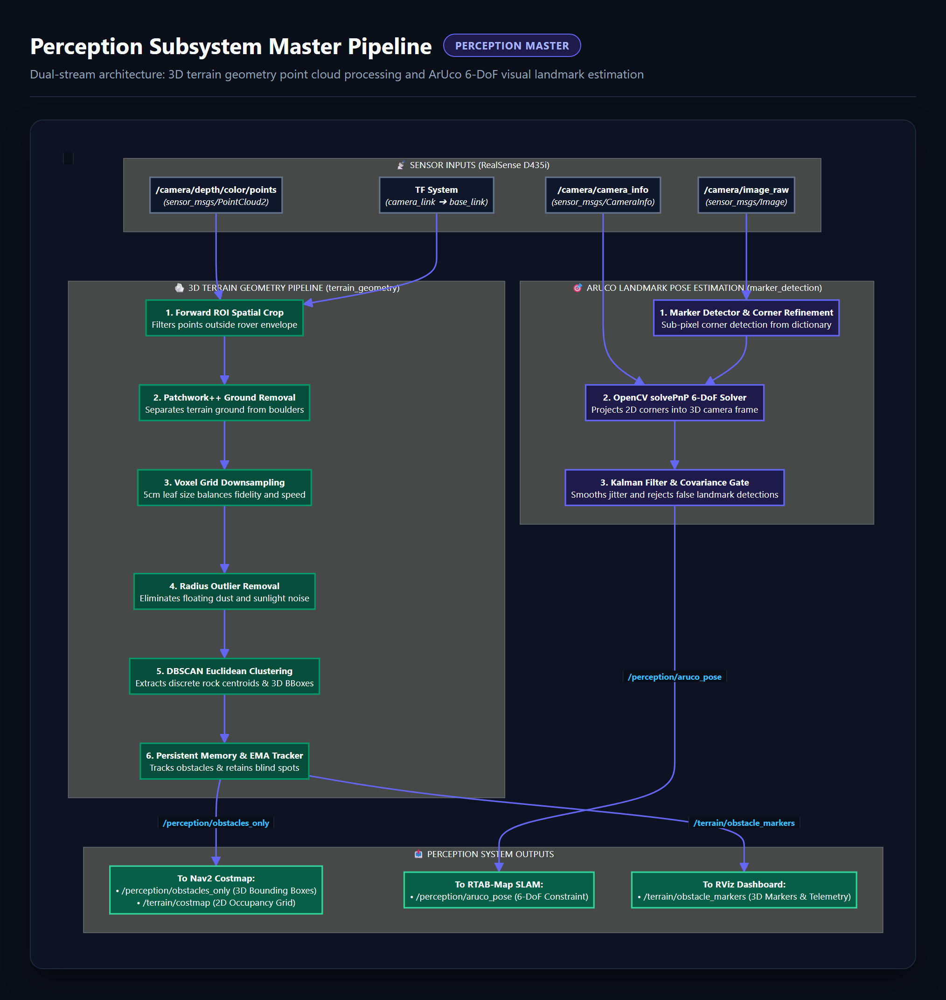

# Perception Subsystem: 3D Terrain Geometry, Obstacle Detection & ArUco Vision

The **Perception Subsystem** provides 3D spatial awareness, terrain geometry segmentation, obstacle extraction, and visual landmark/marker tracking for an autonomous Mars-analog ERC rover.

---

## 🏛️ 1. Subsystem Architecture & Packages

The Perception workspace contains two primary functional modules alongside their custom interface definition packages:

```
Perception/
├── docs/                                    # Architectural HTML & AI implementation guides
│   ├── perception.html                      # Interactive Glassmorphism Architecture Report
│   └── PerceptionAiGuide.md                 # Detailed AI Roadmap & Milestone Gates
│
├── rviz/                                    # 🌐 Centralized Master RViz View
│   └── perception_system_view.rviz          # Unified visualizer (Terrain + Obstacles + ArUco + TF)
│
├── terrain_geometry/                        # 🪨 Core 3D Point Cloud Processing Package
│   ├── terrain_geometry/                    # Python pipeline (ROI, Ground, Voxel, DBSCAN, Costmap)
│   ├── config/                              # Terrain configuration YAMLs
│   ├── launch/                              # Standalone terrain & RViz launchers
│   └── rviz/                                # 📦 Modular Package RViz View
│       └── terrain_geometry_view.rviz       # Dedicated Terrain Geometry display config
│
├── terrain_geometry_msgs/                   # 📜 Custom Terrain Message Definitions
│   └── msg/
│       ├── ObstacleFeature.msg              # Single obstacle centroid & 3D bounding box dimensions
│       └── ObstacleFeatureArray.msg         # Array of detected obstacle features
│
├── marker_detection/                        # 🎯 ArUco Vision & SolvePnP 3D Pose Package
│   ├── marker_detection/                    # Multi-stage detection, SolvePnP, Kalman tracking
│   ├── config/                              # Marker detection YAML parameters
│   ├── launch/                              # Marker detection launchers
│   └── rviz/                                # 📦 Modular Package RViz View
│       └── marker_detection_view.rviz       # Dedicated Marker Detection display config
│
└── marker_detection_msgs/                   # 📜 Custom Marker Message Definitions
    └── msg/
        ├── MarkerPose.msg                   # Filtered 6-DOF marker pose with covariance
        └── MarkerPoseArray.msg              # Array of detected active markers
```

---

## 🔄 Subsystem Architecture Pipeline



---

## 📡 2. Input & Output Topics

### A. Subscriptions (Sensor Inputs - Unified Standard)
*   **`/camera/depth/color/points`** (`sensor_msgs/msg/PointCloud2`): Raw 3D point cloud in the camera optical frame (used by `terrain_geometry`).
*   **`/camera/image_raw`** (`sensor_msgs/msg/Image`): Raw RGB camera feed (used by `marker_detection`).
*   **`/camera/depth/image_raw`** (`sensor_msgs/msg/Image`): Depth image stream (used by `marker_detection`).
*   **`/camera/camera_info`** (`sensor_msgs/msg/CameraInfo`): Camera intrinsic calibration matrix ($f_x, f_y, c_x, c_y$).
*   **`/tf` & `/tf_static`** (`tf2_msgs/msg/TFMessage`): Dynamic and static coordinate transforms (`camera_link` $\rightarrow$ `base_link`).

### B. Publications (Outputs to SLAM & Nav2)
*   **`/perception/local_bboxes`** (`vision_msgs/msg/Detection3DArray`): Raw single-frame 3D rock bounding boxes.
*   **`/perception/obstacles_only`** (`vision_msgs/msg/Detection3DArray`): Smoothed, persistent rock obstacles with blind-spot retention for the Nav2 Costmap Server.
*   **`/terrain/costmap`** (`nav_msgs/msg/OccupancyGrid`): Direct 2D inflated obstacle costmap at 5cm resolution.
*   **`/terrain/obstacle_features`** (`terrain_geometry_msgs/msg/ObstacleFeatureArray`): Obstacle telemetry (centroid, size dimensions, distance).
*   **`/terrain/obstacle_markers`** (`visualization_msgs/msg/MarkerArray`): 3D visual bounding boxes and text labels for RViz2.
*   **`/perception/aruco_pose`** (`geometry_msgs/msg/PoseStamped`): 6-DOF marker target pose for Saif SLAM loop closure / drift hard resets.

### C. Debug Publications (Active when `publish_debug_topics: True`)
*   **`/terrain/debug/ground_cloud`** (`sensor_msgs/msg/PointCloud2`): Ground planes separated by Patchwork++.
*   **`/terrain/debug/voxel_cloud`** (`sensor_msgs/msg/PointCloud2`): Point cloud filtered by Voxel Downsampling.
*   **`/terrain/debug/clustered_cloud`** (`sensor_msgs/msg/PointCloud2`): Points colored by DBSCAN Cluster IDs.

---

## 🖥️ 3. RViz2 Visualization Setup: Modular vs Centralized

To maintain a clean separation of concerns, the workspace provides both **modular package-level views** and a **centralized master perception view**:

| View Scope | Configuration Path | What It Displays |
| :--- | :--- | :--- |
| **Centralized System View** | `Perception/rviz/perception_system_view.rviz` | **Full Perception Subsystem**: Live RGB stream, 3D PointCloud, DBSCAN clusters, 2D Inflated Costmap, Persistent Obstacle BBoxes, and ArUco 3D target markers/TF frames simultaneously. |
| **Terrain Geometry View** | `Perception/terrain_geometry/rviz/terrain_geometry_view.rviz` | **Terrain Only**: PointCloud, ground separation, voxel grid, cluster markers, and `/terrain/costmap`. |
| **Marker Detection View** | `Perception/marker_detection/rviz/marker_detection_view.rviz` | **ArUco Only**: RGB image overlay with 2D corner detections, 3D marker coordinate axes, and `/marker_detection/targets`. |

---

## 🚀 4. Running & Launching

### A. Build the Workspace
```bash
cd /path/to/your/cloned/repository
source /opt/ros/humble/setup.bash # Or jazzy
colcon build
source install/setup.bash
```

### B. Launch Options & CLI Overrides for Each Node

#### 1. Terrain Geometry (`terrain.launch.py`)
Launches the 8-stage 3D point cloud processing pipeline (TF -> ROI -> Ground -> Voxel -> Outlier -> DBSCAN -> Costmap):

| Launch Argument | Default Value | Description |
| :--- | :--- | :--- |
| `use_sim_time` | `true` | Set `true` for Gazebo clock, `false` for physical robot. |
| `publish_debug_topics` | `true` | Publishes `/terrain/debug/clustered_cloud` and `ground_cloud`. |
| `ground_removal_backend`| `auto` | `auto` (uses Patchwork++ if available, else NumPy), `patchwork`, or `fallback`. |
| `input_pointcloud_topic`| `/camera/depth/color/points` | Raw PointCloud2 topic name. |
| `target_frame` | `base_link` | Coordinate frame to project the point cloud and costmap into. |
| `cluster_eps` | `0.3` | DBSCAN distance threshold in meters between obstacle points. |
| `grid_resolution` | `0.05` | Resolution of the output OccupancyGrid costmap (5 cm per cell). |
| `costmap_inflation_radius` | `0.6` | Safety inflation radius around obstacles in meters. |

```bash
# Example: Launch with custom cluster size and patchwork backend
ros2 launch terrain_geometry terrain.launch.py \
  ground_removal_backend:=auto \
  publish_debug_topics:=true \
  costmap_inflation_radius:=0.7

# Launch Dedicated Terrain RViz:
ros2 launch terrain_geometry rviz.launch.py
```

#### 2. Marker Detection (`marker_detection.launch.py`)
Launches 2D ArUco detection, SolvePnP 3D pose estimation, and temporal Kalman tracking:

| Launch Argument | Default Value | Description |
| :--- | :--- | :--- |
| `use_sim_time` | `false` | Set `true` when running in Gazebo simulation! |
| `rgb_topic` | `/camera/color/image_raw` | RGB camera stream topic. In Gazebo: `/camera/image_raw`. |
| `depth_topic` | `/camera/aligned_depth_to_color/image_raw`| Depth stream topic. In Gazebo: `/camera/depth/image_raw`. |
| `camera_info_topic` | `/camera/color/camera_info` | Camera info topic. In Gazebo: `/camera/camera_info`. |
| `params_file` | `config/marker_detection.yaml` | Path to custom YAML configuration parameters. |

```bash
# Example: Launch in Simulation Mode (Gazebo topic remappings)
ros2 launch marker_detection marker_detection.launch.py \
  rgb_topic:=/camera/image_raw \
  depth_topic:=/camera/depth/image_raw \
  camera_info_topic:=/camera/camera_info \
  use_sim_time:=true

# Launch Dedicated Marker RViz:
ros2 launch marker_detection rviz.launch.py use_sim_time:=true
```

#### 3. Full Marker Branch (`marker_branch.launch.py`)
Launches the complete 4-node marker pipeline (Detector + TF Broadcaster + Global Map + Action Server):

```bash
ros2 launch marker_detection marker_branch.launch.py \
  rgb_topic:=/camera/image_raw \
  depth_topic:=/camera/depth/image_raw \
  camera_info_topic:=/camera/camera_info \
  use_sim_time:=true
```

#### 4. Unified Perception Subsystem (`perception_system.launch.py`)
Spins up both `terrain_geometry` and `marker_detection` concurrently:

```bash
# Launch both pipelines together:
ros2 launch terrain_geometry perception_system.launch.py \
  use_sim_time:=true \
  launch_marker_branch:=true \
  launch_rviz:=true
```

---

### C. Step-by-Step: Launching Each Node with its Dedicated RViz View

#### 🌿 Workflow 1: Terrain Geometry with Dedicated RViz View
Use this workflow to test ground removal, 3D rock clustering, and 2D costmap inflation:

* **Terminal 1 (Simulation):** Launch Gazebo Mars Yard world and rover:
  ```bash
  ros2 launch my_robot_description gazebo.launch.py world:=world1.world
  ```
* **Terminal 2 (Perception Node):** Launch the 3D terrain processing pipeline:
  ```bash
  ros2 launch terrain_geometry terrain.launch.py
  ```
* **Terminal 3 (Dedicated RViz):** Launch RViz pre-configured for terrain inspection:
  ```bash
  ros2 launch terrain_geometry rviz.launch.py
  ```
* **Terminal 4 (Teleoperation):** Drive the rover toward rocks:
  ```bash
  ros2 run teleop_twist_keyboard teleop_twist_keyboard
  ```
* **What to verify in RViz:**
  1. Fixed Frame is set to `map` (the grid stays locked, rover moves across the screen).
  2. The 3D rover body model (`RobotModel`) is rendered.
  3. The local inflated costmap (`/terrain/costmap`) appears on the ground beneath the rover.
  4. Rocks have 3D bounding boxes and text labels (`/terrain/obstacle_markers`).
  5. Colored point clusters (`/terrain/debug/clustered_cloud`) match the obstacles in Gazebo.

---

#### 🎯 Workflow 2: Marker Detection with Dedicated RViz View
Use this workflow to test 2D ArUco detection, SolvePnP 6-DoF pose estimation, and 3D coordinate frames:

* **Terminal 1 (Simulation):** Launch Gazebo with a world containing ArUco markers:
  ```bash
  ros2 launch my_robot_description gazebo.launch.py world:=world_Rotated_Aruco.world
  ```
* **Terminal 2 (Perception Node):** Launch marker detection with simulation topic remappings:
  ```bash
  ros2 launch marker_detection marker_detection.launch.py \
    rgb_topic:=/camera/image_raw \
    depth_topic:=/camera/depth/image_raw \
    camera_info_topic:=/camera/camera_info \
    use_sim_time:=true
  ```
* **Terminal 3 (Dedicated RViz):** Launch RViz pre-configured for marker inspection:
  ```bash
  ros2 launch marker_detection rviz.launch.py use_sim_time:=true
  ```
* **Terminal 4 (Teleoperation):** Rotate the rover toward an ArUco cube:
  ```bash
  ros2 run teleop_twist_keyboard teleop_twist_keyboard
  ```
* **What to verify in RViz:**
  1. The **Raw RGB Feed** shows the Gazebo camera stream.
  2. The **2D Detection Debug Feed** shows green bounding boxes with ArUco IDs.
  3. The **3D Pose Debug Feed** shows colored coordinate axes (X=Red, Y=Green, Z=Blue) drawn on the marker.
  4. In the 3D scene, a new TF coordinate frame `aruco_marker_<id>` appears at the marker's 3D position.

---

#### 🌐 Workflow 3: Full Perception Subsystem with Master Centralized RViz View
Use this workflow to run both pipelines concurrently:

* **Terminal 1 (Simulation):** Launch the final world containing both rocks and ArUco markers:
  ```bash
  ros2 launch my_robot_description gazebo.launch.py world:=final_world_RA.world
  # Or use the test launcher script directly:
  ./testing/LunchWorld&Rover.sh
  ```
* **Terminal 2 (Unified Perception):** Launch both terrain geometry and the full marker branch:
  ```bash
  ros2 launch terrain_geometry perception_system.launch.py \
    use_sim_time:=true \
    launch_marker_branch:=true
  ```
* **Terminal 3 (Master RViz):** Launch the centralized master visualizer:
  ```bash
  rviz2 -d Perception/rviz/perception_system_view.rviz --ros-args -p use_sim_time:=true
  ```

---

## 🧪 5. Testing & Validation Workflows

### Method A: Testing in Gazebo Mars Yard Simulation (Recommended)

#### Quickest: Interactive Launcher
```bash
# Terminal 1: Simulation World & Rover
bash scripts/launch_sim.sh   # Select Option 1 (or Option 2 for standalone teleop)

# Terminal 2: Teleop GUI
ros2 run my_robot_description teleop_gui.py

# Terminal 3: Standalone Perception
bash scripts/launch_perception.sh # Select Option 2 (Standalone Test Launcher)
```

#### Manual Playbook:
1. **Start World & Spawn Rover:**
   ```bash
   ros2 launch my_robot_description gazebo.launch.py publish_map_tf:=true
   ```
2. **Drive the Rover with Teleop GUI:**
   ```bash
   ros2 run my_robot_description teleop_gui.py
   ```
3. **Launch Standalone Perception with Visualization:**
   ```bash
   ros2 launch terrain_geometry test_perception_standalone.launch.py
   ```
4. **Inspect RViz2:**
   Verify `/perception/local_bboxes` and `/perception/obstacles_only` (`vision_msgs/msg/Detection3DArray`) and visual markers on `/terrain/obstacle_markers`.

### Method B: Testing with ROS 2 Bag Playback
1. **Publish Camera TF (if not in bag):**
   ```bash
   ros2 run tf2_ros static_transform_publisher 0.5 0 0.5 0 0 0 base_link camera_link
   ```
2. **Play Bag:**
   ```bash
   ros2 bag play /path/to/bag_file/
   ```
3. **Launch Perception:**
   ```bash
   ros2 launch terrain_geometry terrain.launch.py
   ```

---

## ⚠️ 6. Important Notes on QoS Configuration

RealSense camera drivers and Gazebo simulation plugins publish raw sensor streams (`/camera/depth/color/points`, `/camera/image_raw`) using **Best Effort** QoS. 

*   All perception input subscribers are configured to use `QoSReliabilityPolicy.BEST_EFFORT` to prevent silent message drops.
*   If viewing raw feeds in RViz2, make sure each display's **Reliability Policy** is set to **Best Effort**.

---

## 🤖 7. Simulation vs. Physical Rover Deployment (Topic Unification)

To keep the codebase modular and prevent launch discrepancies, all autonomy packages (`terrain_geometry`, `marker_detection`, `rover_slam` RTAB-Map, Nav2, and RViz) are standardized on the following unified topics:

| Sensor Feed | Unified Workspace Topic | Gazebo Sim (`gazebo.launch.py`) | Physical RealSense D435 Default |
| :--- | :--- | :--- | :--- |
| **RGB Stream** | `/camera/image_raw` | `/camera/image_raw` | `/camera/color/image_raw` |
| **Depth Stream** | `/camera/depth/image_raw` | `/camera/depth/image_raw` | `/camera/aligned_depth_to_color/image_raw` |
| **Camera Info** | `/camera/camera_info` | `/camera/camera_info` | `/camera/color/camera_info` |
| **Point Cloud** | `/camera/depth/color/points` | `/camera/depth/color/points` | `/camera/depth/color/points` |
| **Sim Time** | `use_sim_time:=true` | `use_sim_time:=true` | `use_sim_time:=false` |

### 🚀 What to do when deploying on the Physical Rover:

When running on the real rover with the physical Intel RealSense camera driver (`realsense2_camera`), remap the driver's output topics to the unified workspace standard:

```bash
# Option 1: Remap via CLI when launching the RealSense driver
ros2 launch realsense2_camera rs_launch.py \
  pointcloud.enable:=true \
  align_depth.enable:=true \
  rgb_camera.color_topic:=/camera/image_raw \
  rgb_camera.color_info_topic:=/camera/camera_info \
  depth_module.depth_topic:=/camera/depth/image_raw

# Option 2: Pass topics explicitly to marker_detection if driver is already running with defaults
ros2 launch marker_detection marker_detection.launch.py \
  use_sim_time:=false \
  rgb_topic:=/camera/color/image_raw \
  depth_topic:=/camera/aligned_depth_to_color/image_raw \
  camera_info_topic:=/camera/color/camera_info
```

By keeping the workspace unified around `/camera/image_raw`, the entire perception and navigation stack runs identically in simulation and on real hardware without any code changes.


