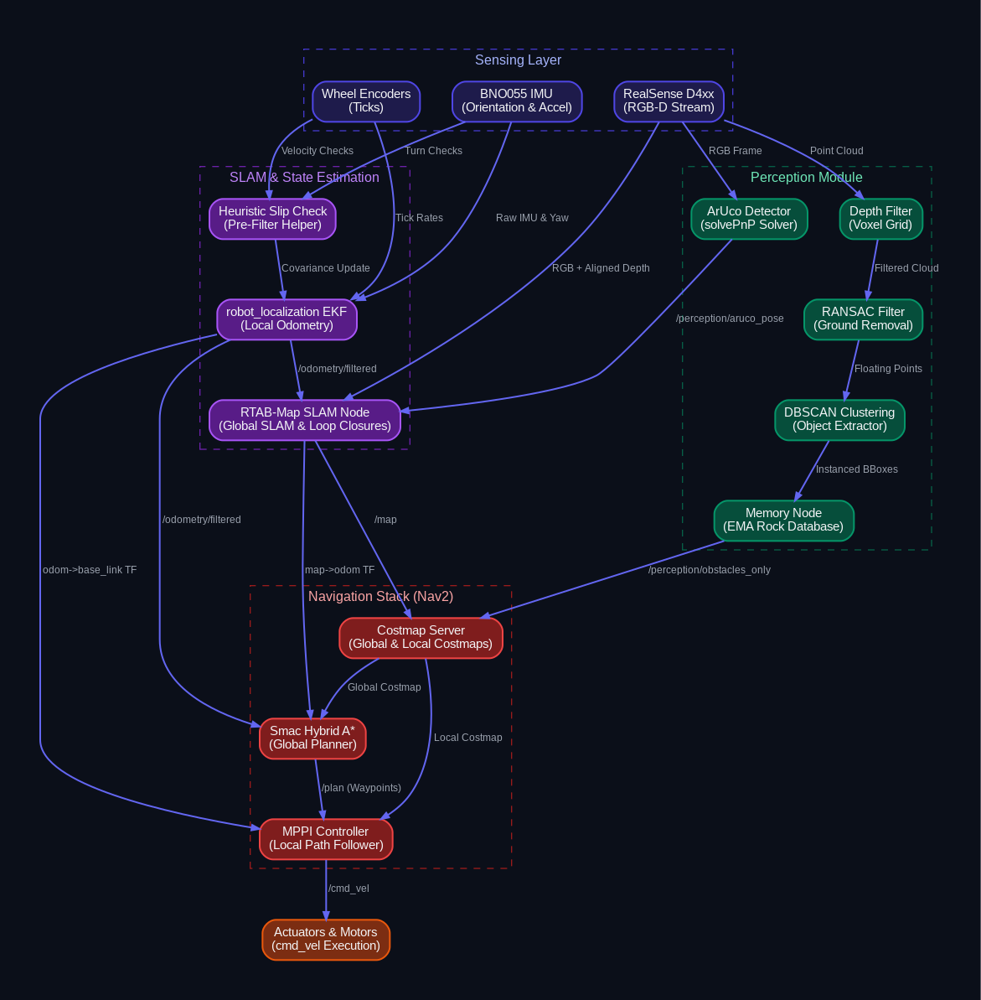

# Autonomous Rover Simulation Workspace

This ROS 2 workspace contains packages for simulating, estimating state, perceiving obstacles, planning paths, and controlling the autonomous rover in the Mars Yard environment.

---

## 🏗️ System Architecture & Data Flow

### 1. End-to-End System Pipeline Diagram



---

### 2. Full Project Block Diagram (Inputs, Outputs & Inter-Node Topics)

```mermaid
graph LR
    %% Styles & Colors
    classDef sensorStyle fill:#1e1b4b,stroke:#4f46e5,stroke-width:2px,color:#f3f4f6;
    classDef perceptionStyle fill:#064e3b,stroke:#059669,stroke-width:2px,color:#f3f4f6;
    classDef slamStyle fill:#581c87,stroke:#a855f7,stroke-width:2px,color:#f3f4f6;
    classDef navStyle fill:#7f1d1d,stroke:#ef4444,stroke-width:2px,color:#f3f4f6;
    classDef actuatorStyle fill:#7c2d12,stroke:#ea580c,stroke-width:2px,color:#f3f4f6;

    %% 1. SENSORS & INPUTS
    subgraph Sensors ["📡 Sensing Layer (Inputs)"]
        RealSense["RealSense D435i<br/><b>RGB-D Camera</b>"]:::sensorStyle
        IMU["BNO055 IMU<br/><b>Orientation & Angular Vel</b>"]:::sensorStyle
        Encoders["Wheel Encoders<br/><b>Tick Rate / Raw Odom</b>"]:::sensorStyle
    end

    %% 2. PERCEPTION BLOCK
    subgraph Perception ["👁️ Perception Module"]
        P_Filter["Depth Filter & RANSAC<br/><i>(Ground Removal)</i>"]:::perceptionStyle
        P_Cluster["DBSCAN Clustering & Memory<br/><i>(EMA Rock Tracker)</i>"]:::perceptionStyle
        P_Aruco["ArUco Detector & Estimator<br/><i>(OpenCV solvePnP)</i>"]:::perceptionStyle
    end

    %% 3. SLAM & STATE ESTIMATION
    subgraph SLAM_Estimation ["🧭 SLAM & State Estimation"]
        S_Slip["Heuristic Slip Checker<br/><i>(Covariance Adaptive)</i>"]:::slamStyle
        S_EKF["robot_localization EKF<br/><i>(Fused Local Odometry)</i>"]:::slamStyle
        S_RTAB["RTAB-Map SLAM<br/><i>(Global SLAM & Loop Closures)</i>"]:::slamStyle
    end

    %% 4. NAVIGATION & PATH PLANNING
    subgraph Navigation ["🗺️ Navigation & Path Planning (Nav2)"]
        N_Costmap["Nav2 Costmap Server<br/><i>(Global & Local Costmaps)</i>"]:::navStyle
        N_Global["Smac Hybrid A* Planner<br/><i>(Global Path Generation)</i>"]:::navStyle
        N_Local["MPPI Controller<br/><i>(Local Trajectory Tracking)</i>"]:::navStyle
    end

    %% 5. ACTUATION & OUTPUT
    subgraph Actuation ["⚙️ Actuation & Motor Control (Outputs)"]
        Motors["Motor Driver / Bridge<br/><i>(Differential / Skid-Steer)</i>"]:::actuatorStyle
    end

    %% CONNECTIONS & TOPICS

    %% Sensors to Perception
    RealSense -->|"/camera/depth/color/points<br/>[sensor_msgs/PointCloud2]"| P_Filter
    RealSense -->|"/camera/color/image_raw<br/>[sensor_msgs/Image]"| P_Aruco

    %% Perception internal
    P_Filter --> P_Cluster

    %% Sensors to SLAM
    Encoders -->|"/wheel/odom_raw<br/>[nav_msgs/Odometry]"| S_Slip
    IMU -->|"/imu/data<br/>[sensor_msgs/Imu]"| S_Slip
    S_Slip --> S_EKF
    Encoders --> S_EKF
    IMU --> S_EKF
    RealSense -->|"/camera/depth/image_rect_raw<br/>[sensor_msgs/Image]"| S_RTAB
    RealSense -->|"/camera/color/image_raw<br/>[sensor_msgs/Image]"| S_RTAB
    P_Aruco -->|"/perception/aruco_pose<br/>[geometry_msgs/PoseStamped]"| S_RTAB

    %% SLAM internal & outputs
    S_EKF -->|"/odometry/filtered<br/>[nav_msgs/Odometry]"| S_RTAB
    S_EKF -->|"odom ➔ base_link<br/>[TF Transform]"| N_Local
    S_EKF -->|"/odometry/filtered<br/>[nav_msgs/Odometry]"| N_Global
    S_EKF -->|"/odometry/filtered<br/>[nav_msgs/Odometry]"| N_Local
    S_RTAB -->|"map ➔ odom<br/>[TF Transform]"| N_Global
    S_RTAB -->|"/map<br/>[nav_msgs/OccupancyGrid]"| N_Costmap

    %% Perception to Nav2
    P_Cluster -->|"/perception/obstacles_only<br/>[vision_msgs/Detection3DArray]"| N_Costmap

    %% Nav2 internal & outputs
    N_Costmap -->|"/global_costmap/costmap<br/>[nav_msgs/OccupancyGrid]"| N_Global
    N_Costmap -->|"/local_costmap/costmap<br/>[nav_msgs/OccupancyGrid]"| N_Local
    N_Global -->|"/plan<br/>[nav_msgs/Path]"| N_Local
    N_Local -->|"/cmd_vel<br/>[geometry_msgs/Twist]"| Motors
```



---

### 3. Module Breakdown: Inputs, Processing & Outputs

| Subsystem / Block | Primary Inputs | Core Processing / Algorithms | Primary Outputs |
| :--- | :--- | :--- | :--- |
| **Sensing Layer** | Physical Mars Yard Environment | Sensor acquisition & hardware bridging | `/camera/*`, `/imu/data`, `/wheel/odom_raw` |
| **Perception** | `/camera/depth/color/points`<br>`/camera/color/image_raw` | Voxel filtering, RANSAC plane extraction, DBSCAN rock clustering, OpenCV ArUco detector + PnP pose estimation | `/perception/obstacles_only` (3D BBoxes)<br>`/perception/aruco_pose` (PoseStamped)<br>`/perception/markers_map` |
| **State Estimation & SLAM** | `/imu/data`<br>`/wheel/odom_raw`<br>`/camera/depth/image_rect_raw`<br>`/perception/aruco_pose` | Heuristic slip detection, 15-state Extended Kalman Filter (`robot_localization`), RTAB-Map graph-based RGB-D SLAM & loop closure | `/odometry/filtered` (nav_msgs/Odometry)<br>`/map` (nav_msgs/OccupancyGrid)<br>`odom ➔ base_link` (TF)<br>`map ➔ odom` (TF) |
| **Navigation (Nav2)** | `/map`<br>`/odometry/filtered`<br>`/perception/obstacles_only`<br>TF Tree (`map ➔ odom ➔ base_link`) | 2D/3D Costmap fusion, Smac Hybrid A* path planner, Model Predictive Path Integral (MPPI) local controller | `/global_costmap/costmap`<br>`/local_costmap/costmap`<br>`/plan` (nav_msgs/Path)<br>`/cmd_vel` (geometry_msgs/Twist) |
| **Actuation & Motors** | `/cmd_vel` (Twist velocity commands) | Skid-steer kinematics conversion, PWM / CAN motor driver execution | Physical wheel rotation / rover movement in Gazebo / Hardware |

---

## 📁 Repository Directory Structure

*   **[Rover/my_robot_description](Rover/my_robot_description)** - URDF / Xacro model description, sensor mount configurations, and Gazebo simulation launch files.
*   **[SLAM/rover_slam](SLAM/rover_slam)** - State estimation (EKF `robot_localization`), RTAB-Map SLAM, visual odometry helper, slip checking, and TF broadcasting.
*   **[Perception/marker_detection](Perception/marker_detection)** - ArUco marker detection, 6-DoF pose estimation, marker mapping, and 3D obstacle tracking.
*   **[PathPlanning/erc_path_planner](PathPlanning/erc_path_planner)** - Nav2 stack configuration (Smac Hybrid A*, MPPI), behavior trees, and costmap bridging.
*   **[Control](Control)** - Motor control architectures, teleoperation scripts, and control documentation.
*   **[testing/PathPlanner](testing/PathPlanner)** - Global path planning benchmarking suite, synthetic map scenarios, and performance reporting.
*   **[worlds](worlds)** - Gazebo simulation worlds (`world1.world`, `marsyard.world`), custom rock and ArUco marker models, and costmap generation tools.
*   **[General_Docs](General_Docs)** - Hardware specifications, migration guides, and system architectural diagrams.

---

## 🐳 Docker Setup & Workflow (Recommended)

A pre-configured Docker environment is provided inside the [`docker/`](docker/) directory containing ROS 2 Jazzy, Nav2, RTAB-Map, Robot Localization, Gazebo (ros_gz), OpenCV, and full GUI forwarding for RViz2 and Gazebo.

### 1. Prerequisites (Host Machine)
Ensure Docker and Docker Compose are installed on your Linux host:
```bash
sudo apt update && sudo apt install -y docker.io docker-compose-v2
sudo usermod -aG docker $USER
# (Re-login or restart terminal after adding user to docker group)
```

*(Optional: For hardware-accelerated 3D graphics on NVIDIA GPUs, install `sudo apt install -y nvidia-container-toolkit`)*

### 2. Build the Docker Image
From the repository root, navigate to the `docker/` folder and build:
```bash
cd docker
docker compose build
```

### 3. Run the Container
Navigate to the `docker/` folder and start the container:
```bash
cd docker
./run_docker.sh
```

To open additional terminals inside the same running container:
```bash
cd docker
./enter_docker.sh
```

### 4. Build & Source Workspace inside the Container
Once inside the container (`root@host:/workspace#`):
```bash
colcon build --symlink-install
source install/setup.bash
```

> [!TIP]
> Your host workspace is bind-mounted to `/workspace`. Any code changes saved on your host machine in VS Code or any editor update immediately inside the container in real time without needing to rebuild the Docker image!

---

## 🛠️ Native Host Setup & Compilation (Alternative)

To build the workspace directly on your host machine without Docker:

```bash
# Sourcing standard ROS 2 (Jazzy / Humble)
source /opt/ros/jazzy/setup.bash

# Build the workspace packages
colcon build --symlink-install

# Source this workspace
source install/setup.bash
```

---

## 🚀 Quick Start Guide

### 1. Launching the Rover into the World (One Command)

To launch the test rover spawned directly inside the Mars Yard simulation world, run:

```bash
ros2 launch my_robot_description gazebo.launch.py
```

> [!NOTE]
> By default, `gazebo.launch.py` loads `world1.world` with `publish_map_tf:=false` and `publish_camera_tf:=false` to ensure clean integration when running with the SLAM stack (RTAB-Map publishes dynamic `map ➔ odom`).
>
> If running standalone teleop/visualization without SLAM, pass:
> ```bash
> ros2 launch my_robot_description gazebo.launch.py publish_map_tf:=true publish_camera_tf:=true
> ```
>
> If you want to launch the rover in the **empty world** instead, run:
> ```bash
> ros2 launch my_robot_description gazebo.launch.py world:=empty_with_sensors.sdf
> ```

---

### 2. Launching the World Only (Without Rover)

To launch only the Mars Yard simulation world (with rocks) without spawning the rover:

```bash
ros2 launch worlds world1.launch.py
```

To launch the empty Mars Yard layout:
```bash
ros2 launch worlds launch_map.launch.py world:=marsyard.world
```

---

## 📖 Testing & Verification Guide

For a complete step-by-step tutorial on driving the rover, starting the perception pipeline, running SLAM, and validating in RViz2, refer to the step-by-step guide:
* **[testing_guide.md](testing_guide.md)**

---

## 🔄 Git Workflow & Best Practices

1. **Always Pull Before Editing**:
   ```bash
   git pull origin main
   ```
2. **Stage and Commit Your Changes**:
   ```bash
   git add .
   git commit -m "feat(module): descriptive summary of changes"
   ```
3. **Push to Remote**:
   ```bash
   git push origin main
   ```
