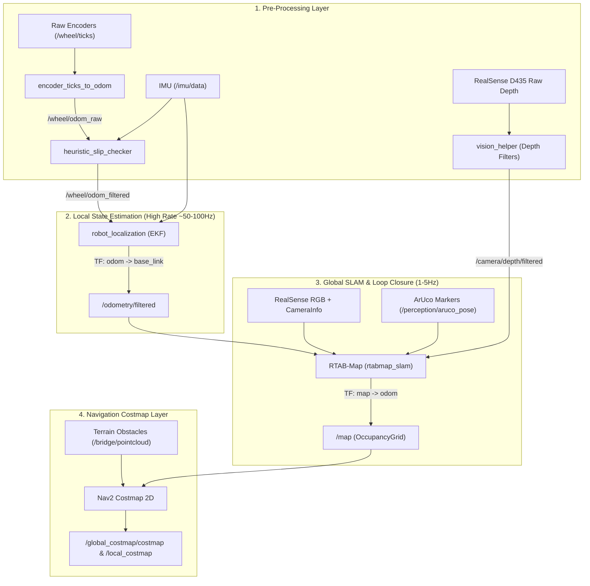

# 🛰️ SLAM (Simultaneous Localization and Mapping) Subsystem

The **SLAM** subsystem provides robust multi-sensor state estimation, 3D visual mapping, wheel slip detection, and 2D navigation costmap generation for the Autonomous Mars Rover.

---

## 🏗️ 1. SLAM Subsystem Architecture

The SLAM pipeline is structured into a 4-tier hierarchical architecture:



---

## 🔄 2. End-to-End Dataflow: Inputs, Blocks & Outputs

The diagram below details the entire dataflow: the sensor inputs, internal computation blocks, messages/topics passed between them, and final outputs delivered to the Path Planning and Control subsystems.

```mermaid
flowchart TD
    %% INPUTS
    subgraph HardwareInputs ["📥 SENSOR & HARDWARE INPUTS"]
        IN_TICKS["Raw Wheel Encoders<br><b>/wheel/ticks</b><br><i>[std_msgs/Int64MultiArray]</i>"]
        IN_IMU["IMU (BNO055 / Gazebo)<br><b>/imu/data</b><br><i>[sensor_msgs/Imu]</i>"]
        IN_RGB["Camera RGB Image<br><b>/camera/image_raw</b><br><i>[sensor_msgs/Image]</i>"]
        IN_INFO["Camera Calibration Info<br><b>/camera/camera_info</b><br><i>[sensor_msgs/CameraInfo]</i>"]
        IN_DEPTH["Raw Depth Stream<br><b>/camera/depth/image_raw</b><br><i>[sensor_msgs/Image]</i>"]
        IN_ARUCO["ArUco Marker Poses<br><b>/perception/aruco_pose</b><br><i>[geometry_msgs/PoseStamped]</i>"]
        IN_ROCKS["Terrain Rock PointCloud<br><b>/bridge/pointcloud</b><br><i>[sensor_msgs/PointCloud2]</i>"]
    end

    %% PROCESSING BLOCKS
    subgraph ProcessingBlocks ["⚙️ SLAM PROCESSING MODULES"]
        
        subgraph BlockOdom ["Block 1: Odometry Kinematics"]
            NODE_ODOM["<b>encoder_ticks_to_odom</b><br>• Converts 4-wheel tick deltas to linear & angular twist<br>• Isolates single-wheel slip per side across 4 wheels<br>• Publishes /wheel/single_wheel_slip & 4-wheel speeds"]
        end
        
        subgraph BlockSlip ["Block 2: Slip Checker & Covariance Filter"]
            NODE_SLIP["<b>heuristic_slip_checker</b><br>• Compares wheel yaw vs IMU gyro & detects stalls<br>• Clamps linear velocity to 0.0 & injects IMU gyro yaw on slip<br>• Dynamically inflates covariance to reject slipping wheels in EKF"]
        end

        subgraph BlockVisionHelper ["Block 3: RealSense Depth Filter"]
            NODE_VISION["<b>vision_helper (realsense2_camera)</b><br>• Decimation, Spatial, Temporal filters<br>• Hole filling & sunlight IR noise removal"]
        end

        subgraph BlockEKF ["Block 4: Local State Estimator"]
            NODE_EKF["<b>robot_localization (ekf_node)</b><br>• Fuses wheel odometry + IMU @ 50-100Hz<br>• Guarantees zero-latency, smooth pose estimate<br>• Publishes local odom -> base_link transform"]
        end

        subgraph BlockRTAB ["Block 5: Global SLAM Backend"]
            NODE_RTAB["<b>RTAB-Map (rtabmap_slam)</b><br>• Visual FAST/GFTT feature tracking<br>• Loop closure detection & 3D memory graph<br>• ArUco landmark 6-DoF constraint fusion<br>• Calculates map -> odom drift correction"]
        end

        subgraph BlockCostmap ["Block 6: Nav2 Costmap 2D"]
            NODE_COSTMAP["<b>nav2_costmap_2d</b><br>• Static Layer: Ingests 2D map from RTAB-Map<br>• Obstacle Layer: Ingests rock point clouds<br>• Inflation Layer: Exponential safety radius"]
        end

    end

    %% INTERMEDIATE TOPIC CONNECTIONS
    IN_TICKS --> NODE_ODOM
    NODE_ODOM -->|<b>/wheel/odom_raw</b><br><i>[nav_msgs/Odometry]</i>| NODE_SLIP
    NODE_ODOM -->|<b>/wheel/single_wheel_slip</b><br><i>[std_msgs/Bool]</i>| NODE_SLIP
    NODE_ODOM -.->|<b>/wheel/per_wheel_speeds</b><br><i>[std_msgs/Float64MultiArray]</i>| DIAG["Telemetry / Logs"]

    IN_IMU --> NODE_SLIP
    NODE_SLIP -->|<b>/wheel/odom_filtered</b><br><i>[nav_msgs/Odometry with inflated cov & clamped v]</i>| NODE_EKF
    NODE_SLIP -->|<b>/wheel/slip_detected</b><br><i>[std_msgs/Bool]</i>| OUT_SLIP

    IN_IMU --> NODE_EKF

    IN_DEPTH --> NODE_VISION
    NODE_VISION -->|<b>/camera/depth/filtered</b><br><i>[sensor_msgs/Image]</i>| NODE_RTAB
    
    IN_RGB --> NODE_RTAB
    IN_INFO --> NODE_RTAB
    IN_ARUCO --> NODE_RTAB

    NODE_EKF -->|<b>/odometry/filtered</b><br><i>[nav_msgs/Odometry @ 50-100Hz]</i>| NODE_RTAB
    NODE_EKF -->|<b>TF: odom &rarr; base_link</b><br><i>[tf2_msgs/TFMessage]</i>| OUT_LOCAL_TF

    NODE_RTAB -->|<b>/map</b><br><i>[nav_msgs/OccupancyGrid]</i>| NODE_COSTMAP
    NODE_RTAB -->|<b>TF: map &rarr; odom</b><br><i>[tf2_msgs/TFMessage @ 1-5Hz]</i>| OUT_GLOBAL_TF

    IN_ROCKS --> NODE_COSTMAP

    %% FINAL OUTPUTS
    subgraph Outputs ["📤 SLAM SYSTEM OUTPUTS"]
        OUT_LOCAL_TF["<b>To Path Tracking / MPPI Controller:</b><br>• /odometry/filtered (100Hz smooth pose)<br>• TF: odom &rarr; base_link (Zero-jump odometry)"]
        OUT_GLOBAL_TF["<b>To Global Path Planner:</b><br>• /map (Global 2D Grid)<br>• TF: map &rarr; odom (Drift correction)"]
        OUT_COSTMAP["<b>To Nav2 Obstacle Avoidance:</b><br>• /global_costmap/costmap<br>• /local_costmap/costmap"]
        OUT_SLIP["<b>To Mission Control / Safety Layer:</b><br>• /wheel/slip_detected"]
    end

    NODE_EKF --> OUT_LOCAL_TF
    NODE_RTAB --> OUT_GLOBAL_TF
    NODE_COSTMAP --> OUT_COSTMAP
```

---

## 📂 Package Directory

* **`rover_slam/`**: Core ROS 2 package containing launch files, configurations, and preprocessing nodes.
  * **`rover_slam/encoder_ticks_to_odom.py`**: 4-wheel encoder tick differential kinematics & odometry calculator.
  * **`rover_slam/heuristic_slip_checker.py`**: Sand slippage detection and dynamic covariance inflation.
  * **`config/ekf.yaml`**: `robot_localization` sensor fusion configuration.
  * **`config/rtabmap.yaml`**: RTAB-Map visual SLAM and graph optimization parameters.
  * **`config/realsense_filters.yaml`**: Intel RealSense D435 post-processing filters.
  * **`config/costmap_params.yaml`**: Nav2 2D costmap layer and inflation configuration.
* **`docs/`**: Subsystem documentation, reference matrices, and GitHub task breakdowns.
  * [`docs/SlamTasks.md`](docs/SlamTasks.md): Ready-to-use GitHub issues for pending tasks.
  * [`docs/SlamProp&Sol.md`](docs/SlamProp&Sol.md): In-depth architectural analysis and solutions.
  * [`docs/slam_nodes_and_topics.md`](docs/slam_nodes_and_topics.md): Full node, topic, and TF tree matrix.
