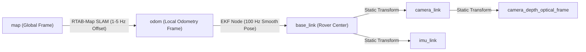

# SLAM System Nodes, Topics & Responsibilities Matrix

This document summarizes every node, its responsibilities, published topics, subscribed topics, and coordinate transforms extracted from `saif SLAM.html` and `SlamAIWorkingGuide.html`.

---

## Complete Node Architecture Table

| Node / Component | File / Script Name | Category | What Should Happen On It (Functionality & Purpose) | Publishes | Subscribers & TF Inputs |
| :--- | :--- | :--- | :--- | :--- | :--- |
| **Wheel Odometry Pre-Processor** | `encoder_ticks_to_odom.py` | Pre-Processing | • Reads raw encoder rotation tick counts. • Calculates differential drive linear velocity ($v_x, v_y$) and angular velocity ($\omega_z$) based on rover kinematics. • Outputs raw wheel odometry twist data. | • `/wheel/odom_raw` `(nav_msgs/msg/Odometry)` | • `/wheel/ticks` `(Raw Encoder / std_msgs)` |
| **Heuristic Slip Checker** | `heuristic_slip_checker.py` | Pre-Processing Filter | • Detects sand wheel slip by comparing $V_{wheels}$ vs $V_{imu}$ and $\omega_{wheel}$ vs IMU yaw rate $\omega_{imu}$. • Slip Flag Rule: $\|V_{wheels} - V_{imu}\| > 0.15\text{ m/s}$. • Dynamically inflates wheel covariance on `/wheel/odom_raw`, forcing EKF to ignore slipping wheels and rely on IMU + Visual SLAM. | • `/wheel/odom_raw` `(nav_msgs/msg/Odometry with updated covariance)` | • `/wheel/odom_raw` `(nav_msgs/msg/Odometry)` • `/imu/data` `(sensor_msgs/msg/Imu)` |
| **Depth Post-Processing Filter** | `vision_helper.launch.py` | Vision Filter | • Pre-filters Intel RealSense D435 depth stream to eliminate sunlight IR noise. • **Decimation Filter**: Downsamples resolution to save compute. • **Spatial Filter**: Smooths high-frequency noise. • **Temporal Filter**: Averages frames to fill hole flicker. • **Hole-Filling Filter**: Fills missing depth values. • **Max Range Clip**: Truncates depth $> 4.0\text{m}$. | • `/camera/depth/filtered` `(sensor_msgs/msg/Image)` | • `/camera/depth/image_rect_raw` `(sensor_msgs/msg/Image)` |
| **EKF Node (`robot_localization`)** | `config/ekf.yaml` `launch/ekf.launch.py` | Local State Estimator | • Fuses linear velocity ($X, Y$) from wheel odometry (`/wheel/odom_raw`) and orientation (Roll, Pitch, Yaw) + angular rate from IMU (`/imu/data`). • Runs at **100 Hz** with zero latency and no coordinate jumps. • Provides smooth state estimation for local MPPI controller. • Configured with `world_frame: odom` and `two_d_mode: false` for 3D slopes. | • `/odometry/filtered` `(nav_msgs/msg/Odometry @ 100Hz)` • **TF**: `odom -> base_link` `(Transform Frame @ 100Hz)` | • `/wheel/odom_raw` `(nav_msgs/msg/Odometry)` • `/imu/data` `(sensor_msgs/msg/Imu)` |
| **RTAB-Map Visual SLAM** | `config/rtabmap.yaml` `launch/rtabmap.launch.py` | Global SLAM Backend | • Extracts FAST/GFTT visual features from RGB & filtered depth streams to build visual 3D memory map. • Performs loop-closure detection and integrates 6-DOF ArUco landmark poses (`/perception/aruco_pose`) as global constraints. • Calculates global drift offset between real world map frame and local odometry frame. • Broadcasts global transform correction **map -> odom** (1–5 Hz). | • `/map` `(nav_msgs/msg/OccupancyGrid)` • **TF**: `map -> odom` `(Transform Frame @ 1–5Hz)` • `/rtabmap/grid_map` `(nav_msgs/msg/OccupancyGrid)` | • `/camera/color/image_raw` `(sensor_msgs/msg/Image)` • `/camera/depth/filtered` `(sensor_msgs/msg/Image)` • `/odometry/filtered` `(nav_msgs/msg/Odometry)` • `/perception/aruco_pose` `(geometry_msgs/msg/PoseStamped)` |
| **ArUco Detector Node** | `aruco_detector_node.py` | Landmark Perception | • Subscribes to raw RGB feed `/camera/color/image_raw` and camera info. • Solves PnP math (`cv2.solvePnP()`) using camera matrix to calculate 3D pose of detected ArUco markers. • Publishes 6-DOF marker coordinates relative to camera frame as absolute landmark correction inputs for RTAB-Map. | • `/perception/aruco_pose` `(geometry_msgs/msg/PoseStamped)` | • `/camera/color/image_raw` `(sensor_msgs/msg/Image)` • `/camera/camera_info` `(sensor_msgs/msg/CameraInfo)` |
| **Nav2 Costmap 2D Server** | `config/costmap_params.yaml` `launch/costmap.launch.py` | Navigation Costmap | • Creates layered 2D occupancy grid map for path planners. • **Static Layer**: Subscribes to `/map` from RTAB-Map. • **Obstacle Layer**: Subscribes to `/perception/obstacles_only` (rock point clouds/bounding boxes). • **Inflation Layer**: Inflates rock obstacle boundaries with safety cost gradients. | • `/global_costmap/costmap` `(nav_msgs/msg/OccupancyGrid)` • `/local_costmap/costmap` `(nav_msgs/msg/OccupancyGrid)` | • `/map` `(nav_msgs/msg/OccupancyGrid)` • `/perception/obstacles_only` `(sensor_msgs/msg/PointCloud2)` • **TF**: `map -> base_link` |
| **Static Transform Broadcaster** | `launch/static_transforms.launch.py` | TF Infrastructure | • Publishes fixed physical geometric transform offsets between chassis and hardware sensors. • Establishes physical relations between robot center `base_link`, IMU (`imu_link`), camera (`camera_link`), and optical frame (`camera_depth_optical_frame`). | • **TF**: `base_link -> camera_link` • **TF**: `base_link -> imu_link` • **TF**: `camera_link -> camera_depth_optical_frame` | • None *(Broadcaster to `/tf_static`)* |
| **Perception Rock / Obstacle Node** | `costmap_test_stub.py` | Perception / Test Stub | • Perception module node (or test stub) that processes vision point clouds / stereo images to detect terrain rocks. • Publishes 3D rock obstacle point clouds to feed Nav2 Costmap 2D. • `costmap_test_stub.py` acts as a mock publisher to test costmap inflation. | • `/perception/obstacles_only` `(sensor_msgs/msg/PointCloud2)` | • Raw PointCloud / Depth sensors |
| **Hardware Drivers** | `realsense2_camera` BNO055 driver Wheel Serial Driver | Hardware Layer | • Hardware interface nodes communicating with microcontrollers, IMU chip, and RealSense USB camera. • Converts physical motor tick counts, IMU registers, and camera sensor frames into standard ROS 2 topics. | • `/wheel/ticks` `(nav_msgs/msg/Odometry)` • `/imu/data` `(sensor_msgs/msg/Imu)` • `/camera/color/image_raw` `(sensor_msgs/msg/Image)` • `/camera/depth/image_rect_raw` `(sensor_msgs/msg/Image)` • `/camera/camera_info` `(sensor_msgs/msg/CameraInfo)` | • Physical Hardware Buses `(USB / I2C / UART / CAN)` |

---

## Coordinate Transform Tree (TF Tree) Hierarchy

### Key TF Distinctions:
1. **`odom -> base_link` (Local Link):** Calculated at 100 Hz by EKF (`robot_localization`). Smooth, high-rate, zero coordinate jumps, used by local path tracking controllers (MPPI).
2. **`map -> odom` (Global Link):** Calculated at 1–5 Hz by RTAB-Map. Absorbs global drift corrections and visual loop closures without causing sudden position jumps in the local wheel controller.
