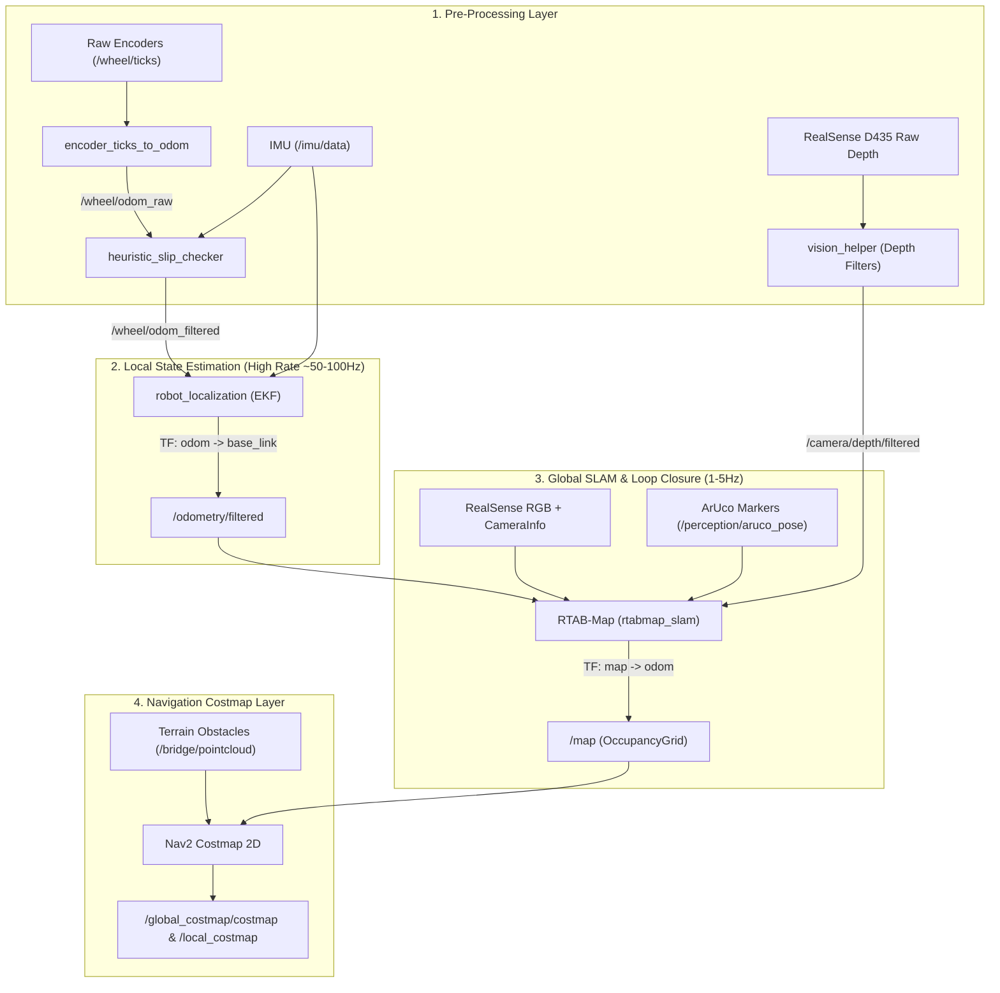

# 🚀 rover_slam: ERC Mars Rover SLAM & State Estimation Package

This ROS 2 package implements **Option B Architecture** for the ERC Autonomous Mars Rover:
* **Local State Estimator:** `robot_localization` EKF node publishing smooth `odom -> base_link` pose at 100 Hz.
* **Pre-Filtering:** RealSense D435 post-processing depth filters + `heuristic_slip_checker.py` dynamically scaling wheel covariance during sand slippage.
* **Global Mapping Backend:** `rtabmap_ros` publishing static `/map` grid and `map -> odom` transform offset (1-5 Hz), incorporating ArUco landmark 6-DOF poses.
* **Costmap Server:** `nav2_costmap_2d` server fusing static map & dynamic rock obstacle point clouds into `/global_costmap/costmap`.



> 📖 For full end-to-end dataflow (inputs, outputs, topics, and message types), see [**`SLAM/README.md`**](../README.md).

## 📦 Package Layout
```text
rover_slam/
├── config/
│   ├── ekf.yaml                  # robot_localization EKF config
│   ├── rtabmap.yaml              # RTAB-Map parameters & loop closure settings
│   ├── costmap_params.yaml       # Nav2 Costmap 2D layer & inflation settings
│   ├── realsense_filters.yaml   # D435 depth filter parameters
│   └── slam_visualization.rviz  # RViz 2 dashboard configuration
├── launch/
│   ├── slam_bringup.launch.py   # Master system launch file
│   ├── ekf.launch.py            # Local EKF & Slip Checker launch
│   ├── rtabmap.launch.py        # RTAB-Map SLAM launch
│   ├── static_transforms.launch.py # Static TFs (base_link -> camera_link / imu_link)
│   ├── vision_helper.launch.py  # Camera depth filters & ArUco detector launch
│   └── costmap.launch.py        # Nav2 Costmap 2D server launch
├── rover_slam/
│   ├── encoder_ticks_to_odom.py  # Converts raw wheel ticks to nav_msgs/Odometry Twist & isolates single-wheel slip
│   ├── heuristic_slip_checker.py # Compares wheel vs IMU, suppresses false velocity, and scales covariance
│   ├── aruco_detector_node.py    # OpenCV ArUco detector & PnP solver
│   └── costmap_test_stub.py      # Test stub simulating perception rock clouds
└── test/
    ├── test_encoder_ticks_to_odom.py # Unit tests for robust side velocity & kinematics
    └── test_slip_checker.py          # Unit tests for slip detection & covariance logic
```

## 🛠️ System Dependencies Installation
Before building or running, install required system dependencies:
```bash
sudo apt update && sudo apt install -y \
  ros-jazzy-diagnostic-updater \
  ros-jazzy-nav2-lifecycle-manager \
  ros-jazzy-nav2-costmap-2d \
  ros-jazzy-robot-localization \
  ros-jazzy-rtabmap-ros
```

## 🚀 How to Build
```bash
colcon build --symlink-install --packages-select rover_slam
source install/setup.bash
```

---

## 🧪 Standalone Testing Guide (World + Rover + Teleop + SLAM)

You can validate state estimation, EKF fusion, and RTAB-Map 3D SLAM mapping in isolation with the simulated rover:

### Method A: Interactive Launcher (Fastest)
```bash
bash scripts/launch_slam.sh
# Select Option 1 for Production Bringup, or Option 2 for Dedicated Standalone Testing
```

---

### Method B: Manual Step-by-Step Terminal Playbook

#### Step 1: Launch Mars Yard Simulation & Spawn Rover
Open Terminal 1:
```bash
source install/setup.bash
# Keep bridge_sim_tf:=false (default) so EKF owns the odom -> base_link transform
ros2 launch my_robot_description gazebo.launch.py
```

#### Step 2: Launch Teleoperation GUI
Open Terminal 2:
```bash
source install/setup.bash
ros2 run my_robot_description teleop_gui.py
```

#### Step 3: Launch Standalone SLAM Bringup
Open Terminal 3:
```bash
source install/setup.bash
ros2 launch rover_slam test_slam_standalone.launch.py
```
*(Boots Static TFs, Heuristic Slip Checker, EKF state estimator, RTAB-Map SLAM, and opens `slam_visualization.rviz`).*

#### Step 4: Verification & Transform Diagnostics
Open Terminal 4:
```bash
# 1. Verify EKF publishes continuous filtered odometry (~50 Hz)
ros2 topic hz /odometry/filtered

# 2. Verify odom -> base_link transform is owned solely by EKF
ros2 run tf2_ros tf2_echo odom base_link

# 3. Verify RTAB-Map publishes dynamic map -> odom transform (1-5 Hz)
ros2 run tf2_ros tf2_echo map odom

# 4. Verify 2D occupancy grid map generation
ros2 topic hz /map
```
As you drive the rover using the GUI, observe the 3D point cloud assembling and the 2D occupancy grid expanding in RViz2 without TF jitter.

---

## 🔬 Subsystem Unit Tests & Standalone Checkpoints

### 1️⃣ Test 1: Static Transforms Validation (Checkpoint 1)
Verify that static coordinate frames (`base_link -> camera_link` and `base_link -> imu_link`) broadcast correctly:
```bash
# Terminal 1:
ros2 launch rover_slam static_transforms.launch.py

# Terminal 2:
ros2 run tf2_ros tf2_echo base_link camera_link
ros2 run tf2_ros tf2_echo base_link imu_link
```
*Expected Result:* 3D translation and rotation frames print continuously at 10 Hz with 0 lookup errors.

> [!NOTE]
> **TF Tree Conflict Prevention**: When running the full SLAM stack (`slam_bringup.launch.py`), `spawn_rover.launch.py` and `gazebo.launch.py` MUST run with `publish_map_tf:=false` (default) and `publish_camera_tf:=false` (default). This guarantees that RTAB-Map is the sole publisher of `map ➔ odom` and `static_transforms.launch.py` is the sole owner of the camera optical frame, preventing TF conflicts.

---

### 2️⃣ Test 2: RealSense Depth Filter Pipeline (Checkpoint 2)
Verify that camera depth post-processing filters (decimation, spatial, temporal, 4.0m range clipping) are active:
```bash
# Terminal 1:
ros2 launch rover_slam vision_helper.launch.py

# Terminal 2:
ros2 topic hz /camera/depth/filtered
```
*Expected Result:* Filtered depth images publish smoothly on `/camera/depth/filtered`.

---

### 3️⃣ Test 3: Standalone Nav2 Costmap 2D + Synthetic Obstacle Test (Checkpoint 4B)
Verify that `nav2_costmap_2d` ingests 3D point cloud rocks from `/perception/obstacles_only` and outputs an inflated safety costmap grid:
```bash
# Terminal 1: Launch Costmap 2D Server
ros2 launch rover_slam costmap.launch.py

# Terminal 2: Run Synthetic Rock Generator
ros2 run rover_slam costmap_test_stub

# Terminal 3: Echo the Costmap Output
ros2 topic echo /global_costmap/costmap
```
*Expected Result:* `/global_costmap/costmap` publishes streaming `nav_msgs/msg/OccupancyGrid` showing inflated rock obstacle cost zones (costs 100 -> 85 -> 50).

---

### 4️⃣ Test 4: ArUco Landmark Pose Topic Contract (Checkpoint 3B)
Verify that the SLAM landmark channel can ingest 6-DOF marker poses independently:
```bash
ros2 topic pub /perception/aruco_pose geometry_msgs/msg/PoseStamped "{header: {frame_id: 'camera_link'}, pose: {position: {x: 1.0, y: 0.0, z: 0.5}, orientation: {w: 1.0}}}" -1
```
*Expected Result:* Message publishes cleanly for RTAB-Map graph loop closure.

---

### 5️⃣ Test 5: Master SLAM Bringup (Checkpoint 5)
Run the full system integration launch combining all sub-systems:
```bash
# Production mode (clean defaults: real perception, no stubs, Nav2 costmap managed by path planner):
ros2 launch rover_slam slam_bringup.launch.py

# Standalone SLAM testing mode (enable internal costmap & synthetic ArUco generator):
ros2 launch rover_slam slam_bringup.launch.py launch_costmap:=true launch_costmap_stub:=true launch_aruco_stub:=true
```

---

## 🛞 Wheel Slip Detection & IMU Fusion Pipeline

### Multi-Stage Traction Validation
1. **Intra-Side Single-Wheel Slip Isolation (`encoder_ticks_to_odom.py`)**:
   * Cross-evaluates front vs rear wheels on each side (`|v_front - v_rear| > single_wheel_slip_threshold`).
   * Rejects free-spinning wheels by bounding side speed to the lower-magnitude traction wheel.
   * Publishes `/wheel/single_wheel_slip` (`std_msgs/msg/Bool`).
2. **Kinematic & Impact Verification (`heuristic_slip_checker.py`)**:
   * Subscribes to `/wheel/single_wheel_slip` and flags slip when individual wheels lose traction.
   * Compares wheel yaw rate $w_{wheel}$ against IMU calibrated gyroscope $w_{imu,z}$.
   * Symmetrically detects forward/reverse collision impact decelerations and sustained obstacle stalls.
   * Detects stalled takeoff from rest across both forward and reverse commands.
3. **Dynamic Odometry Clamping & Covariance Scaling**:
   * On slip detection, clamps `filtered_odom.twist.twist.linear.x = 0.0` and `linear.y = 0.0`, preventing false EKF dead-reckoning forward motion while stuck or spinning.
   * Directs calibrated IMU gyroscope rate `angular.z = w_imu` into filtered odometry.
   * Inflates twist and pose covariance by `covariance_inflation_factor` (100x), commanding EKF to discount slipping wheel data.

