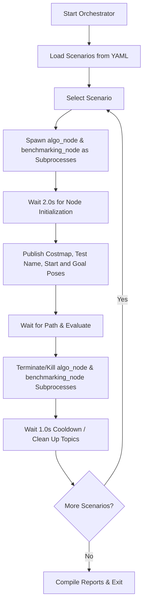

# 📖 ROS 2 Global Path Planning Benchmarking Usage Guide

This guide provides step-by-step instructions on how to run, validate, and migrate each node in the **Global Path Planning Benchmarking Suite** individually.

The suite consists of three modular nodes:
1. **`algo_node`** (Path Planner): Computes A* or straight-line paths based on costmap and goal inputs.
2. **`benchmarking_node`** (Evaluator): Observes planning events, scores path quality (time, length, obstacles, cost, replanning), and generates CSV/PDF reports on shutdown.
3. **`testing_node`** (Orchestrator): Automates loading maps/scenarios, launching nodes as subprocesses, injecting dynamic obstacles, and producing consolidated reports.

---

## 🛠️ Prerequisites & Setup

Before running or testing any node individually, ensure your ROS 2 environment and package workspaces are correctly sourced.

```bash
# Source the ROS 2 installation (e.g., Jazzy, Humble, etc.)
source /opt/ros/<ros2-distro>/setup.bash

# Build the workspace
cd "/home/saif/Desktop/ROAR/gpp benchmarking"
colcon build --packages-select global_path_benchmarking

# Source the workspace
source install/setup.bash
```

---

## 1. Algo Node (`algo_node`)

The **Algorithmic Node** is a standalone global path planner. It subscribes to costmaps, start poses, and goal poses, and publishes the generated paths and its internal computation time.

### 📌 Node Interface
* **Node Name**: `/algo_node`
* **Subscribed Topics**:
  * `/global_costmap/costmap` (`nav_msgs/msg/OccupancyGrid`): The static map representing terrain obstacle costs.
  * `/start_pose` (`geometry_msgs/msg/PoseStamped`): The coordinates where the robot starts.
  * `/goal_pose` (`geometry_msgs/msg/PoseStamped`): The target coordinates. **Note:** Receiving a goal triggers the pathfinding algorithm.
* **Published Topics**:
  * `/planned_path` (`nav_msgs/msg/Path`): The generated path sequence of waypoints.
  * `/planner_internal_time` (`std_msgs/msg/Float32`): Time taken to compute the path in seconds.
* **Parameters**:
  * `use_astar` (`bool`, default: `true`): If `true`, the planner uses A* pathfinding. If `false`, it plans a straight line.

---

### 🚀 Running Standalone
To start the `algo_node` on its own:
```bash
ros2 run global_path_benchmarking algo_node
```

To run with A* disabled (straight-line fallback only):
```bash
ros2 run global_path_benchmarking algo_node --ros-args -p use_astar:=false
```

---

### 🔍 How to Validate Standalone
To verify that `algo_node` is functioning correctly without other nodes running:

#### Step 1: Verify Node Startup & Graph
Check that the node appears in the active ROS 2 graph:
```bash
# List all active nodes
ros2 node list
# Expected output: /algo_node

# Inspect node publishers, subscribers, and parameters
ros2 node info /algo_node
```

#### Step 2: Listen for Output Topics
Open a new terminal, source the environment, and run:
```bash
ros2 topic echo /planned_path
```
Open another terminal to monitor internal planning times:
```bash
ros2 topic echo /planner_internal_time
```

#### Step 3: Publish Mock Input Data
To trigger path computation, you need to publish a costmap, a start pose, and a goal pose. Run the following command sequences in a new terminal:

1. **Publish a 10x10 empty Costmap (0 cost everywhere):**
   ```bash
   ros2 topic pub -1 /global_costmap/costmap nav_msgs/msg/OccupancyGrid "{
     header: {frame_id: 'map'},
     info: {
       resolution: 1.0,
       width: 10,
       height: 10,
       origin: {position: {x: 0.0, y: 0.0, z: 0.0}, orientation: {w: 1.0}}
     },
     data: [
       0,0,0,0,0,0,0,0,0,0,
       0,0,0,0,0,0,0,0,0,0,
       0,0,0,0,0,0,0,0,0,0,
       0,0,0,0,0,0,0,0,0,0,
       0,0,0,0,0,0,0,0,0,0,
       0,0,0,0,0,0,0,0,0,0,
       0,0,0,0,0,0,0,0,0,0,
       0,0,0,0,0,0,0,0,0,0,
       0,0,0,0,0,0,0,0,0,0,
       0,0,0,0,0,0,0,0,0,0
     ]
   }"
   ```

2. **Publish the Start Pose:**
   ```bash
   ros2 topic pub -1 /start_pose geometry_msgs/msg/PoseStamped "{
     header: {frame_id: 'map'},
     pose: {position: {x: 1.0, y: 1.0, z: 0.0}, orientation: {w: 1.0}}
   }"
   ```

3. **Publish the Goal Pose (Triggers Planning):**
   ```bash
   ros2 topic pub -1 /goal_pose geometry_msgs/msg/PoseStamped "{
     header: {frame_id: 'map'},
     pose: {position: {x: 8.0, y: 8.0, z: 0.0}, orientation: {w: 1.0}}
   }"
   ```

* **Expected Result:** The `topic echo` terminals will print a path containing waypoints from (1.0, 1.0) to (8.0, 8.0) and display a planner execution time (typically < 0.01s).

---

### 📦 Decoupling & Migrating to Another Project
To copy `algo_node` to a new ROS 2 project:

1. **Copy the Source File:**
   Copy `global_path_benchmarking/algo_node.py` into your new package's node directory (e.g., `my_custom_planner/my_custom_planner/algo_node.py`).
2. **Define Dependencies:**
   Add these dependencies to your new package's `package.xml`:
   ```xml
   <depend>rclpy</depend>
   <depend>nav_msgs</depend>
   <depend>geometry_msgs</depend>
   <depend>std_msgs</depend>
   ```
3. **Register Entry Points:**
   Add the node to `setup.py` inside the new package:
   ```python
   entry_points={
       'console_scripts': [
           'algo_node = my_custom_planner.algo_node:main',
       ],
   },
   ```
4. **Python Libraries:** Ensure the target system has `numpy` installed (`pip install numpy`).

---
---

## 2. Benchmarking Node (`benchmarking_node`)

The **Benchmarking Node** acts as a black-box evaluator. It calculates path length, safety margins, footprint collisions, and average costs. When it receives a SIGINT/SIGTERM signal (e.g., Node Shutdown), it aggregates the run history and outputs CSV and PDF report summaries in the `reports/` folder.

### 📌 Node Interface
* **Node Name**: `/benchmarking_node`
* **Subscribed Topics**:
  * `/test_name` (`std_msgs/msg/String`): Context identifier for the active scenario.
  * `/global_costmap/costmap` (`nav_msgs/msg/OccupancyGrid`): Keeps track of obstacles to compute obstacle clearances and footprint collisions.
  * `/start_pose` (`geometry_msgs/msg/PoseStamped`): Captured start pose.
  * `/goal_pose` (`geometry_msgs/msg/PoseStamped`): Targets the start of the round-trip evaluation timer.
  * `/planned_path` (`nav_msgs/msg/Path`): Stopping trigger for the round-trip timer, triggering immediate evaluation.
  * `/planner_internal_time` (`std_msgs/msg/Float32`): Subscribes to the planner's internal execution duration.
* **Parameters**:
  * `config` (`string`, default: `"config/scenarios.yaml"`): Location of scenarios database.
  * `benchmark_config` (`string`, default: `"config/benchmark_config.yaml"`): Scoring threshold rules.

---

### 🚀 Running Standalone
Start the `benchmarking_node` independently:
```bash
ros2 run global_path_benchmarking benchmarking_node
```

To run it with custom config files:
```bash
ros2 run global_path_benchmarking benchmarking_node --ros-args \
  -p config:=/absolute/path/to/my_scenarios.yaml \
  -p benchmark_config:=/absolute/path/to/my_benchmark_rules.yaml
```

---

### 🔍 How to Validate Standalone
To check if the evaluator calculates metrics and generates reports properly:

#### Step 1: Start the Node
Run the node in a dedicated terminal. It will wait for incoming topics:
```bash
ros2 run global_path_benchmarking benchmarking_node
```

#### Step 2: Feed Mock Test Data
In another terminal, publish sequential updates representing a complete planning cycle:

1. **Set Test Name:**
   ```bash
   ros2 topic pub -1 /test_name std_msgs/msg/String "{data: 'manual_verification_test'}"
   ```
2. **Publish Costmap:**
   ```bash
   ros2 topic pub -1 /global_costmap/costmap nav_msgs/msg/OccupancyGrid "{
     header: {frame_id: 'map'},
     info: {resolution: 1.0, width: 5, height: 5, origin: {position: {x: 0.0, y: 0.0, z: 0.0}, orientation: {w: 1.0}}},
     data: [0,0,0,0,0, 0,0,100,0,0, 0,0,100,0,0, 0,0,100,0,0, 0,0,0,0,0]
   }"
   ```
3. **Publish Start Pose:**
   ```bash
   ros2 topic pub -1 /start_pose geometry_msgs/msg/PoseStamped "{
     header: {frame_id: 'map'},
     pose: {position: {x: 0.5, y: 2.5, z: 0.0}, orientation: {w: 1.0}}
   }"
   ```
4. **Publish Goal Pose (Starts Benchmarker Timer):**
   ```bash
   ros2 topic pub -1 /goal_pose geometry_msgs/msg/PoseStamped "{
     header: {frame_id: 'map'},
     pose: {position: {x: 4.5, y: 2.5, z: 0.0}, orientation: {w: 1.0}}
   }"
   ```
5. **Publish Planner Internal Time:**
   ```bash
   ros2 topic pub -1 /planner_internal_time std_msgs/msg/Float32 "{data: 0.082}"
   ```
6. **Publish Planned Path (Completes Planning and Calculates Metrics):**
   ```bash
   ros2 topic pub -1 /planned_path nav_msgs/msg/Path "{
     header: {frame_id: 'map'},
     poses: [
       {pose: {position: {x: 0.5, y: 2.5, z: 0.0}}},
       {pose: {position: {x: 2.5, y: 0.5, z: 0.0}}},
       {pose: {position: {x: 4.5, y: 2.5, z: 0.0}}}
     ]
   }"
   ```

* **Expected Result:** The `benchmarking_node` logs will instantly output:
  ```text
  ================ MANUAL RUN PATH METRICS ================
  Test Name:       manual_verification_test
  Status:          SUCCESS
  Roundtrip Time:  x.xxxx s
  Planner Time:    0.0820 s
  Path Length:     5.66 m
  Blocked Cells:   0
  Average Cost:    0.0
  Safety Margin:   1.00 m
  =========================================================
  ```

#### Step 3: Trigger PDF and CSV Report Compilation
Press `Ctrl+C` in the `benchmarking_node` terminal to shut down the node.
* **Expected Result:**
  ```text
  [INFO] [benchmarking_node]: Successfully generated CSV report at: reports/benchmark_history.csv
  [INFO] [benchmarking_node]: Successfully generated PDF report at: reports/benchmark_report.pdf
  ```
  Navigate to the `reports/` folder and inspect the files.

---

### 📦 Decoupling & Migrating to Another Project
To copy `benchmarking_node` to a new ROS 2 project:

1. **Copy the Source Code & Configs:**
   * Copy `global_path_benchmarking/benchmarking_node.py` into your target package.
   * Copy the folder `config/` (containing `scenarios.yaml` and `benchmark_config.yaml`) to the root of your target project.
2. **Define Dependencies:**
   * **ROS 2:** Add `rclpy`, `nav_msgs`, `geometry_msgs`, and `std_msgs` to your target package's `package.xml`.
   * **Python Packages:** Make sure the system running your target package has the necessary visualization and PDF rendering packages installed:
     ```bash
     pip install numpy matplotlib reportlab pyyaml pillow
     ```
3. **Register Entry Points:**
   Add the node script entry point inside `setup.py` of the target package:
   ```python
   entry_points={
       'console_scripts': [
           'benchmarking_node = my_custom_package.benchmarking_node:main',
       ],
   },
   ```

---
---

## 3. Testing Node (`testing_node`)

The **Testing Node** is the test coordinator. It automates testing by reading scenario settings, spawning planner and evaluator nodes in background subprocesses, publishing maps and goal configurations, handling dynamic obstacles, and producing aggregated JSON, Markdown, and PDF reports at the end of the runs.

### 📌 Command-Line Interface (CLI) Arguments
When running the node, you can customize execution via the following flags:
* `--config <path>`: Path to scenarios YAML file (default: `config/scenarios.yaml`).
* `--benchmark_config <path>`: Path to scoring YAML configuration (default: `config/benchmark_config.yaml`).
* `--verify`: Generates validation start/goal plots for each scenario under `reports/` and exits immediately (without launching planner/evaluator).
* `--clean`: Force kills any old/stale ROS 2 benchmarking nodes in the background before starting.
* `--scenario_id <id>`: Specifies a single scenario to run (e.g., `empty_straight`). If omitted, all scenarios run sequentially.
* `--use_astar <true/false>`: Set to `false` to instruct the spawned `algo_node` to bypass A* and use the straight-line planner.

---

### 🚀 Running Standalone
Run all scenarios sequentially:
```bash
ros2 run global_path_benchmarking testing_node
```

Verify scenario start/goal/reference pathways visually before launching test execution:
```bash
ros2 run global_path_benchmarking testing_node --verify
```

Clean processes and execute only the `scattered_rocks_detour` test:
```bash
ros2 run global_path_benchmarking testing_node --clean --scenario_id scattered_rocks_detour
```

---

### 🔍 How to Validate Standalone
To check if the coordinator behaves correctly:

1. **Run a single test case:**
   ```bash
   ros2 run global_path_benchmarking testing_node --scenario_id empty_straight
   ```
2. **Watch the Orchestration Log:**
   * It will show stdout logs indicating that it generates synthetic maps, spins up subprocesses, publishes the empty costmap, publishes start/goal targets, waits for path callbacks, terminates subprocesses, and compiles reports.
3. **Check Outputs:**
   Verify that the consolidated reports are generated successfully inside the `reports/` directory:
   * `reports/results.json`
   * `reports/numerical_report.md`
   * `reports/numerical_report.pdf`
   * `reports/result_scenario_empty_straight.png`

---

### 📦 Decoupling & Migrating to Another Project
If you want to use the automated test orchestrator in another system:

1. **Copy the Source & Configs:**
   * Copy `global_path_benchmarking/testing_node.py` to the target project.
   * Copy the `config/` and `maps/` folders to the target workspace.
2. **Customize Spawned Commands:**
   Open `testing_node.py` and inspect how it starts the planner and evaluator subprocesses in the `run_scenario` method (around line 474).
   * By default, the orchestrator spawns the Python node executables directly from the built `install/` directory:
     ```python
     algo_cmd = ["install/global_path_benchmarking/lib/global_path_benchmarking/algo_node"]
     ```
   * This direct execution ensures that termination signals (`SIGTERM`) are received directly by the Python interpreter process rather than a shell wrapper. This is critical for allowing clean shutdowns, resource cleanups, and the final PDF/HTML report generation callbacks to execute successfully.
   * If you use this orchestrator with a custom planner, customize `algo_cmd` to point to your built node executable.
3. **Dependencies:**
   Ensure the target system includes `rclpy`, `nav_msgs`, `geometry_msgs`, `std_msgs`, and the required Python tools:
   ```bash
   pip install numpy matplotlib reportlab pyyaml pillow
   ```

---
---

## 🧪 Orchestrated Benchmark Testing Suite

The `testing_node` acts as a test coordinator. It automates running multiple navigation test cases (scenarios) sequentially. 

### 🔄 The Test Lifecycle (Dynamic Spawning & Teardown)
To ensure that each test case is completely isolated and evaluated under a clean state, the orchestrator manages a strict lifecycle:


1. **Isolation:** For every scenario, new instances of `algo_node` (path planner) and `benchmarking_node` (evaluator) are spawned.
2. **State Reset:** When a scenario ends, the orchestrator terminates (sends SIGTERM/SIGKILL to) both the planner and the evaluator.
3. **Transition:** This completely cleans up active topics and internal variables (avoiding accumulative times, path confusion, or leftover costmaps).
4. **Aggregation:** Once all scenarios are completed, the orchestrator compiles the final results.

---

### 🚀 How to Run the Tests in General
You can launch the entire benchmarking suite (which sequentializes all scenarios configured in `config/scenarios.yaml`) using either the launcher or the CLI tool.

#### Option A: Using ROS 2 Launch (Recommended)
This is the easiest way to launch the suite as it handles configuration paths automatically:
```bash
ros2 launch global_path_benchmarking benchmark.launch.py
```

#### Option B: Running the testing_node Directly
```bash
ros2 run global_path_benchmarking testing_node --clean
```
*(The `--clean` flag automatically sweeps and kills any leftover `algo_node` or `benchmarking_node` processes before starting).*

---

### 🎯 How to Run a Specific Scenario
If you do not want to run all test cases, you can run a single selected scenario using its **Scenario ID**. 

#### Available Default Scenario IDs:
* `empty_straight`
* `scattered_rocks_detour`
* `canyon_gate_passage`
* `marsyard_rough_slopes`
* `marsyard_labyrinth`
* `canyon_gate_blocked`
* `marsyard_snake_passage`
* `dead_end_trap`
* `crater_field`

#### Command via ROS 2 Launch:
Use the `scenario_id` argument to target a specific test:
```bash
ros2 launch global_path_benchmarking benchmark.launch.py scenario_id:=scattered_rocks_detour
```

#### Command via Direct Node Run:
Pass the `--scenario_id` argument to the executable:
```bash
ros2 run global_path_benchmarking testing_node --scenario_id scattered_rocks_detour
```

---
---

## ⚡ Quick Validation & Troubleshooting Cheatsheet

If nodes do not seem to communicate, use these tools to inspect the active ROS 2 graph:

| Command | Purpose |
| :--- | :--- |
| `ros2 topic list` | Lists all active topics in the graph. Check for `/planned_path`, `/start_pose`, etc. |
| `ros2 topic info <topic_name>` | Checks the publisher and subscriber count of a specific topic. |
| `ros2 node list` | Lists all active nodes. You should see `/algo_node`, `/benchmarking_node`, `/testing_node`. |
| `ros2 topic echo <topic_name>` | Listens to a topic and outputs active messages to the screen. |
| `ros2 param list` | Lists all active node parameters. |
| `pkill -f -9 algo_node` | Force kills background planner nodes. |
| `pkill -f -9 benchmarking_node` | Force kills background evaluator nodes. |
