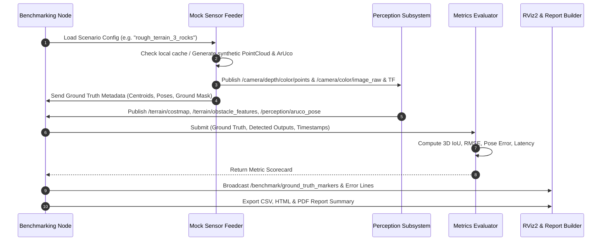

# Perception Testing & Benchmarking Technical Documentation (`PerTesterDoc`)

This document outlines the complete technical blueprint, mathematical foundations, architectural specifications, and GitHub project tasks for implementing the **Perception Testing Suite & Benchmarking Node** (`testing/Perception`).

---

# 1. System Requirements & Interface Specification

The Perception Subsystem under test comprises two main packages:
1. **`terrain_geometry`**: 3D LiDAR / Depth Point Cloud ground extraction (Patchwork++), downsampling, DBSCAN obstacle clustering, 3D bounding box estimation, and 2D Costmap generation.
2. **`marker_detection`**: RGB-D ArUco visual detection, SolvePnP 6-DOF pose estimation, and Kalman filter tracking.

### 1.1 Input Topics Required by Perception Nodes
| Topic Name | Message Type | Target Node | Purpose |
| :--- | :--- | :--- | :--- |
| `/camera/depth/color/points` | `sensor_msgs/msg/PointCloud2` | `terrain_geometry_node` | 3D Point cloud of terrain & obstacles in `camera_depth_optical_frame` |
| `/camera/color/image_raw` | `sensor_msgs/msg/Image` | `marker_detection_node` | 8-bit RGB camera feed (e.g. 1280x720 or 640x480) |
| `/camera/camera_info` | `sensor_msgs/msg/CameraInfo` | `marker_detection_node` | Camera intrinsic matrix ($K$) and distortion coefficients ($D$) |
| `/tf`, `/tf_static` | `tf2_msgs/msg/TFMessage` | Both nodes | Dynamic & static transforms linking sensor frames to `base_link` |

### 1.2 Output Topics to be Monitored & Evaluated
| Topic Name | Message Type | Source Node | Metrics to Evaluate |
| :--- | :--- | :--- | :--- |
| `/terrain/costmap` | `nav_msgs/msg/OccupancyGrid` | `terrain_geometry_node` | 2D obstacle footprint IoU, inflation boundary accuracy |
| `/terrain/obstacle_features` | `terrain_geometry_msgs/msg/ObstacleFeatureArray` | `terrain_geometry_node` | 3D obstacle centroid RMSE, dimension errors ($\Delta w, \Delta l, \Delta h$) |
| `/perception/obstacles_only` | `vision_msgs/msg/Detection3DArray` | `terrain_geometry_node` | 3D Bounding Box IoU, Precision, Recall, False Positives |
| `/perception/aruco_pose` | `geometry_msgs/msg/PoseStamped` | `marker_detection_node` | 6-DOF Translation Error (mm) & Rotation Angle Error ($^\circ$) |
| `/terrain/debug/ground_cloud` | `sensor_msgs/msg/PointCloud2` | `terrain_geometry_node` | Ground segmentation Precision / Recall against true ground labels |

---

# 2. Autonomous Mock & Synthetic Data Generation

If external datasets or bag files are missing, the benchmarking suite must autonomously synthesize complete 3D and 2D sensor feeds with mathematically exact Ground Truth.

### 2.1 Synthetic 3D Point Cloud Generation (`synthetic_generator.py`)
1. **Ground Surface Generation**:
   * *Flat Plane*: $z = 0 + \mathcal{N}(0, \sigma_{\text{ground}})$.
   * *Inclined Slope*: $z(x, y) = x \tan(\theta_{\text{pitch}}) + y \tan(\theta_{\text{roll}})$.
   * *Rough Mars Terrain (Perlin/Simplex Noise)*: $z(x, y) = \sum_{k=1}^N A_k \sin(f_k x + \phi_k) \cos(f_k y + \psi_k)$.
2. **Positive Obstacles (Boulders & Rocks)**:
   * Upper hemisphere / triaxial ellipsoid:
     $$\frac{(x - x_0)^2}{a^2} + \frac{(y - y_0)^2}{b^2} + \frac{(z - z_0)^2}{c^2} \le 1, \quad z \ge z_0$$
3. **Negative Obstacles (Craters / Trenches)**:
   * Parabolic / Gaussian depression:
     $$z(x, y) = z_{\text{ground}} - d_{\text{crater}} \exp\left(-\frac{(x - x_c)^2 + (y - y_c)^2}{2 r_c^2}\right)$$
4. **Sensor Realism & Noise Model**:
   * Radial depth jitter: $\sigma_d(r) = \sigma_0 + k \cdot r^2$ (simulating RealSense depth degradation over range).
   * Dropout rate: random sparsity of $1\% - 5\%$ simulating infrared surface absorption or clipping.

### 2.2 Synthetic ArUco RGB-D Scene Generation
1. **Marker Rendering & Perspective Warping**:
   * Generate canonical ArUco binary image (e.g. `DICT_4X4_50`, ID: 0 to 49) using OpenCV ArUco.
   * Given ground truth pose $\mathbf{T}_{\text{cam}}^{\text{marker}} = [\mathbf{R} \mid \mathbf{t}]$ and camera matrix $K$:
     $$\mathbf{p}_{\text{img}} \sim K \cdot (\mathbf{R} \cdot \mathbf{p}_{\text{marker\_3D}} + \mathbf{t})$$
   * Warp marker quad into the background RGB canvas with perspective transform (`cv2.warpPerspective`).
2. **Depth Map Alignment**:
   * Render corresponding 16-bit depth image (`16UC1` in mm) matching the marker plane depth $z$.
3. **Simulated Disturbances**:
   * Brightness scaling, Gaussian blur, Poisson noise, partial occlusions (e.g. $10\%$ to $40\%$ corner masking).

---

# 3. Mathematical Evaluation Metrics Engine

The `metrics_evaluator.py` module executes quantitative scoring against ground truth annotations.

### 3.1 3D Bounding Box Intersection-over-Union (3D IoU)
Given Ground Truth box $B_{gt}$ and Detected box $B_{det}$:
$$\text{IoU}_{3D} = \frac{\text{Vol}(B_{gt} \cap B_{det})}{\text{Vol}(B_{gt} \cup B_{det})} = \frac{\text{Vol}(B_{gt} \cap B_{det})}{\text{Vol}(B_{gt}) + \text{Vol}(B_{det}) - \text{Vol}(B_{gt} \cap B_{det})}$$
* Bipartite matching via Hungarian Algorithm (Munkres) pairs detected boxes with ground truth instances based on centroid distance and 3D IoU.

### 3.2 Centroid Position RMSE
For $M$ matched obstacles:
$$\text{RMSE}_{\text{pos}} = \sqrt{\frac{1}{M} \sum_{i=1}^M \|\mathbf{c}_{i, det} - \mathbf{c}_{i, gt}\|^2}$$
$$\Delta x = |x_{det} - x_{gt}|, \quad \Delta y = |y_{det} - y_{gt}|, \quad \Delta z = |z_{det} - z_{gt}|$$

### 3.3 ArUco 6-DOF Pose Estimation Error
* **Translation Error**:
  $$e_{\text{trans}} = \|\mathbf{t}_{\text{est}} - \mathbf{t}_{\text{gt}}\|_2 = \sqrt{(x_e - x_g)^2 + (y_e - y_g)^2 + (z_e - z_g)^2}$$
* **Rotation Geodesic Error**:
  $$\Delta \mathbf{R} = \mathbf{R}_{\text{est}} \mathbf{R}_{\text{gt}}^T$$
  $$e_{\text{rot}} = \arccos\left(\frac{\text{Tr}(\Delta \mathbf{R}) - 1}{2}\right) \quad [\text{or in quaternion form: } 2 \arccos(|\mathbf{q}_{\text{est}} \cdot \mathbf{q}_{\text{gt}}|)]$$

### 3.4 Ground Segmentation Accuracy
Using point-level ground truth binary labels ($y_i \in \{0: \text{obstacle}, 1: \text{ground}\}$):
$$\text{Precision} = \frac{TP}{TP + FP}, \quad \text{Recall} = \frac{TP}{TP + FN}, \quad F_1 = \frac{2 \cdot \text{Precision} \cdot \text{Recall}}{\text{Precision} + \text{Recall}}$$

### 3.5 Latency & Throughput
* **Frame Latency**: $\Delta T = t_{\text{published\_output}} - t_{\text{input\_sensor\_stamp}}$ (measured in ms).
* **Processing Rate**: $\text{FPS} = \frac{N_{\text{frames}}}{\sum \Delta T}$.

---

# 4. Benchmarking Node & Testing Pipeline Architecture

---

# 5. GitHub Projects Task Breakdown

Below is the complete task decomposition designed to be imported directly into GitHub Projects / Issues.

---

### 📌 Task 1: Perception Benchmarking Package Scaffolding & Configuration
* **Description**: Create the ROS 2 Python package structure (`testing/Perception`), setup dependencies (`package.xml`, `setup.py`), and define the benchmark configuration and scenario schemas.
* **Suggested Implementation Guide**:
  1. Initialize `package.xml` with dependencies: `rclpy`, `sensor_msgs`, `geometry_msgs`, `nav_msgs`, `vision_msgs`, `visualization_msgs`, `tf2_ros`, `cv_bridge`, `terrain_geometry_msgs`, `marker_detection_msgs`.
  2. Implement `config/benchmark_config.yaml` specifying error thresholds (e.g., max allowed centroid RMSE $< 0.10\,\text{m}$, max pose angle error $< 3.0^\circ$, max latency $< 100\,\text{ms}$).
  3. Implement `config/scenarios.yaml` specifying test scenarios with ground truth definitions (flat ground, scattered boulders, slopes, ArUco distances from $1\,\text{m}$ to $8\,\text{m}$).
* **Acceptance Criteria**:
  * `colcon build --packages-select perception_benchmarking` succeeds without warnings.
  * Configuration YAMLs are parsed cleanly into Python dictionaries.

---

### 📌 Task 2: Synthetic 3D Terrain & Point Cloud Generator
* **Description**: Implement `synthetic_generator.py` capable of mathematically generating synthetic 3D Point Clouds with ground surfaces, positive obstacles (boulders), negative obstacles (craters), and sensor noise.
* **Suggested Implementation Guide**:
  1. Build parametric ground generators (flat, sloped at angle $\alpha$, noisy undulating surface).
  2. Add ellipsoid/box obstacle injectors that append obstacle 3D points and record ground truth 3D bounding boxes and centroids.
  3. Implement depth noise and dropout modeling.
  4. Convert NumPy `(N, 3)` or `(N, 4)` point arrays to ROS 2 `sensor_msgs/msg/PointCloud2` using `sensor_msgs_py.point_cloud2`.
  5. Cache generated synthetic clouds to `synthetic_data/pointclouds/` for fast replay.
* **Acceptance Criteria**:
  * PointCloud2 messages have correct optical frame headers (`camera_depth_optical_frame`).
  * Generates valid synthetic point clouds in $< 50\,\text{ms}$ on the fly if missing.

---

### 📌 Task 3: Synthetic RGB-D ArUco Image Generator
* **Description**: Implement visual synthesis routines in `synthetic_generator.py` to generate synthetic ArUco RGB images and aligned 16-bit depth images across different distances and angles.
* **Suggested Implementation Guide**:
  1. Use `cv2.aruco` to render standard dictionaries (`DICT_4X4_50`, etc.).
  2. Implement 3D homography / perspective warp projecting the marker to target 3D camera coordinates $(x, y, z, \text{roll}, \text{pitch}, \text{yaw})$.
  3. Generate aligned 16-bit millimeter depth maps (`16UC1`).
  4. Implement perturbation options: Gaussian blur, glare, motion blur, partial occlusion masks.
  5. Provide `CameraInfo` message factory populating $K$ and $D$ matrices.
* **Acceptance Criteria**:
  * Output RGB image and depth image match OpenCV pinhole projection geometry.
  * Ground truth marker 3D pose matches projected visual corners exactly.

---

### 📌 Task 4: Mock Sensor & Transform Broadcaster Node
* **Description**: Implement `mock_sensor_node.py` to publish synthetic/cached sensor streams, broadcast TF frames, and publish ground truth metadata to the benchmarking coordinator.
* **Suggested Implementation Guide**:
  1. Create ROS 2 Node `MockSensorNode`.
  2. Publish `/camera/depth/color/points`, `/camera/color/image_raw`, `/camera/camera_info` at configurable rates (e.g. 10 Hz / 30 Hz or single-shot stepped mode).
  3. Broadcast static/dynamic TF transforms: `base_link` $\rightarrow$ `camera_link` $\rightarrow$ `camera_depth_optical_frame` / `camera_color_optical_frame`.
  4. Publish ground truth marker arrays for RViz visualization on `/benchmark/ground_truth_markers`.
* **Acceptance Criteria**:
  * Nodes under test (`terrain_geometry_node` and `marker_detection_node`) receive inputs without topic mismatch errors.
  * TF tree is complete and valid with no lookup exceptions.

---

### 📌 Task 5: Mathematical Metrics Evaluator Engine
* **Description**: Implement `metrics_evaluator.py` containing pure numerical evaluation routines (IoU, RMSE, Quaternion Geodesic Error, Ground Classification F1, Costmap Overlap).
* **Suggested Implementation Guide**:
  1. Implement 3D Oriented Bounding Box (OBB) and Axis-Aligned Bounding Box (AABB) IoU calculator.
  2. Implement Hungarian algorithm matching between detected centroids and ground truth centroids.
  3. Implement translation RMSE and quaternion rotation geodesic angular error.
  4. Implement ground classification precision, recall, and false positive metrics.
  5. Implement 2D costmap occupancy grid matching vs true obstacle masks.
* **Acceptance Criteria**:
  * Unit tests verify mathematical correctness of all distance and angle error functions.
  * Evaluation executes in $< 10\,\text{ms}$ per frame.

---

### 📌 Task 6: Perception Benchmarking Coordinator Node
* **Description**: Implement `benchmarking_node.py` to orchestrate scenario execution, synchronize sensor feeds with perception outputs, record latency, and aggregate metric scorecards.
* **Suggested Implementation Guide**:
  1. Implement scenario state machine (Idle $\rightarrow$ Load Scenario $\rightarrow$ Feed Sensor Data $\rightarrow$ Capture Perception Outputs $\rightarrow$ Evaluate $\rightarrow$ Record Scorecard $\rightarrow$ Next Scenario).
  2. Subscribe to `/terrain/costmap`, `/terrain/obstacle_features`, `/perception/obstacles_only`, `/perception/aruco_pose`.
  3. Time-sync outputs with inputs to record end-to-end processing latency.
  4. Aggregate results into structured run dictionaries and write out raw summary CSVs.
* **Acceptance Criteria**:
  * Automatically cycles through all scenarios in batch mode.
  * Gracefully handles timeouts (e.g. if a module fails to detect or crashes).

---

### 📌 Task 7: RViz Live Benchmarking Overlay & Visualizer
* **Description**: Create unified RViz configuration and dynamic marker publishers in `benchmarking_node.py` to visualize Ground Truth vs Perception Detections live side-by-side.
* **Suggested Implementation Guide**:
  1. Publish Ground Truth 3D bounding boxes as semi-transparent green wireframes/cubes.
  2. Publish Detected 3D bounding boxes as solid yellow/red cubes.
  3. Publish real-time error vectors (lines connecting detected centroids to ground truth centroids).
  4. Publish ArUco ground truth coordinate axes vs estimated coordinate axes.
  5. Create `rviz/perception_benchmark.rviz` with pre-configured display layers for ground cloud, clustered cloud, costmap, and benchmark marker overlays.
* **Acceptance Criteria**:
  * Launching `ros2 launch perception_benchmarking live_test.launch.py` opens RViz2 with all displays active.
  * Ground truth (green) and detected (red/yellow) objects are clearly distinguishable.

---

### 📌 Task 8: Automated HTML, PDF & CSV Report Generator
* **Description**: Implement `report_generator.py` to parse benchmark scorecards and generate visual, publication-quality HTML, PDF, and CSV reports with matplotlib charts.
* **Suggested Implementation Guide**:
  1. Implement CSV exporter detailing metrics per scenario.
  2. Generate Matplotlib summary graphs:
     * Centroid error vs distance from camera.
     * ArUco position/orientation error vs true distance & yaw angle.
     * Latency distribution boxplots.
     * 2D top-down ground truth vs detected obstacle overlay plots.
  3. Implement Jinja2 / HTML report template with pass/fail badges, scorecards, and embedded matplotlib plots.
  4. Add PDF conversion utility (via `weasyprint`, `pdfkit`, or `matplotlib.backends.backend_pdf`).
* **Acceptance Criteria**:
  * Generates clean HTML and PDF reports in `testing/Perception/reports/`.
  * Summary table highlights tests that failed predefined tolerance thresholds in red.
