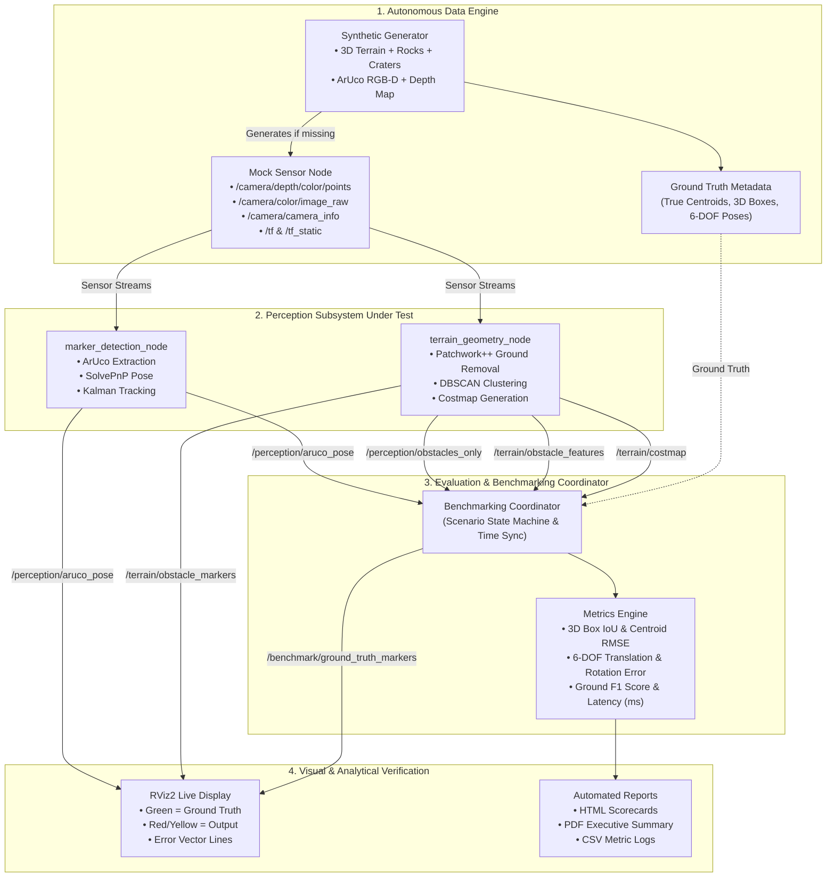

# Perception Testing & Benchmarking Suite (`perception_benchmarking`)

An automated, self-contained testing, validation, and benchmarking suite for the **Perception Subsystem** (`terrain_geometry` and `marker_detection`).

This testing suite operates analogously to the PathPlanner benchmark suite (`testing/PathPlanner`), serving as both an **autonomous data feeder (mock sensor pipeline)** and an **automated evaluator** that assesses perception accuracy numerically and visually in RViz and standalone reports.

---

## 🎯 The End Goal: What Does This Tester Achieve?

The ultimate objective of the Perception Tester is to provide a **100% self-contained, reproducible, and automated verification harness** for the entire perception stack before running code on physical rover hardware or heavy Gazebo simulations.

### 🌟 Key Deliverables & End-State Value:
1. **Zero-Dependency Testing (Self-Contained Ingestion)**:
   * Test the perception nodes instantly on any machine without needing Gazebo worlds, real RealSense/LiDAR sensors, or recorded ROS bags.
   * If input data is missing, the suite **autonomously generates** mathematically precise 3D Point Clouds (flat terrain, slopes, craters, rock fields) and photorealistic ArUco RGB-D images on the fly.

2. **Automated "Ground Truth vs Estimation" Scoring**:
   * Bridges the gap between raw algorithm output and objective truth.
   * Quantifies exactly how well `terrain_geometry` extracts ground planes, clusters obstacles, and draws bounding boxes (3D IoU, Centroid RMSE in cm, False Positives/Negatives).
   * Quantifies the accuracy of `marker_detection` 6-DOF SolvePnP & Kalman filter tracking (Translation error in mm, Angular error in degrees) across varying distances ($0.5\,\text{m}$ to $10\,\text{m}$) and viewing angles.

3. **Real-Time Costmap & Nav2 Verification**:
   * Evaluates the integrity of the 2D obstacle costmap (`/terrain/costmap`) to guarantee that obstacles are inflated correctly without phantom obstacles or blind spots before feeding into the Path Planner.

4. **Dual-Mode Visual Inspection (RViz & Reporting)**:
   * **Live RViz2 Overlay**: Provides visual feedback by rendering **Green Bounding Boxes** for Ground Truth and **Red/Yellow Bounding Boxes** for algorithm detections, linked by dynamic offset error vector lines.
   * **Offline Executive Reports**: Generates publication-grade **HTML, PDF, and CSV reports** with Matplotlib error curves, latency histograms, and pass/fail scorecards.

5. **Regression & Safety Gatekeeper (CI/CD)**:
   * Serves as an automated quality gate in the development pipeline. Whenever filter parameters, clustering thresholds, or camera calibrations are tuned, this suite runs all scenarios to ensure detection rates did not degrade and processing latency stays within the $<100\,\text{ms}$ real-time budget.

---

## 🏛️ Architecture & End-to-End Workflow



---

## 📊 Evaluation Metrics Summary

| Evaluated Module | Target Topics | Metrics Computed | Acceptance Thresholds |
| :--- | :--- | :--- | :--- |
| **Ground Segmentation** | `/terrain/debug/ground_cloud` | Ground Recall, Precision, $F_1$-score | $F_1 \ge 95\%$ |
| **Obstacle Extraction** | `/terrain/obstacle_features`<br>`/perception/obstacles_only` | 3D Bounding Box IoU, Centroid RMSE ($\Delta x, \Delta y, \Delta z$), Detection Recall | $\text{RMSE} \le 0.10\,\text{m}$<br>$\text{Recall} \ge 90\%$ |
| **2D Costmap** | `/terrain/costmap` | Occupancy grid footprint IoU, inflation boundary accuracy | $\text{IoU} \ge 85\%$ |
| **ArUco 6-DOF Pose** | `/perception/aruco_pose` | Translation Error ($e_{\text{trans}}$ in mm), Geodesic Angular Error ($e_{\text{rot}}$ in degrees) | $e_{\text{trans}} \le 30\,\text{mm}$ ($<3\,\text{m}$)<br>$e_{\text{rot}} \le 3.0^\circ$ |
| **System Latency** | End-to-End pipeline delta | Execution duration per frame (ms), throughput (FPS) | Latency $\le 100\,\text{ms}$ ($>10\,\text{Hz}$) |

---

## 📁 Directory Structure

```
testing/Perception/
├── README.md                           # This architecture and overview guide
├── PerTesterDoc.md                     # Deep technical implementation guide & GitHub tasks
├── package.xml                         # ROS 2 package manifest
├── setup.py                            # Python package setup
├── setup.cfg                           # Setup configuration
├── config/
│   ├── benchmark_config.yaml           # Global pass/fail thresholds and test parameters
│   └── scenarios.yaml                  # Predefined testing scenes and ground truth metadata
├── launch/
│   ├── benchmark.launch.py             # Batch automated benchmarking launcher
│   └── live_test.launch.py             # Interactive visual test launcher with RViz
├── perception_benchmarking/
│   ├── __init__.py
│   ├── synthetic_generator.py          # Math-based point cloud and ArUco scene generator
│   ├── mock_sensor_node.py             # ROS 2 publisher for point clouds, images, TF, and camera info
│   ├── benchmarking_node.py            # Central orchestrator and topic synchronizer
│   ├── metrics_evaluator.py            # Quantitative mathematical evaluation engine
│   └── report_generator.py             # Matplotlib, HTML, and PDF report builder
├── rviz/
│   └── perception_benchmark.rviz       # RViz configuration with ground-truth vs output displays
├── synthetic_data/                     # Storage for generated/cached test scenes
│   ├── pointclouds/
│   └── images/
└── reports/                            # Generated benchmark outputs (CSV, HTML, PDF)
```

---

## 🚀 Quickstart & Usage

### 1. Run Automated Benchmarks (Headless / Batch Mode)
```bash
ros2 launch perception_benchmarking benchmark.launch.py scenario:=all
```

### 2. Run Interactive Live RViz Benchmark
```bash
ros2 launch perception_benchmarking live_test.launch.py scenario:=scattered_boulders
```

### 3. Generate Evaluation Reports
```bash
ros2 run perception_benchmarking report_generator --input-csv reports/benchmark_latest.csv
```
