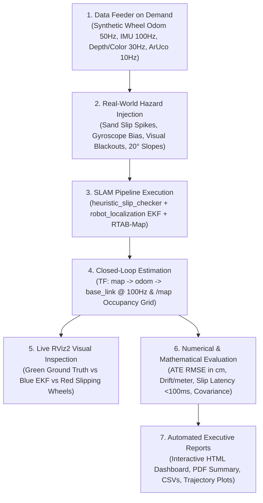

# 🛰️ SLAM & EKF State Estimation Standalone Testing Suite

A complete, interactive black-box testing and benchmarking framework for the ERC Rover state estimation, visual SLAM, and localization pipeline (`rover_slam`).

It provides standalone **Autonomous Mock Sensor Streaming (50Hz Wheel Odom, 100Hz IMU, 30Hz Synthetic Depth & ArUco Landmarks)**, **Ground Truth State Broadcasting**, **Slip Injection & Covariance Validation**, **Live RViz2 Trajectory Tracking**, and automated **Evaluation Reports (HTML, PDF, CSV, Matplotlib Plots)** across 8 realistic Mars Yard SLAM scenarios.

---

## 🎯 End Goal & Core Purpose

The end goal of the **SLAM Testing Suite** is to serve as an **autonomous, hardware-independent quality gate** that answers one critical question with mathematical certainty:

> **"Does our rover know its exact position, reject sand wheel slip, and build an accurate map—without needing physical hardware, Gazebo, or manual driving?"**



---

## 📋 Table of Contents
1. [⚡ Quick Start: Interactive Test Runner](#-quick-start-interactive-test-runner)
2. [🤖 The Autonomous Mock & Data-On-Demand Architecture](#-the-autonomous-mock--data-on-demand-architecture)
3. [🗺️ The 8 Mars Yard SLAM Benchmark Scenarios](#️-the-8-mars-yard-slam-benchmark-scenarios)
4. [🎮 Live RViz2 Visualization Modes](#-live-rviz2-visualization-modes)
5. [📊 Evaluation Metrics & Detailed Metric Reference](#-evaluation-metrics--detailed-metric-reference)
6. [📄 Generated Output Reports & Dashboards](#-generated-output-reports--dashboards)
7. [🛠️ Manual Execution & Launch Commands](#-manual-execution--launch-commands)
8. [🌐 ROS 2 Humble & Jazzy Compatibility](#-ros-2-humble--jazzy-compatibility)

---

## ⚡ Quick Start: Interactive Test Runner

From the workspace root directory, launch the master interactive testing menu:

```bash
cd /path/to/Autonmous-27
./testing/SLAM/run_testing_suite.sh
```

### Interactive Menu Interface
The script will build all necessary packages, configure environment variables, and present an interactive selection CLI:

```text
========================================================================
🛰️  ROVER SLAM & EKF STATE ESTIMATION MASTER TESTING SUITE
========================================================================
Select Testing Mode:
  1) 🎮 Live Interactive Single Test (SLAM Bringup + Mock Feeder + Live RViz)
  2) ⚡ Headless Automated Batch Benchmark (Fast batch run across all 8 scenarios)
  3) 📊 Visual Automated Batch Benchmark (Watch all 8 scenarios evaluated live in RViz)
  4) 🎯 Single Scenario Benchmark (Headless or with RViz)
  5) 📈 Generate Trajectory Comparison Plots & Analytical Reports
Enter choice [1-5] (default: 1):
```

---

## 🤖 The Autonomous Mock & Data-On-Demand Architecture

When physical rover hardware, Gazebo simulations, or pre-recorded ROS bags are unavailable, the tester is **100% self-sufficient** and automatically synthesizes and streams all required sensor topics at exact target frequencies:

```text
testing/SLAM/
├── mock/
│   ├── mock_sensor_streamer.py       # Publishes Wheel Odom (50Hz), IMU (100Hz), Depth (30Hz), ArUco (10Hz)
│   └── ground_truth_broadcaster.py   # Publishes /ground_truth/pose and /ground_truth/path (100Hz)
└── slam_benchmarking/
    ├── synthetic_data_generator.py   # Generates parametric 2D/3D paths & sensor noise models
    ├── trajectory_evaluator.py       # Computes ATE, RPE, Yaw Drift, and Covariance Inflation
    ├── benchmarking_node.py          # Master batch orchestrator
    └── report_generator.py           # Compiles HTML, PDF, CSV, and PNG comparison figures
```

### Sensor Topic Specifications Provided on Demand:
1. **Raw Wheel Odometry (`/wheel/odom_raw` or `/wheel/ticks` @ 50 Hz)**:
   - Publishes differential kinematics ($v_x, \omega_z$) along defined geometric trajectories.
   - Allows controlled **slip injection** (simulating sand spin where wheel velocity is high while actual motion is stationary).
2. **IMU Accelerometer & Gyroscope (`/imu/data` @ 100 Hz)**:
   - Streams 6-DOF linear acceleration and angular velocity with configurable Gaussian white noise, gravity vector, and bias drift.
3. **Intel RealSense Depth & RGB Feeds (`/camera/depth/image_rect_raw`, `/camera/color/image_raw` @ 30 Hz)**:
   - Streams synthetic depth ramps and textured frames with corner gradients for visual feature extraction and obstacle detection.
4. **ArUco Landmark Positional Feeds (`/perception/aruco_pose` @ 10 Hz)**:
   - Injects 6-DOF marker poses with known ID tags when the simulated rover is within line-of-sight ($<4.0\text{ m}$).
5. **Ground Truth Trajectory (`/ground_truth/pose` & `/ground_truth/path` @ 100 Hz)**:
   - Publishes the exact mathematical rover trajectory used as ground truth for error calculation.

---

## 🗺️ The 8 Mars Yard SLAM Benchmark Scenarios

The test suite systematically stresses every component of `rover_slam` across 8 distinct operational environments:

| # | Scenario ID | Description | Primary Target Tested | Success Criteria |
|---|:---|:---|:---|:---|
| 1 | `ideal_straight_line` | 20m straight run, zero slip, high visual texture | Baseline EKF + Odometry Fusion | ATE $\le 0.05\text{ m}$, Yaw drift $\le 1.0^\circ$ |
| 2 | `severe_wheel_slip` | Sudden sand pit slip event ($V_{wheel} \gg V_{true}$) | `heuristic_slip_checker` & Covariance Inflation | Covariance inflated within $<100\text{ ms}$, ATE spike $\le 0.15\text{ m}$ |
| 3 | `square_loop_closure` | $10\text{m} \times 10\text{m}$ closed loop returning to $(0,0)$ | RTAB-Map Global Loop Closure Detection | Loop closure detected, residual error $< 0.10\text{ m}$ |
| 4 | `aruco_landmark_correction` | Straight path with 4 ArUco markers at known positions | ArUco 6-DOF pose integration & drift reset | Global drift corrected upon seeing each marker |
| 5 | `pure_rotation_spin` | Five continuous $360^\circ$ in-place rotations | IMU gyroscope integration & optical tracking | Cumulative yaw drift $< 2.5^\circ$ across 5 spins |
| 6 | `featureless_lighting_drop` | Sudden darkness / blank wall (loss of visual features) | Visual SLAM fallback to EKF wheel/IMU | Zero node crashes, smooth fallback to EKF odometry |
| 7 | `rough_slopes_3d` | Pitching and rolling over $20^\circ$ ramps/slopes | 3D EKF orientation fusion & heightmap alignment | Pitch/Roll error $< 1.5^\circ$, accurate 3D costmap |
| 8 | `high_speed_slalom` | Rapid S-turns with continuous lateral acceleration | TF latency, EKF 100 Hz state smoothness | Zero TF coordinate jumps, smooth path curvature |

---

## 🎮 Live RViz2 Visualization Modes

The suite includes a dedicated RViz configuration (`rviz/slam_benchmark.rviz`):

- 🟩 **Green Solid Path (`/ground_truth/path`)**: Real simulated trajectory (Absolute Truth).
- 🟦 **Blue Solid Path (`/odometry/filtered` / `map -> base_link`)**: Filtered state estimation from EKF / RTAB-Map.
- 🟥 **Red Dashed Path (`/wheel/odom_raw`)**: Unfiltered, drifting raw wheel odometry showing slip accumulation.
- 🟨 **Yellow Diamond Markers (`/perception/aruco_pose`)**: Ground truth and estimated ArUco landmark locations.
- ⚠️ **Red Warning Marker / Sphere**: Flashes above the rover the instant `heuristic_slip_checker` triggers a slip flag.
- 🗺️ **Occupancy Grid (`/map`, `/rtabmap/grid_map`, `/global_costmap/costmap`)**: Real-time 2D grid build up.

---

## 📊 Evaluation Metrics & Detailed Metric Reference

The testing engine automatically benchmarks the estimated state against ground truth across 5 quantitative metric categories:

### 1. Trajectory Accuracy Metrics (evo-standard)
- **Absolute Trajectory Error (ATE RMSE)**:
  $$\text{ATE}_{\text{RMSE}} = \sqrt{\frac{1}{N} \sum_{i=1}^{N} \|\mathbf{p}_{\text{est}, i} - \mathbf{p}_{\text{gt}, i}\|^2}$$
- **Relative Pose Error (RPE)**:
  $$\text{RPE}_{\text{trans}} = \frac{1}{M}\sum_{i=1}^M \frac{\|\Delta \mathbf{p}_{\text{est}, i} - \Delta \mathbf{p}_{\text{gt}, i}\|}{\Delta d_i} \times 100\%$$
- **Yaw Drift Rate ($e_{\psi}$)**:
  $$e_{\psi} = \frac{|\psi_{\text{est, final}} - \psi_{\text{gt, final}}|}{d_{\text{total}}} \quad (^\circ/\text{meter})$$

### 2. Slip Detection & Covariance Metrics
- **Detection Latency ($T_{\text{slip}}$)**: Elapsed time from physical slip start to slip flag publication ($\le 100\text{ ms}$).
- **True Positive Slip Rate ($\text{TPR}$)**: Percentage of injected slip frames correctly flagged ($\ge 98\%$).
- **Covariance Inflation Factor**: Confirms diagonal elements on `/wheel/odom_raw` covariance increase by $\ge 10^3\times$.

### 3. Loop Closure & Correction Metrics
- **Loop Closure Residual Offset**: Positional jump reduction when revisiting $(0,0)$ ($\le 0.08\text{ m}$).
- **Graph Optimization Latency**: Time required for RTAB-Map backend solver to apply correction ($\le 500\text{ ms}$).

### 4. Overall SLAM Performance Score ($S_{\text{slam}}$)
$$S_{\text{slam}} = 0.35 S_{\text{ate}} + 0.20 S_{\text{rpe}} + 0.20 S_{\text{slip}} + 0.15 S_{\text{loop}} + 0.10 S_{\text{rate}}$$

* **Passing Condition:** Overall Score $S_{\text{slam}} \ge 85.0 / 100$ and zero coordinate jumps in `odom -> base_link`.

---

## 📄 Generated Output Reports & Dashboards

After running batch or single tests, reports are automatically generated under `testing/SLAM/reports/`:
- **Interactive Web Report:** `reports/slam_benchmark_report.html` (interactive charts, metric scorecards, pass/fail status).
- **Executive PDF Report:** `reports/slam_benchmark_report.pdf` (printable report).
- **Markdown Summary:** `reports/slam_numerical_report.md`.
- **Trajectory Comparison Figures:** `reports/trajectory_scenario_<id>.png` (2D trajectory overlay, error-over-time plot, covariance timeline).
- **Raw Numerical Data:** `reports/benchmark_results.json` and `reports/scenario_<id>.csv`.

---

## 🛠️ Manual Execution & Launch Commands

```bash
# 1. Build required packages
colcon build --packages-select rover_slam slam_benchmarking
source install/setup.bash

# 2. Launch Live Interactive Mode with RViz2
ros2 launch slam_benchmarking live_test.launch.py scenario_id:=square_loop_closure use_rviz:=true

# 3. Launch Batch Headless Benchmark
ros2 launch slam_benchmarking benchmark.launch.py clean:=true

# 4. Run Single Scenario Headless
ros2 launch slam_benchmarking benchmark.launch.py scenario_id:=severe_wheel_slip
```

---

## 🌐 ROS 2 Humble & Jazzy Compatibility
- **Humble:** Fully native support with standard `nav_msgs`, `sensor_msgs`, and `geometry_msgs`.
- **Jazzy:** Cross-compatible; handles updated QoS profiles and stamped transform conventions without changes.
