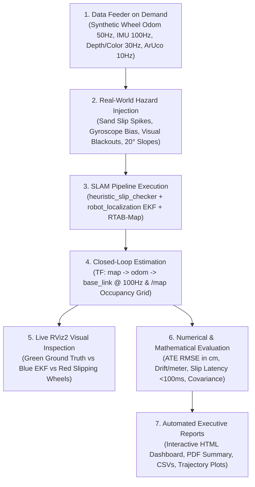
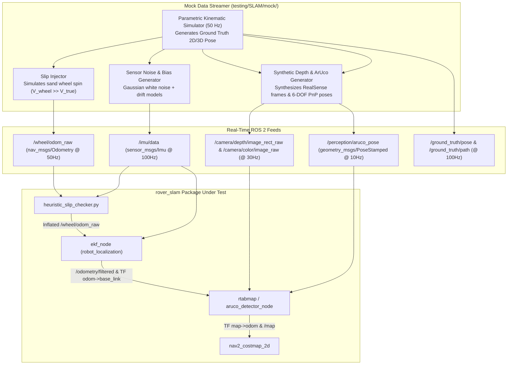

# 🛰️ SLAM & EKF State Estimation Standalone Testing Suite

A complete, interactive black-box testing and benchmarking framework for the ERC Rover state estimation, visual SLAM, and localization pipeline (`rover_slam`).

It provides standalone **Autonomous Mock Sensor Streaming (50Hz Wheel Odom, 100Hz IMU, 30Hz Synthetic Depth & ArUco Landmarks)**, **Ground Truth State Broadcasting**, **Slip Injection & Covariance Validation**, **Live RViz2 Trajectory Tracking**, and automated **Evaluation Reports (HTML, PDF, CSV, Matplotlib Plots)** across 8 realistic Mars Yard SLAM scenarios.

---

## 🎯 End Goal & Core Purpose

The end goal of the **SLAM Testing Suite** is to serve as an **autonomous, hardware-independent quality gate** that answers one critical question with mathematical certainty:

> **"Does our rover know its exact position, reject sand wheel slip, and build an accurate map—without needing physical hardware, Gazebo, or manual driving?"**



---

## 📋 Table of Contents
1. [🏗️ Operational Architecture (Mirroring PathPlanner)](#1-️-operational-architecture-mirroring-pathplanner)
2. [🤖 Autonomous Mock Feeder Architecture ("Data On Demand")](#2--autonomous-mock-feeder-architecture-data-on-demand)
3. [🗺️ The 8 Mars Yard SLAM Benchmark Scenarios](#3-️-the-8-mars-yard-slam-benchmark-scenarios)
4. [⚙️ Configuration Files Schema (`scenarios.yaml` & `benchmark_config.yaml`)](#4-️-configuration-files-schema-scenariosyaml--benchmark_configyaml)
5. [🎮 Live RViz2 Visualization Modes & Topic Bindings](#5--live-rviz2-visualization-modes--topic-bindings)
6. [📐 Mathematical Evaluation & Detailed Metrics Reference](#6--mathematical-evaluation--detailed-metrics-reference)
7. [📊 Multi-Format Reporting Pipeline (HTML/PDF/CSV/PNG)](#7--multi-format-reporting-pipeline-htmlpdfcsvpng)
8. [⚡ Quick Start: Interactive CLI Test Runner (`run_testing_suite.sh`)](#8-⚡-quick-start-interactive-cli-test-runner-run_testing_suitesh)
9. [🛠️ Manual Execution & Launch Commands](#9-🛠️-manual-execution--launch-commands)
10. [🌐 ROS 2 Humble & Jazzy Compatibility](#10-🌐-ros-2-humble--jazzy-compatibility)

---

## 1. 🏗️ Operational Architecture (Mirroring PathPlanner)

Just like `testing/PathPlanner/` decouples path planning from physical hardware using `mock_rover_sim` and `mock_perception`, the `testing/SLAM/` suite decouples state estimation and visual SLAM from physical rover sensors:

```text
testing/SLAM/
├── package.xml
├── setup.py / setup.cfg
├── run_testing_suite.sh                  # Interactive bash runner (Modes 1 to 5)
├── config/
│   ├── scenarios.yaml                   # 8 Mars Yard SLAM test scenarios & trajectories
│   └── benchmark_config.yaml            # Scoring weights, tolerances, and thresholds
├── mock/
│   ├── __init__.py
│   ├── ground_truth_broadcaster.py      # Mathematical 100Hz Truth Simulator (/ground_truth/pose, path)
│   └── mock_sensor_streamer.py          # 50Hz Odom, 100Hz IMU, 30Hz Depth/Color, 10Hz ArUco
├── slam_benchmarking/
│   ├── __init__.py
│   ├── testing_node.py                  # Live single-test interactive orchestrator
│   ├── benchmarking_node.py             # Headless batch test orchestrator & process manager
│   ├── trajectory_evaluator.py          # ATE, RPE, Covariance & Slip Latency Math
│   └── report_generator.py              # HTML (Jinja2), PDF (WeasyPrint), CSV, PNG plots
├── launch/
│   ├── live_test.launch.py              # Interactive single scenario test with RViz
│   └── benchmark.launch.py              # Automated batch / single scenario runner
├── rviz/
│   └── slam_benchmark.rviz              # Pre-configured RViz display layers
└── reports/                             # Generated benchmark outputs
```

### The 5 Operational Modes of the Testing Suite:
1. **Mode 1: 🎮 Live Interactive Single Test**: Launches `rover_slam` nodes (`heuristic_slip_checker`, `ekf_node`, `rtabmap`), starts the mock sensor streamer, and opens RViz2 with live real-time path tracking.
2. **Mode 2: ⚡ Headless Automated Batch Benchmark**: Sequentially runs all 8 scenarios in the background at max speed, computes metrics, and compiles HTML/PDF reports.
3. **Mode 3: 📊 Visual Automated Batch Benchmark**: Runs the batch benchmark with RViz2 open, automatically transitioning between scenarios and resetting rover poses in real time.
4. **Mode 4: 🎯 Single Scenario Benchmark**: Runs a targeted scenario selected from an interactive prompt (either headless or with RViz).
5. **Mode 5: 🗺️ Verify Scenario Reference Trajectories**: Generates standalone verification PNG plots of ground truth reference paths and injected fault timelines.

---

## 2. 🤖 Autonomous Mock Feeder Architecture ("Data On Demand")

If physical sensors or pre-recorded ROS bags are not present, the test suite acts as an autonomous test feeder, generating and publishing standard ROS 2 topics at precise real-time rates:



### Sensor Topic Specifications Provided by Tester:
1. **Raw Wheel Odometry (`/wheel/odom_raw` @ 50 Hz)**:
   - Linear velocity $v_{x, \text{wheel}} = v_{x, \text{gt}} + \delta_{\text{slip}}$
   - Angular velocity $\omega_{z, \text{wheel}} = \omega_{z, \text{gt}} + \mathcal{N}(0, \sigma_\omega^2)$
   - Covariance matrix: initial diagonal values $[0.001, \dots, 0.001]$.
2. **IMU Accelerometer & Gyroscope (`/imu/data` @ 100 Hz)**:
   - Linear acceleration: $\mathbf{a}_{\text{imu}} = \mathbf{a}_{\text{gt}} + \mathbf{g} + \mathbf{b}_a + \mathcal{N}(0, \sigma_a^2)$
   - Angular rate: $\boldsymbol{\omega}_{\text{imu}} = \boldsymbol{\omega}_{\text{gt}} + \mathbf{b}_g + \mathcal{N}(0, \sigma_g^2)$
   - Orientation quaternion: computed from integrated ground truth orientation.
3. **Intel RealSense Depth & RGB Feeds (`/camera/depth/image_rect_raw`, `/camera/color/image_raw` @ 30 Hz)**:
   - Synthetic 16-bit 1-channel depth images containing simulated ground planes and obstacle boxes.
   - 8-bit 3-channel synthetic BGR images containing high-contrast corner patterns (GFTT/ORB features) and embedded ArUco tag patterns.
4. **ArUco Marker Ground Truth & Pose (`/perception/aruco_pose` @ 10 Hz)**:
   - When rover is within $<4.0\text{ m}$ and $\pm 45^\circ$ FOV of a defined marker coordinate, publishes the 6-DOF transform relative to `camera_depth_optical_frame`.
5. **Ground Truth Publisher (`/ground_truth/pose` & `/ground_truth/path` @ 100 Hz)**:
   - Broadcasts the exact mathematical rover trajectory used as ground truth for error calculation.

---

## 3. 🗺️ The 8 Mars Yard SLAM Benchmark Scenarios

The test suite systematically stresses every component of `rover_slam` across 8 distinct operational environments:

| # | Scenario ID | Duration | Motion Profile / Parametric Equations | Injected Fault / Conditions | Primary Target Tested | Pass Criteria |
|---|:---|:---:|:---|:---|:---|:---|
| **1** | `ideal_straight_line` | 40s | $x(t) = 0.5t$, $y=0$, $\theta=0$ (20m total) | Zero slip, clean IMU, rich optical texture | Baseline EKF noise filtering & steady-state drift | $\text{ATE}_{\text{RMSE}} \le 0.05\text{m}$, Yaw drift $\le 1.0^\circ$ |
| **2** | `severe_wheel_slip` | 35s | 10m forward, 3s pause, 10m forward | At $t \in [15, 18]\text{s}$: $v_{\text{wheel}} = 1.5\text{ m/s}$ while $v_{\text{true}} = 0$ (Sand Pit) | Verify `heuristic_slip_checker` detects slip and EKF isolates wheel odom | Slip latency $\le 100\text{ms}$, Covariance inflation $\ge 10^3\times$, $\text{ATE} \le 0.15\text{m}$ |
| **3** | `square_loop_closure` | 80s | $10\text{m} \times 10\text{m}$ closed loop returning to $(0,0)$ | Accumulated dead-reckoning drift ($~0.5\text{m}$) before loop | Verify RTAB-Map graph optimization detects loop closure and snaps map | Loop closure detected, residual end error $\le 0.08\text{m}$ |
| **4** | `aruco_landmark_correction` | 60s | 30m straight path passing 4 known ArUco markers | Injected continuous wheel bias ($+5\%$ speed offset) | Verify ArUco 6-DOF PnP constraints eliminate accumulated longitudinal drift | End-point error $\le 0.10\text{m}$ across 30m |
| **5** | `pure_rotation_spin` | 40s | 5 in-place $360^\circ$ rotations at $\omega_z = 0.5\text{ rad/s}$ | Continuous gyroscopic integration | Evaluate IMU gyroscope bias integration & optical flow tracking | Cumulative yaw drift $\le 2.5^\circ$ across 5 spins |
| **6** | `featureless_lighting_drop` | 30s | 15m forward translation | At $t \in [10, 15]\text{s}$: Camera RGB & Depth frames blacked out ($0\text{ lux}$) | Test visual SLAM graceful degradation and fallback to EKF wheel/IMU | No node crash, EKF maintains state, $\text{ATE} \le 0.20\text{m}$ |
| **7** | `rough_slopes_3d` | 50s | Traversal over $20^\circ$ pitch ramps and $15^\circ$ roll banks | 3D non-planar terrain with height variation $z(t)$ | Validate 3D orientation EKF fusion and 2D costmap projection | Pitch/Roll error $\le 1.5^\circ$, accurate 3D costmap |
| **8** | `high_speed_slalom` | 40s | Sinusoidal slalom: $y(t) = 1.5 \sin(0.4 x(t))$ at $1.0\text{ m/s}$ | High lateral acceleration & dynamic yaw rates | Verify TF broadcast rate (100 Hz), jitter, and kinematic smoothness | EKF update rate $\ge 98\text{Hz}$, zero TF jumps |

---

## 4. ⚙️ Configuration Files Schema (`scenarios.yaml` & `benchmark_config.yaml`)

### A. `config/scenarios.yaml`
```yaml
scenarios:
  - id: "ideal_straight_line"
    duration: 40.0
    trajectory_type: "straight"
    speed: 0.5
    distance: 20.0
    initial_pose: [0.0, 0.0, 0.0]
    slip_injections: []
    aruco_markers: []

  - id: "severe_wheel_slip"
    duration: 35.0
    trajectory_type: "straight_pause_straight"
    speed: 0.5
    initial_pose: [0.0, 0.0, 0.0]
    slip_injections:
      - start_time: 15.0
        end_time: 18.0
        slip_wheel_speed: 1.5
        true_ground_speed: 0.0
    aruco_markers: []

  - id: "square_loop_closure"
    duration: 80.0
    trajectory_type: "square"
    side_length: 10.0
    speed: 0.5
    initial_pose: [0.0, 0.0, 0.0]
    slip_injections: []
    aruco_markers: []

  - id: "aruco_landmark_correction"
    duration: 60.0
    trajectory_type: "straight"
    speed: 0.5
    distance: 30.0
    initial_pose: [0.0, 0.0, 0.0]
    slip_injections: []
    aruco_markers:
      - id: 10
        pose: [5.0, 1.5, 0.5, 0.0, 0.0, -1.57]
      - id: 11
        pose: [12.0, -1.5, 0.5, 0.0, 0.0, 1.57]
      - id: 12
        pose: [20.0, 1.5, 0.5, 0.0, 0.0, -1.57]
      - id: 13
        pose: [28.0, -1.5, 0.5, 0.0, 0.0, 1.57]
```

### B. `config/benchmark_config.yaml`
```yaml
benchmark:
  pass_threshold: 85.0
  weights:
    ate: 0.35
    rpe: 0.20
    slip: 0.20
    loop: 0.15
    timing: 0.10
  limits:
    max_ate_rmse: 0.08
    max_drift_rate_percent: 2.0
    max_slip_latency_ms: 100.0
    min_slip_tpr: 0.98
    min_cov_inflation_ratio: 1000.0
    max_loop_closure_residual: 0.08
    min_ekf_publish_rate: 95.0
```

---

## 5. 🎮 Live RViz2 Visualization Modes & Topic Bindings

The suite includes a dedicated RViz configuration (`rviz/slam_benchmark.rviz`) structured with the following topic bindings:

| Visual Layer | Topic Name | Message Type | RViz Display Type | Color / Styling |
|---|---|---|---|---|
| **Ground Truth Path** | `/ground_truth/path` | `nav_msgs/msg/Path` | Path | Solid Bright Green (`#00FF00`, 0.05m) |
| **Estimated EKF Path** | `/odometry/filtered` / `/slam/path` | `nav_msgs/msg/Path` | Path | Solid Cyan/Blue (`#00BFFF`, 0.05m) |
| **Raw Slipping Wheel Path** | `/slam/raw_wheel_path` | `nav_msgs/msg/Path` | Path | Red Dashed Line (`#FF3333`, 0.03m) |
| **ArUco Ground Truth Landmarks** | `/perception/aruco_markers_vis` | `visualization_msgs/msg/MarkerArray` | MarkerArray | Yellow Diamonds (`#FFD700`) + Floating ID Text |
| **Slip Detection Alert** | `/slam/slip_marker` | `visualization_msgs/msg/Marker` | Marker | Flashing Red Sphere (`#FF0000`) 0.4m above rover |
| **Occupancy Grid** | `/map` & `/rtabmap/grid_map` | `nav_msgs/msg/OccupancyGrid` | Map | Costmap scheme (White=Free, Black=Obstacle) |
| **Rover 3D Chassis** | `/robot_description` | TF: `map -> odom -> base_link` | RobotModel | Full 3D Chassis Mesh & Coordinate Axis |

---

## 6. 📐 Mathematical Evaluation & Detailed Metrics Reference

The testing engine automatically benchmarks the estimated state against ground truth across 5 quantitative metric categories:

### A. SE(3) Rigid Trajectory Alignment (Umeyama Algorithm)
$$\min_{\mathbf{R}, \mathbf{t}} \sum_{i=1}^N \|\mathbf{p}_{\text{gt}, i} - (\mathbf{R} \mathbf{p}_{\text{est}, i} + \mathbf{t})\|^2$$

### B. Trajectory Accuracy Metrics (evo-standard)
- **Absolute Trajectory Error (ATE RMSE)**:
  $$\text{ATE}_{\text{RMSE}} = \sqrt{\frac{1}{N} \sum_{i=1}^{N} \|\mathbf{p}_{\text{est}, i} - \mathbf{p}_{\text{gt}, i}\|^2}$$
- **Relative Pose Error (RPE)**:
  $$\text{RPE}_{\text{trans}} = \frac{1}{M}\sum_{i=1}^M \frac{\|\Delta \mathbf{p}_{\text{est}, i} - \Delta \mathbf{p}_{\text{gt}, i}\|}{\Delta d_i} \times 100\%$$
- **Yaw Drift Rate ($e_{\psi}$)**:
  $$e_{\psi} = \frac{|\psi_{\text{est, final}} - \psi_{\text{gt, final}}|}{d_{\text{total}}} \quad (^\circ/\text{meter})$$

### C. Slip Detection & Covariance Metrics
- **Detection Latency ($T_{\text{slip}}$)**: Elapsed time from physical slip start to slip flag publication ($\le 100\text{ ms}$).
- **True Positive Slip Rate ($\text{TPR}$)**: Percentage of injected slip frames correctly flagged ($\ge 98\%$).
- **Covariance Inflation Factor**: Confirms diagonal elements on `/wheel/odom_raw` covariance increase by $\ge 10^3\times$.

### D. Loop Closure & Correction Metrics
- **Loop Closure Residual Offset**: Positional jump reduction when revisiting $(0,0)$ ($\le 0.08\text{ m}$).
- **Graph Optimization Latency**: Time required for RTAB-Map backend solver to apply correction ($\le 500\text{ ms}$).

### E. Overall SLAM Performance Score ($S_{\text{slam}}$)
$$S_{\text{slam}} = 0.35 S_{\text{ate}} + 0.20 S_{\text{rpe}} + 0.20 S_{\text{slip}} + 0.15 S_{\text{loop}} + 0.10 S_{\text{rate}}$$

* **Passing Condition:** Overall Score $S_{\text{slam}} \ge 85.0 / 100$ and zero coordinate jumps in `odom -> base_link`.

---

## 7. 📊 Multi-Format Reporting Pipeline (HTML/PDF/CSV/PNG)

After running batch or single tests, reports are automatically generated under `testing/SLAM/reports/`:
- **Interactive Web Report:** `reports/slam_benchmark_report.html` (interactive charts, metric scorecards, pass/fail status).
- **Executive PDF Report:** `reports/slam_benchmark_report.pdf` (printable report).
- **Markdown Summary:** `reports/slam_numerical_report.md`.
- **Trajectory Comparison Figures:** `reports/trajectory_scenario_<id>.png` (2D trajectory overlay, error-over-time plot, covariance timeline).
- **Raw Numerical Data:** `reports/benchmark_results.json` and `reports/scenario_<id>.csv`.

---

## 8. ⚡ Quick Start: Interactive CLI Test Runner (`run_testing_suite.sh`)

From the workspace root directory, launch the master interactive testing menu:

```bash
cd /path/to/Autonmous-27
./testing/SLAM/run_testing_suite.sh
```

### Interactive Menu Interface
```text
========================================================================
🛰️  ROVER SLAM & EKF STATE ESTIMATION MASTER TESTING SUITE
========================================================================
Select Testing Mode:
  1) 🎮 Live Interactive Single Test (SLAM Bringup + Mock Feeder + Live RViz)
  2) ⚡ Headless Automated Batch Benchmark (Fast batch run across all 8 scenarios)
  3) 📊 Visual Automated Batch Benchmark (Watch all 8 scenarios evaluated live in RViz)
  4) 🎯 Single Scenario Benchmark (Headless or with RViz)
  5) 📈 Generate Trajectory Comparison Plots & Analytical Reports
Enter choice [1-5] (default: 1):
```

---

## 9. 🛠️ Manual Execution & Launch Commands

```bash
# 1. Build required packages
colcon build --packages-select rover_slam slam_benchmarking
source install/setup.bash

# 2. Launch Live Interactive Mode with RViz2
ros2 launch slam_benchmarking live_test.launch.py scenario_id:=square_loop_closure use_rviz:=true

# 3. Launch Batch Headless Benchmark
ros2 launch slam_benchmarking benchmark.launch.py clean:=true

# 4. Run Single Scenario Headless
ros2 launch slam_benchmarking benchmark.launch.py scenario_id:=severe_wheel_slip
```

---

## 10. 🌐 ROS 2 Humble & Jazzy Compatibility
- **Humble:** Fully native support with standard `nav_msgs`, `sensor_msgs`, and `geometry_msgs`.
- **Jazzy:** Cross-compatible; handles updated QoS profiles and stamped transform conventions without changes.
