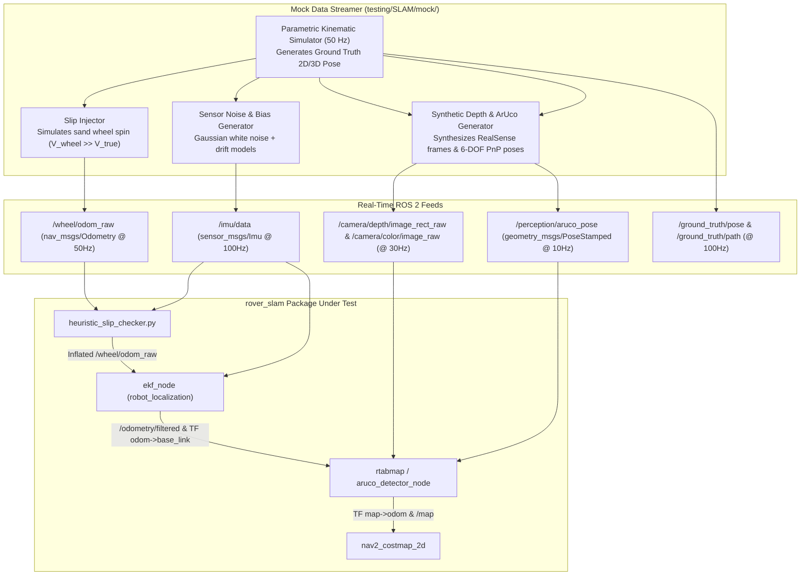

# 🛰️ SLAM & EKF State Estimation Standalone Testing Suite: Architecture & Implementation Specification

This document provides the complete engineering specifications, mathematical formulations, software design, and GitHub Project task breakdown for implementing the standalone SLAM and EKF testing suite inside `testing/SLAM/`.

---

## 📑 Table of Contents
1. [🎯 Executive Summary & Purpose](#1--executive-summary--purpose)
2. [🤖 Autonomous Mock Feeder Architecture ("Data On Demand")](#2--autonomous-mock-feeder-architecture-data-on-demand)
3. [🗺️ The 8 Mars Yard SLAM Benchmark Scenarios](#3-️-the-8-mars-yard-slam-benchmark-scenarios)
4. [📐 Mathematical Evaluation & Metrics Engine](#4--mathematical-evaluation--metrics-engine)
5. [🎮 Live RViz2 Visualization Architecture](#5--live-rviz2-visualization-architecture)
6. [📊 Multi-Format Reporting Pipeline (HTML/PDF/CSV/PNG)](#6--multi-format-reporting-pipeline-htmlpdfcsvpng)
7. [⚡ Interactive CLI Test Runner (`run_testing_suite.sh`)](#7-⚡-interactive-cli-test-runner-run_testing_suitesh)
8. [📋 GitHub Projects Task Breakdown](#8--github-projects-task-breakdown)

---

## 1. 🎯 Executive Summary & Purpose

The SLAM pipeline on the ERC Mars Rover (`rover_slam`) consists of tightly coupled state estimation layers:
1. `encoder_ticks_to_odom.py` (Wheel kinematics @ 50 Hz)
2. `heuristic_slip_checker.py` (Wheel slip detection & covariance inflation filter)
3. `robot_localization` EKF (`odom -> base_link` local state estimation @ 100 Hz)
4. `rtabmap_ros` / ArUco PnP (`map -> odom` global loop closure and drift correction @ 1–5 Hz)
5. `nav2_costmap_2d` (Costmap generation from point clouds and occupancy grids)

### The Problem:
Testing this pipeline in Gazebo or on physical rover hardware is slow, non-deterministic, and prone to environmental variability. Furthermore, evaluating edge cases (e.g., sudden wheel spin on loose Martian sand, visual blackout, or gyroscope drift) cannot be easily reproduced.

### The Solution:
A standalone, fully deterministic **black-box testing and benchmarking harness** (`testing/SLAM/`) that:
- **Feeds synthetic/recorded sensor streams directly** to the SLAM nodes when physical data is absent.
- **Injects controlled faults** (e.g., $1.5\text{ m/s}$ slip spikes, IMU bias shifts, optical dropouts).
- **Evaluates state estimation numerically** using industry-standard trajectory metrics (ATE, RPE, Covariance checks).
- **Renders real-time visual tracking in RViz2**.
- **Generates automated executive reports (HTML, PDF, Markdown, CSV, Matplotlib plots)**.

---

## 2. 🤖 Autonomous Mock Feeder Architecture ("Data On Demand")

If physical sensors or pre-recorded ROS bags are not present, the test suite acts as an autonomous test feeder, generating and publishing standard ROS 2 topics at precise real-time rates:



### Sensor Synthesis Specifications:
1. **Wheel Odometry (`/wheel/odom_raw` @ 50 Hz)**:
   - Linear velocity $v_{x, \text{wheel}} = v_{x, \text{gt}} + \delta_{\text{slip}}$
   - Angular velocity $\omega_{z, \text{wheel}} = \omega_{z, \text{gt}} + \mathcal{N}(0, \sigma_\omega^2)$
   - Covariance matrix: initial diagonal values $[0.001, \dots, 0.001]$.
2. **IMU Accelerometer & Gyroscope (`/imu/data` @ 100 Hz)**:
   - Linear acceleration: $\mathbf{a}_{\text{imu}} = \mathbf{a}_{\text{gt}} + \mathbf{g} + \mathbf{b}_a + \mathcal{N}(0, \sigma_a^2)$
   - Angular rate: $\boldsymbol{\omega}_{\text{imu}} = \boldsymbol{\omega}_{\text{gt}} + \mathbf{b}_g + \mathcal{N}(0, \sigma_g^2)$
   - Orientation quaternion: computed from integrated ground truth orientation.
3. **Intel RealSense Depth & RGB Feeds (`/camera/depth/image_rect_raw`, `/camera/color/image_raw` @ 30 Hz)**:
   - Synthetic 16-bit 1-channel depth images containing simulated ground planes and obstacle boxes.
   - 8-bit 3-channel synthetic BGR images containing high-contrast corner patterns (GFTT/ORB features) and embedded ArUco tag patterns.
4. **ArUco Marker Ground Truth & Pose (`/perception/aruco_pose` @ 10 Hz)**:
   - When rover is within $<4.0\text{ m}$ and $\pm 45^\circ$ FOV of a defined marker coordinate, publishes the 6-DOF transform relative to `camera_depth_optical_frame`.
5. **Ground Truth Publisher (`/ground_truth/pose` & `/ground_truth/path` @ 100 Hz)**:
   - Broadcasts the exact mathematical rover trajectory used as ground truth for error calculation.

---

## 3. 🗺️ The 8 Mars Yard SLAM Benchmark Scenarios

The suite evaluates state estimation across 8 rigorous test scenarios defined in `config/scenarios.yaml`:

| # | Scenario ID | Motion Profile & Injected Conditions | Key SLAM Verification Goal |
|---|:---|:---|:---|
| **1** | `ideal_straight_line` | 20m straight translation at $v_x = 0.5\text{ m/s}$, zero slip, rich visual texture | Baseline EKF noise rejection & steady-state drift |
| **2** | `severe_wheel_slip` | 10m forward, followed by 3.0s in-place wheel spin ($v_{\text{wheel}} = 1.5\text{ m/s}, v_{\text{true}} = 0$), then resume | Verify `heuristic_slip_checker` detects slip and EKF relies solely on IMU |
| **3** | `square_loop_closure` | $10\text{m} \times 10\text{m}$ square trajectory returning to exact $(0,0)$ origin | Measure RTAB-Map loop closure detection and global map drift elimination |
| **4** | `aruco_landmark_correction` | 30m corridor with 4 ArUco markers placed at $x = 5\text{m}, 12\text{m}, 20\text{m}, 28\text{m}$ | Verify 6-DOF ArUco constraints correct accumulated odometry drift |
| **5** | `pure_rotation_spin` | Five continuous $360^\circ$ in-place rotations at $\omega_z = 0.5\text{ rad/s}$ | Evaluate IMU gyroscope bias integration and orientation drift |
| **6** | `featureless_lighting_drop` | 15m traversal with visual blackout (depth/color feed zeroed out for 5 seconds) | Test SLAM robustness to optical failure & smooth fallback to EKF |
| **7** | `rough_slopes_3d` | Pitching ($\pm 20^\circ$) and rolling ($\pm 15^\circ$) over simulated 3D craters/ramps | Validate 3D EKF orientation fusion and heightmap costmap projection |
| **8** | `high_speed_slalom` | Rapid sinusoidal S-curves at $1.0\text{ m/s}$ with continuous lateral acceleration | Verify TF broadcast rate (100 Hz), jitter, and kinematic smoothness |

---

## 4. 📐 Mathematical Evaluation & Metrics Engine

The evaluation engine (`trajectory_evaluator.py`) mathematically benchmarks the estimated state against ground truth across 5 primary metric categories:

### A. Absolute Trajectory Error (ATE)
Evaluates global trajectory consistency after rigid-body SE(3) alignment:
$$\text{ATE}_{\text{RMSE}} = \sqrt{\frac{1}{N}\sum_{i=1}^N \|\mathbf{p}_{\text{est}, i} - \mathbf{p}_{\text{gt}, i}\|^2}$$
$$\text{ATE}_{\text{Max}} = \max_{i=1 \dots N} \|\mathbf{p}_{\text{est}, i} - \mathbf{p}_{\text{gt}, i}\|$$
$$\text{ATE}_{\text{Mean}} = \frac{1}{N}\sum_{i=1}^N \|\mathbf{p}_{\text{est}, i} - \mathbf{p}_{\text{gt}, i}\|$$

### B. Relative Pose Error (RPE)
Measures local drift rate over fixed distance intervals $\Delta d = 1.0\text{ m}$:
$$\mathbf{E}_{i} = (\mathbf{T}_{\text{gt}, i}^{-1} \mathbf{T}_{\text{gt}, i+\Delta})^{-1} (\mathbf{T}_{\text{est}, i}^{-1} \mathbf{T}_{\text{est}, i+\Delta})$$
$$\text{RPE}_{\text{trans}} = \frac{1}{M}\sum_{i=1}^M \|\text{trans}(\mathbf{E}_i)\| \quad (\% \text{ of distance traveled})$$
$$\text{RPE}_{\text{rot}} = \frac{1}{M}\sum_{i=1}^M |\text{rot}(\mathbf{E}_i)| \quad (^\circ/\text{meter})$$

### C. Slip Detection & Covariance Inflation Metrics
1. **Slip Detection Latency ($T_{\text{slip\_latency}}$)**:
   $$T_{\text{slip\_latency}} = t_{\text{flag\_published}} - t_{\text{slip\_injected}} \le 100\text{ ms}$$
2. **True Positive Rate ($\text{TPR}_{\text{slip}}$)**:
   $$\text{TPR}_{\text{slip}} = \frac{\text{Frames correctly flagged as slip}}{\text{Total frames with injected slip}} \ge 98\%$$
3. **Covariance Inflation Factor**:
   $$\text{Ratio}_{\text{cov}} = \frac{\text{Covariance during slip}}{\text{Covariance during normal motion}} \ge 10^3$$

### D. Loop Closure Metrics
1. **Pre-Closure Drift ($\Delta p_{\text{pre}}$)**: Euclidean error right before loop closure trigger.
2. **Post-Closure Residual ($\Delta p_{\text{post}}$)**: Euclidean error immediately following graph optimization ($\le 0.08\text{ m}$).
3. **Loop Correction Magnitude ($\Delta p_{\text{pre}} - \Delta p_{\text{post}}$)**: Net drift eliminated by the visual loop closure.

### E. System Performance & Timing
1. **EKF Publish Frequency & Jitter**: Mean rate $= 100 \pm 2\text{ Hz}$, jitter standard deviation $\sigma_t \le 1.5\text{ ms}$.
2. **RTAB-Map Update Time**: Global optimization cycle time $\le 500\text{ ms}$.

### F. Overall SLAM Score Formulation
$$S_{\text{slam}} = 0.35 S_{\text{ate}} + 0.20 S_{\text{rpe}} + 0.20 S_{\text{slip}} + 0.15 S_{\text{loop}} + 0.10 S_{\text{timing}}$$
- **PASS Criteria**: $S_{\text{slam}} \ge 85.0 / 100$ and zero coordinate jumps in `odom -> base_link`.

---

## 5. 🎮 Live RViz2 Visualization Architecture

A pre-configured RViz display configuration (`rviz/slam_benchmark.rviz`) provides real-time visual inspection:

```text
RViz Display Layers:
├── 🟩 Ground Truth Path (/ground_truth/path)      -> Solid Bright Green Polyline
├── 🟦 Filtered EKF / SLAM Path (/odometry/filtered) -> Solid Cyan/Blue Polyline
├── 🟥 Raw Wheel Odometry Path (/wheel/odom_raw)    -> Red Dashed Polyline (reveals drift)
├── 🟨 ArUco Landmark Array (/perception/aruco_pose)-> Yellow Diamonds & Text IDs
├── ⚠️ Slip Warning Marker (/slam/slip_detected)   -> Flashing Red Sphere over Rover
├── 🚗 Rover 3D Body Mesh & TF Frames               -> map -> odom -> base_link
└── 🗺️ Occupancy Grid (/map & /rtabmap/grid_map)   -> 2D Grayscale Obstacle Map
```

---

## 6. 📊 Multi-Format Reporting Pipeline (HTML/PDF/CSV/PNG)

The testing engine automatically outputs clean, executive-level reports into `testing/SLAM/reports/`:

```text
testing/SLAM/reports/
├── slam_benchmark_report.html       # Full interactive dashboard with sortable tables & interactive charts
├── slam_benchmark_report.pdf        # High-resolution printable PDF summary
├── slam_numerical_report.md         # Clean markdown summary for documentation & CI/CD
├── benchmark_results.json           # Machine-readable JSON database of all metrics
├── scenario_<id>.csv                # Time-series logs (timestamp, x_gt, y_gt, x_est, y_est, cov, slip_flag)
└── plots/
    ├── trajectory_<id>.png          # 2D/3D ground truth vs estimated path overlay
    ├── error_time_<id>.png          # Euclidean error vs time / distance curve
    └── slip_covariance_<id>.png     # Wheel vs IMU velocity & covariance inflation timeline
```

---

## 7. ⚡ Interactive CLI Test Runner (`run_testing_suite.sh`)

A high-productivity master bash script with menu options:

```bash
#!/bin/bash
# testing/SLAM/run_testing_suite.sh
# 1. Interactive Single Scenario Live Test (with RViz)
# 2. Headless Batch Benchmark (all 8 scenarios with automated PDF/HTML reports)
# 3. Visual Batch Benchmark (watch all 8 scenarios live in RViz)
# 4. Single Targeted Scenario Benchmark
# 5. Clean & Generate Analytical Trajectory Comparison Plots
```

---

## 8. 📋 GitHub Projects Task Breakdown

To track and execute the development of this testing suite seamlessly, the implementation is decomposed into **7 distinct, production-ready tasks**:

---

### Task 1: Package Scaffolding, Configuration & ROS 2 Build Infrastructure
- **Description**: Create the `slam_benchmarking` ROS 2 package structure inside `testing/SLAM/`, including `package.xml`, `setup.py`, `setup.cfg`, `config/scenarios.yaml`, `config/benchmark_config.yaml`, and directory skeletons (`mock/`, `slam_benchmarking/`, `rviz/`, `launch/`, `reports/`).
- **Suggested Implementation Guide**:
  1. Initialize ROS 2 Python package `slam_benchmarking` with dependencies: `rclpy`, `nav_msgs`, `sensor_msgs`, `geometry_msgs`, `visualization_msgs`, `tf2_ros`, `tf2_geometry_msgs`, `numpy`, `scipy`, `matplotlib`, `jinja2`, `weasyprint`, `pyyaml`.
  2. Write `config/scenarios.yaml` containing the exact definitions, durations, velocities, slip injection windows, and ArUco coordinates for all 8 benchmark scenarios.
  3. Write `config/benchmark_config.yaml` specifying pass/fail thresholds for ATE, RPE, slip latency, and update rates.
- **Acceptance Criteria**:
  - `colcon build --packages-select slam_benchmarking` compiles with 0 warnings/errors.
  - Sourcing `install/setup.bash` makes package launches discoverable.

---

### Task 2: Ground Truth & Parametric Kinematic Simulator
- **Description**: Implement `testing/SLAM/mock/ground_truth_broadcaster.py` to mathematically generate deterministic 2D/3D trajectories (straight line, square, circle, S-curve, slopes) and broadcast ground truth reference topics.
- **Suggested Implementation Guide**:
  1. Implement closed-form kinematic path generators using parametric equations $x(t), y(t), z(t), \theta(t)$.
  2. Publish `/ground_truth/pose` (`geometry_msgs/msg/PoseStamped`) and `/ground_truth/path` (`nav_msgs/msg/Path`) at 100 Hz.
  3. Publish ground truth TF transform `world -> ground_truth_rover` for RViz rendering.
- **Acceptance Criteria**:
  - Ground truth path generates smooth mathematical polyline for all 8 scenario configurations.
  - Publish rate holds steady at $100.0 \pm 1.0\text{ Hz}$.

---

### Task 3: Autonomous Mock Sensor Streamer & Fault/Slip Injector
- **Description**: Implement `testing/SLAM/mock/mock_sensor_streamer.py` to synthesize all sensor topics required by `rover_slam` when physical inputs are missing.
- **Suggested Implementation Guide**:
  1. **Wheel Odometry Publisher (`/wheel/odom_raw` @ 50 Hz)**: Calculate linear/angular velocity from ground truth. Invert kinematics during configured time windows to inject wheel slip ($v_{\text{wheel}} = 1.5\text{ m/s}$ while $v_{\text{gt}} = 0$).
  2. **IMU Publisher (`/imu/data` @ 100 Hz)**: Calculate body accelerations and angular rates, apply bias drift ($b_g$) and Gaussian noise.
  3. **ArUco Publisher (`/perception/aruco_pose` @ 10 Hz)**: Transform global marker coordinates into camera optical frame when in FOV.
  4. **Synthetic Depth/RGB Publisher (`/camera/depth/image_rect_raw`, `/camera/color/image_raw` @ 30 Hz)**: Generate synthetic OpenCV frames with corner gradients and ArUco markers.
- **Acceptance Criteria**:
  - All 4 topic streams publish continuously at target frequencies.
  - Injected slip events precisely match timing defined in `scenarios.yaml`.

---

### Task 4: Trajectory & SLAM Mathematical Evaluator Engine
- **Description**: Implement `testing/SLAM/slam_benchmarking/trajectory_evaluator.py` to calculate quantitative metrics (ATE, RPE, Yaw drift, Slip detection latency, Covariance inflation, Loop closure residual).
- **Suggested Implementation Guide**:
  1. Implement temporal timestamp synchronization between `/ground_truth/pose` and estimated state (`/odometry/filtered` / `map -> base_link`).
  2. Implement Umeyama / Horn SE(3) trajectory alignment to compute ATE RMSE, Max, and Mean error.
  3. Implement RPE windowed translation and rotation drift computation.
  4. Implement slip evaluation: measure elapsed time between slip injection and `heuristic_slip_checker` flag, and check that covariance on `/wheel/odom_raw` increased by $\ge 10^3\times$.
  5. Compute overall score $S_{\text{slam}}$ and output results dictionary.
- **Acceptance Criteria**:
  - Validated against synthetic test cases with known mathematical drift and known slip events.
  - Correctly outputs all 12 quantitative metrics into a structured Python dictionary.

---

### Task 5: Multi-Format Report Generator & Visualization Engine
- **Description**: Implement `testing/SLAM/slam_benchmarking/report_generator.py` to generate automated HTML, PDF, Markdown, CSV reports, and Matplotlib trajectory comparison figures.
- **Suggested Implementation Guide**:
  1. Create Matplotlib plotting pipelines:
     - 2D Trajectory comparison (Ground Truth vs EKF vs Raw Wheel Odom vs ArUco markers).
     - Error vs Time / Distance curve.
     - Velocity & Covariance inflation timeline.
  2. Build Jinja2 HTML template with responsive Bootstrap styling, metric badges, summary cards, and embedded PNG charts.
  3. Integrate WeasyPrint to compile standalone PDF reports (`reports/slam_benchmark_report.pdf`).
  4. Write summary markdown (`reports/slam_numerical_report.md`) and raw CSV files.
- **Acceptance Criteria**:
  - Running report generation produces valid `.html`, `.pdf`, `.md`, `.csv`, and `.png` files in `testing/SLAM/reports/`.
  - PDF renders cleanly without formatting overlap.

---

### Task 6: Master Benchmarking Orchestrator & Launch Infrastructure
- **Description**: Implement `testing/SLAM/slam_benchmarking/benchmarking_node.py`, `testing/SLAM/slam_benchmarking/testing_node.py`, and launch files (`launch/benchmark.launch.py`, `launch/live_test.launch.py`, `rviz/slam_benchmark.rviz`).
- **Suggested Implementation Guide**:
  1. Implement scenario execution lifecycle: launch `rover_slam` nodes (`heuristic_slip_checker`, `ekf_node`, `rtabmap`), start mock sensor streaming, record trajectory buffers, stop nodes, run evaluator, and proceed to next scenario.
  2. Build `rviz/slam_benchmark.rviz` with pre-configured path displays (Green GT, Blue EKF, Red Raw Odom), marker arrays, and occupancy grids.
  3. Create launch files supporting `scenario_id`, `use_rviz`, `clean`, and `headless` arguments.
- **Acceptance Criteria**:
  - `ros2 launch slam_benchmarking benchmark.launch.py` runs all 8 scenarios sequentially in headless mode and generates reports.
  - `ros2 launch slam_benchmarking live_test.launch.py scenario_id:=square_loop_closure use_rviz:=true` opens RViz2 and displays live motion and state estimation.

---

### Task 7: Master Interactive CLI Runner & End-to-End Validation
- **Description**: Implement `testing/SLAM/run_testing_suite.sh` and create end-to-end integration tests verifying complete pipeline execution.
- **Suggested Implementation Guide**:
  1. Write interactive bash script with ASCII art banner, automatic environment sourcing, and options 1–5.
  2. Implement process cleanup handlers to terminate orphaned ROS 2 nodes upon exit.
  3. Validate full closed-loop execution on ROS 2 Humble and Jazzy across all 8 Mars Yard scenarios.
- **Acceptance Criteria**:
  - Running `./testing/SLAM/run_testing_suite.sh` allows full selection and execution of all test modes without manual command typing.
  - All stale processes are cleanly killed on exit (Ctrl+C).
